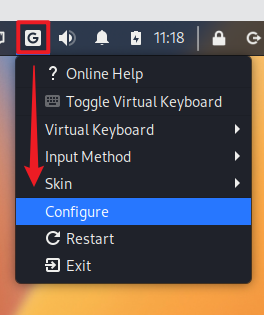
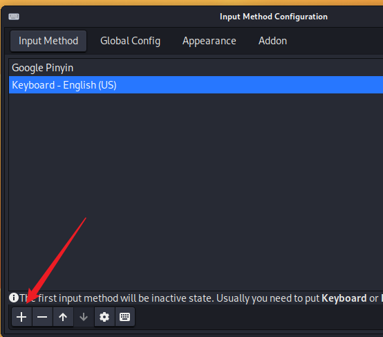
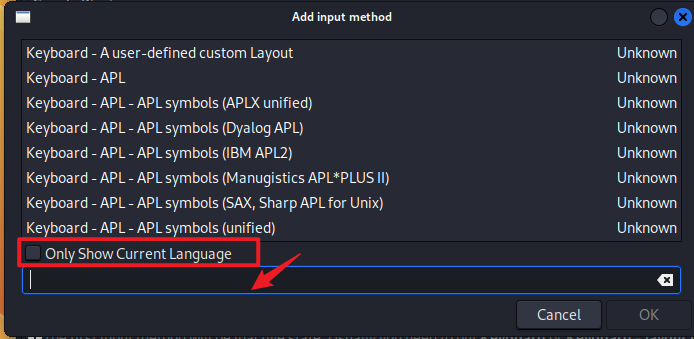
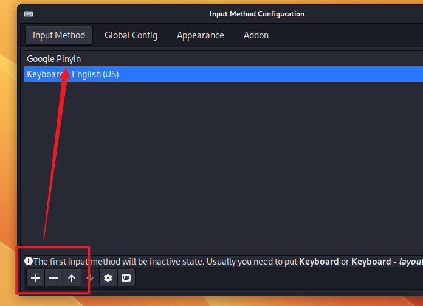

# grub开启启动时间


```
su
mousepad  /etc/default/grub
```

会看到如下内容

```
GRUB_DEFAULT=0
GRUB_TIMEOUT=5
GRUB_DISTRIBUTOR=`lsb_release -i -s 2> /dev/null || echo Debian`
GRUB_CMDLINE_LINUX_DEFAULT="quiet"
GRUB_CMDLINE_LINUX=""
```

把GRUB_TIMEOUT设置为你需要的时间即可

然后输入 `update-grub`


# ssh

https://www.cnblogs.com/wlanjsfx/p/15150196.html


```
┌──(kali㉿G16-7620)-[~]
└─$ sudo vim /etc/ssh/sshd_config


passworAuthentication yes
```

,

```

┌──(kali㉿G16-7620)-[~]
└─$ sudo service ssh start
Starting OpenBSD Secure Shell server: sshd.

┌──(kali㉿G16-7620)-[~]
└─$ sudo update-rc.d ssh enable

┌──(kali㉿G16-7620)-[~]
└─$ sudo service ssh status
sshd is running.
```


# 软件 


查看已安装的软件

```
1), dpkg -l 
2), sudo apt list --installed
3), 分页查看 sudo apt list --installed | less
```


删除安装失败的包

```
$ sudo dpkg --configure -a 
$ sudo dpkg --remove --force-remove-reinstreq {失败的包名}
```


## 卸载


```
# 删除软件及其配置文件
apt --purge remove <package>


# 删除没用的依赖包
apt autoremove <package>

# 此时dpkg的列表中有“rc”状态的软件包，可以执行如下命令做最后清理：
dpkg -l |grep ^rc|awk '{print $2}' |sudo xargs dpkg -P
```

## 环境变量

kali默认bash是 zsh

所以配置环境在 /home/kali/.zshrc 配置

如果在其它地方配置, 会导致shell连接或者本地shell登录中, 环境不一致


输出环境变量

```
echo $PATH    
```


临时修改环境变量

```
 export PATH=/usr/local/webserver/mysql/bin:$PATH
```


永久修改环境变量（比如当前用户是dqx )

```
┌──(dqx㉿D0g3)-[~]
└─$ vim ~/.zshrc
```

然后在文本最后一行添加你要的环境变量

比如添加 /home/dqx/.local/bin

写入的内容是

```
export PATH="/home/dqx/.local/bin:$PATH"
```

之后保存，然后

```
┌──(dqx㉿D0g3)-[~]
└─$ source ~/.profile
```

输出一下是否成功修改

```
echo $PATH 
```


# 输入法


```
apt install fcitx

apt-get install fcitx-googlepinyin

reboot # 重启
```

然后点击键盘,选择configure. 虽然此处我不是键盘图标



然后



然后



输入Google, 查找我们安装的书法,并点击ok, 完成添加

然后上移Google 拼音,作为默认第一项



# clash代理

```
sudo vim /etc/environment

# 添加
export http_proxy="http://127.0.0.1:7890"
export https_proxy="http://127.0.0.1:7890"
export no_proxy="localhost, 127.0.0.1"

sudo vim /etc/sudoers

#添加
Defaults env_keep+="http_proxy https_proxy no_proxy"
```


# sublime text4

https://www.sublimetext.com/docs/linux_repositories.html

```
wget -qO - https://download.sublimetext.com/sublimehq-pub.gpg | gpg --dearmor | sudo tee /etc/apt/trusted.gpg.d/sublimehq-archive.gpg > /dev/null

echo "deb https://download.sublimetext.com/ apt/stable/" | sudo tee /etc/apt/sources.list.d/sublime-text.list

sudo apt-get update
sudo apt-get install sublime-text
```

# scrcpy

https://github.com/Genymobile/scrcpy/blob/master/doc/linux.md

```
sudo apt install ffmpeg libsdl2-2.0-0 adb wget \
                 gcc git pkg-config meson ninja-build libsdl2-dev \
                 libavcodec-dev libavdevice-dev libavformat-dev libavutil-dev \
                 libswresample-dev libusb-1.0-0 libusb-1.0-0-dev
                 
git clone https://github.com/Genymobile/scrcpy
cd scrcpy
./install_release.sh
```

