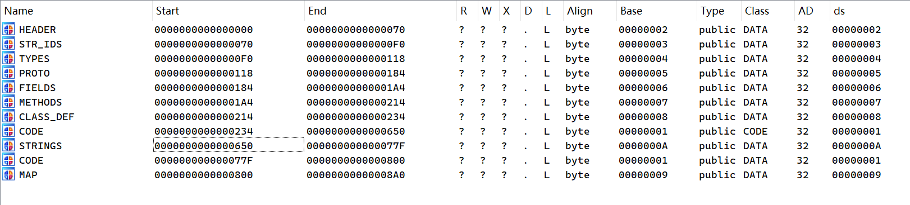
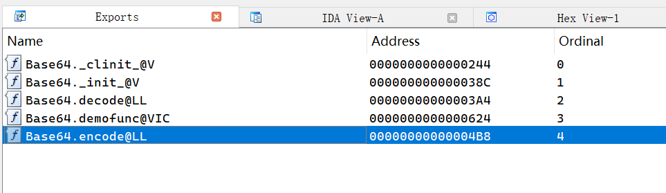
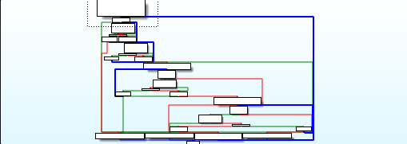

# loaded Type libraries

https://www.cnblogs.com/pady/p/13763956.html

# dex

IDA的segment视图可以看到dex的文件布局，如图

dex文件中所有方法可以点击Exports选项卡查看。

Alt + T : 搜字符串信息的，也可以搜相关的API

流程图: 通过流程图的理解，可以更好的辅助我们的逆向分析

