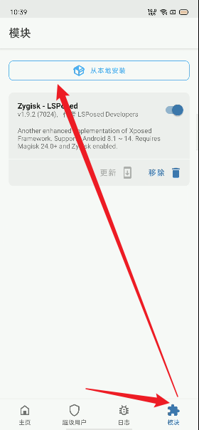
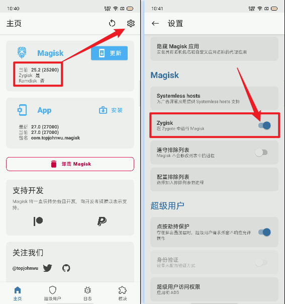
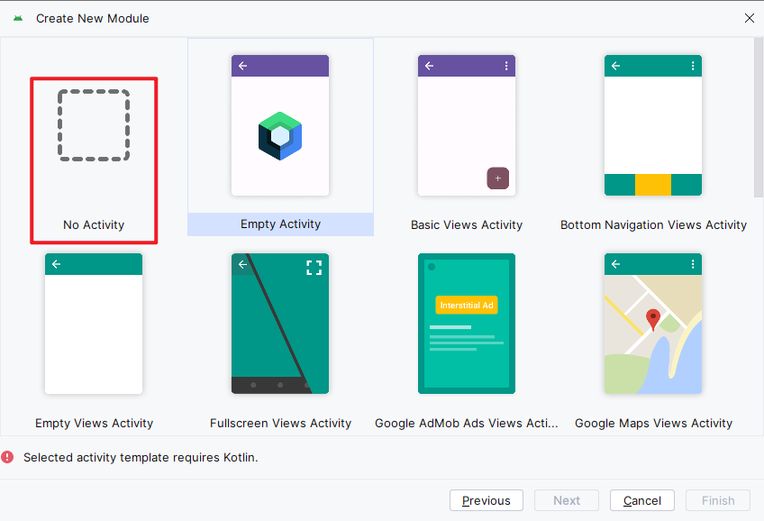
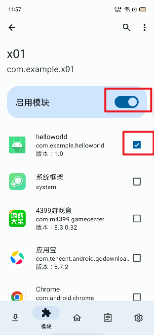
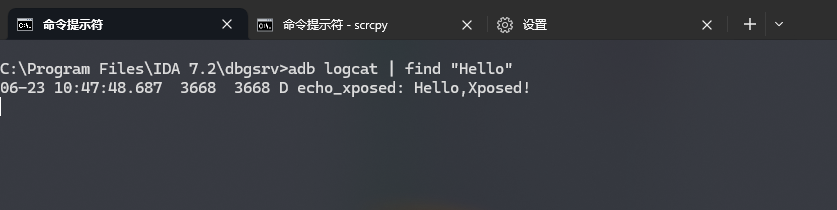

# 下载+安装

准备一个root的手机

已经安装了最新版的Magisk

Android Studio

一个用于测试的apk(com.example.helloworld): 功能就是输出hell world,用于被hook


1), 

下载: https://github.com/LSPosed/LSPosed

下载结果是一个zip安装包, 我们用magisk安装它即可.

magisk: 模块-=> 从本地安装-> 选择下载的zip文件

之后重启



2), 之后发现lsposed还是不能用

见文章 https://www.xitmi.com/10831.html

要在主界面开启某个选项,然后再重启




3), 安装后没图标?

在通知状态栏,你注意看看,点击它,他会提醒你是否添加快捷方式


# hello world 编写

环境:

```
Android Studio Jellyfish | 2023.3.1 Patch 1
Build #AI-233.14808.21.2331.11842104, built on May 15, 2024
Runtime version: 17.0.10+0--11572160 amd64
VM: OpenJDK 64-Bit Server VM by JetBrains s.r.o.
Windows 10.0
GC: G1 Young Generation, G1 Old Generation
Memory: 2048M
Cores: 20
Registry:
  ide.experimental.ui=true
Non-Bundled Plugins:
  com.codeium.intellij (1.8.58)
```


从本质上来讲，Xposed 模块也是一个 Android 程序。但与普通程序不同的是，想要让写出的Android程序成为一个Xposed 模块，要额外多完成以下四个硬性任务：

- 让手机上的xposed框架知道我们安装的这个程序是个xposed模块
- 模块里要包含有xposed的API的jar包，以实现下一步的hook操作
- 这个模块里面要有对目标程序进行hook操作的方法
- 要让手机上的xposed框架知道，我们编写的xposed模块中，哪一个方法是实现hook操作的

这就引出如下的四大件（与前四步一一对照）：

- AndroidManifest.xml
- XposedBridgeApi-xx.jar 与 build.gradle
- 实现hook操作的具体代码
- xposed_Init


新建一个项目, 无activity的

我选的build.gradle,而不是build.gradle.kts




1),  根项目,根目录,的setting.gradle


作用:  配置依赖相关

```
dependencyResolutionManagement {
    repositoriesMode.set(RepositoriesMode.FAIL_ON_PROJECT_REPOS)
    repositories {
        google()
        mavenCentral()
        maven { url 'https://api.xposed.info/' }  // 添加这一行即可
    }
}
```


2), 当前项目的build.gradle

Xposed框架需要用到第三方库

作用:  配置依赖相关

```
dependencies {

    implementation libs.appcompat
    ......

    compileOnly 'de.robv.android.xposed:api:82'
    // compileOnly 'de.robv.android.xposed:api:82:sources' // 不要导入源码，这会导致idea无法索引文件，从而让语法提示失效
}
```


3), 当前项目的 src/main/res/value目录中新建`arrays.xml`,内容如下

作用: xposed会作用于一些app,下面内容中包含的apk 会被xposed hook作为推荐项

```
<resources>
    <string-array name="xposedscope" >
        <!-- 这里填写模块的作用域应用的包名，可以填多个。 -->
        <item>ceui.lisa.pixiv</item>
        <item>com.xjs.ehviewer</item>
        <item>com.picacomic.fregata</item>
    </string-array>
</resources>
```


4),  当前项目的AndroidManifes.xml 配置如下

作用:  声明xposed模块的身份信息

```xml
<?xml version="1.0" encoding="utf-8"?>
<manifest xmlns:android="http://schemas.android.com/apk/res/android">

    <application
        android:allowBackup="true"
        android:icon="@mipmap/ic_launcher"
        android:label="@string/app_name">

        <!-- 是否是xposed模块，xposed根据这个来判断是否是模块 -->
        <meta-data
            android:name="xposedmodule"
            android:value="true" />
        <!-- 模块描述，显示在xposed模块列表那里第二行 -->
        <meta-data
            android:name="xposeddescription"
            android:value="不可以涩涩" />
        <!-- 最低xposed版本号(lib文件名可知,一般填54即可) -->
        <meta-data
            android:name="xposedminversion"
            android:value="54" />
        <!-- 模块作用域 -->
        <meta-data
            android:name="xposedscope"
            android:resource="@array/xposedscope"/>

    </application>

</manifest>
```


5), 在当前项目 src/main/目录新建目录`assets`,在`assets`中新建文件`xposed_init`

作用: 大概是声明入口类吧

```
├── AndroidManifest.xml
├── assets
│   └── xposed_init
├── java
│   └── com
│       └── example
│           └── x01
│               └── MainHook.java
└── res
    ├── layout
    │   └── activity_main.xml
```

`xposed_init`的文本内容是: 你的当前项目 `包名.入口类`

```
com.example.x01.MainHook
```

 


6), 下面是一个垃圾的hello world代码

当前xposed模块叫做 `com.example.x01`, 

作用于`com.example.helloworld`, 也就是我们要监听hook`com.example.helloworld`, 

`com.example.helloworld`的功能就是输出hellworkd


com.example.x01.MainHook内容如下

```java
package com.example.x01;

import android.util.Log;

import de.robv.android.xposed.IXposedHookLoadPackage;
import de.robv.android.xposed.callbacks.XC_LoadPackage;

public class MainHook implements IXposedHookLoadPackage {
    @Override
    public void handleLoadPackage(XC_LoadPackage.LoadPackageParam lpparam) throws Throwable {
        // 过滤不必要的应用
        if (!lpparam.packageName.equals("com.example.helloworld"))
            return;
        // 执行Hook
        hook(lpparam);
    }

    private void hook(XC_LoadPackage.LoadPackageParam lpparam) {
        // 具体流程
        Log.d("echo_xposed","Hello,Xposed!");
    }
}
```


7),  apk安装它, 再LSposed中启用它,选择作用的app



8), 监听一下, 因为我们hook的功能 log输出一下

先点击 com.example.helloworld ,然后come.exaple.x01就会hook它



这期间,貌似也不需要我们去重启手机之类的.


