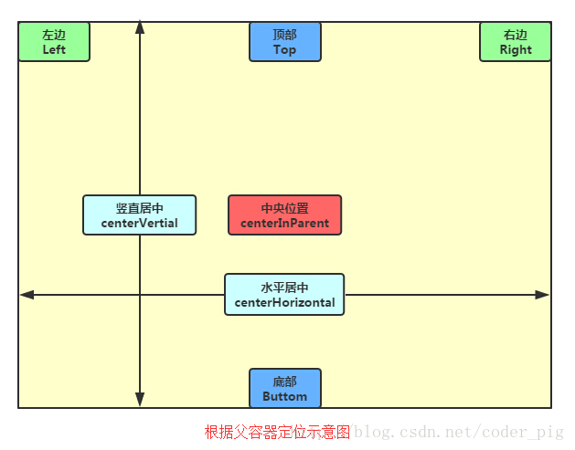

​	

# 布局

就是一个界面成员的排布方式

Android中有六大布局

- LinearLayout(线性布局)
- RelativeLayout(相对布局)
- TableLayout(表格布局) 
- FrameLayout(帧布局)
- AbsoluteLayout(绝对布局)
- GridLayout(网格布局)
- ...


## LinearLayout

 MyApplication_001\dqx001\src\main\res\layout\ 

- page1.xml
- page2.xml
- page3.xml
- page4.xml

 

最普通常用的布局，线性布局。


了解：

1），

java代码中，也可以设置一些控件属性

```java
setLayoutParams(new LayoutParams(LayoutParams.FILL_PARENT,LayoutParams.WRAP_CONTENT, 1)); 
```

2），分割线

比如你吧一个view设置得很小，那它就是分割线

```xml
<View  
    android:layout_width="match_parent"  
    android:layout_height="1px"  
    android:background="#000000" />  
```

这种分割线比较笨拙，Android有专门的风险 

```
    android:divider="@drawable/ktv_line_div" 分割线图片来源	  
    android:showDividers="middle"  
    android:dividerPadding="10dp" 
```

->

```xml
<LinearLayout xmlns:android="http://schemas.android.com/apk/res/android"  
    xmlns:tools="http://schemas.android.com/tools"  
    android:id="@+id/LinearLayout1"  
    android:layout_width="match_parent"  
    android:layout_height="match_parent"  
    android:orientation="vertical"  
    android:divider="@drawable/ktv_line_div"  
    android:showDividers="middle"  
    android:dividerPadding="10dp"  
    tools:context="com.jay.example.linearlayoutdemo.MainActivity" >  

    <Button  
        android:layout_width="wrap_content"  
        android:layout_height="wrap_content"  
        android:text="按钮1" />  

    <Button  
        android:layout_width="wrap_content"  
        android:layout_height="wrap_content"  
        android:text="按钮2" />  

</LinearLayout>
```


## RelativeLayout

C:\Users\tinyx\AndroidStudioProjects\MyApplication_001\dqx001\src\main\res\layout\

- page5.xml
- page6.xml





## GridLayout (excel网格布局)

C:\Users\tinyx\AndroidStudioProjects\MyApplication_001\dqx001\src\main\res\layout\page7.xml

 


## TableLayout(表格布局) 


## FrameLayout(帧布局)

## AbsoluteLayout(绝对布局)

# 视图

滚动视图：有横向的滚动，也有竖向的滚动。dqx007，注意宽度高度如何去设置


# 控件


## TextView

MyApplication_001\dqx002\src\main\res\layout\

- activity_main.xml
- page1.xml
- page2.xml
- page3.xml


字体大小，文本内容，字体颜色，字体背景

```xml
<TextView
    android:id="@+id/tv_1"
    android:layout_width="wrap_content"
    android:layout_height="wrap_content"
    android:text="hello world" 
    android:textSize="30dp"/>
```


关于文本，知道它可以setText差不多就够用了

```java
//修改一开始的字体
TextView tv=findViewById(R.id.tv_1);
tv.setText("20");
```


## ImageView

dqx005

功能：设置图片背景来源，图片scale缩放类型

src：是内容

background：是背景


## EditText

dqx003

```xml
    <EditText
        android:id="@+id/et_1"
        android:layout_width="match_parent"
        android:layout_height="wrap_content"
        android:inputType="number"
        android:maxLength="11"
        android:textSize="25dp" />
```


```java
et_user.getText().toString();//获取字符串
et_user.setText("");//设置字符串
```


输入的数据可以限制为一些类型，如密码，只能是数字，...

最大最小输入长度

设置最小行，最多行，单行，多行，自动换行

只允许单行输入，而且不会滚动


> 焦点

```
edit.requestFocus(); //请求获取焦点
edit.clearFocus(); //清除焦点
```

焦点监听：

```
edit.setOnFocusChangeListener()
```


> 光标

```
setSelection();
setSelectAllOnFocus(true);
setCursorVisible(false);	
getSelectionStart()
getSelectionEnd()
```


## Button

dqx004

### selector设置背景样式


```
drawable:引用的Drawable位图,我们可以把他放到最前面,就表示组件的正常状态~
state_pressed :控件是否被按下,eg: button
state_checkable:控件可否被勾选
state_checked:控件是否被勾选,eg:checkbox，radiobutton
state_focused:是否获得焦点,eg：exitText
state_selected:控件是否被选择,针对有滚轮的情况

state_window_focused:是否获得窗口焦点
state_enabled:控件是否可用
state_active:控件是否处于活动状态,eg:slidingTab
state_single:控件包含多个子控件时,确定是否只显示一个子控件
state_first:控件包含多个子控件时,确定第一个子控件是否处于显示状态
state_middle:控件包含多个子控件时,确定中间一个子控件是否处于显示状态
state_last:控件包含多个子控件时,确定最后一个子控件是否处于显示状态
```


### 继续


功能：点击监听，长按监听，禁用按钮，恢复按钮，...

```java
button.setOnClickListener(this);
//监听函数继承于 View.OnClickListener

//方式2，之后的很多监听事件都可以这样去写，如果愿意的话
btn.setOnClickListener(new View.OnClickListener() {
            @Override
            public void onClick(View v) {
                
            }
        });
```


解决按钮背景色：https://blog.csdn.net/year599168784/article/details/135895733 

背景色问题 dqx021有案例。

```
parent="Theme.MaterialComponents.DayNight.NoActionBar.Bridge"   
```


## ImageButton

dqx010

ImageButton继承自ImageView	


## 复合按钮

貌似，他们设置监听事件的函数都是 `setOnCheckedChangeListener(this)`

### 单选按钮

MyApplication_001\dqx006\src\main\res\layout\activity_main.xml 

```java
//设置监听事件 
rg.setOnCheckedChangeListener(this);
```


### checkbok复选框

MyApplication_001\dqx006\src\main\res\layout\checkbox_demo.xml

```java
//设置监听事件
cb.setOnCheckedChangeListener(this);
```


### Switch开关

MyApplication_001\dqx006\src\main\res\layout\switch_demo_page.xml

```java
//设置监听事件
sw.setOnCheckedChangeListener(this);
```


## 对话框


### 提醒对话框

dqx027


### 日期对话框

### 时间对话框


 


## ProgressBar(进度条)

 AndroidStudioProjects\MyApplication_001\dqx009_progressbar

```java
<ProgressBar
    android:id="@+id/pb5"
    style="@android:style/Widget.ProgressBar.Horizontal"
    android:layout_width="match_parent"
    android:layout_height="wrap_content"
    android:max="100"
    android:progress="0" />
```


```xml
android:max：进度条的最大值
android:progress：进度条已完成进度值
android:progressDrawable：设置轨道对应的Drawable对象
android:indeterminate：如果设置成true，则进度条不精确显示进度
android:indeterminateDrawable：设置不显示进度的进度条的Drawable对象
android:indeterminateDuration：设置不精确显示进度的持续时间
android:secondaryProgress：二级进度条，类似于视频播放的一条是当前播放进度，一条是缓冲进度，前者通过progress属性进行设置！
```


```java
getMax()：返回这个进度条的范围的上限
getProgress()：返回进度
getSecondaryProgress()：返回次要进度
incrementProgressBy(int diff)：进度条增加，diff为实际增加的？？
isIndeterminate()：指示进度条是否在不确定模式下
setIndeterminate(boolean indeterminate)：设置不确定模式下
setProgress(int diff);//设置进度条初始值
```


```java
progressBar.setProgress(0);
final Timer timer=new Timer();
final Handler handler=new Handler();
timer.schedule(new TimerTask() {
@Override
public void run() {
    progressBar.incrementProgressBy(20);
    if (progressBar.getProgress()==100){
        handler.post(new Runnable() {
                @Override
                public void run() {
                    progressBar.setVisibility(View.INVISIBLE);
                }
            });
        }
    }
},0,500);
```


## SeekBar(拖动条)

 AndroidStudioProjects\MyApplication_001\a10_seekbar

```
android:max="100" //滑动条的最大值
android:progress="60" //滑动条的当前值
android:secondaryProgress="70" //二级滑动条的进度
android:thumb = "@mipmap/sb_icon" //滑块的drawable
```

**SeekBar.OnSeekBarChangeListener** 我们只需重写三个对应的方法：

```
onProgressChanged：进度发生改变时会触发
onStartTrackingTouch：按住SeekBar时会触发
onStopTrackingTouch：放开SeekBar时触发
```


## Toast消息

功能：Toast是Android系统提供的轻量级信息提醒机制，用于向用户提示即时消息，它显示在应用程序界面的最上层，显示一段时间后自动消失不会打断当前操作，也不获得焦点。


## 时间显示


### TextClock


```java
is24HourModeEnabled();//  系统是否在使用24进制时间显示! 在24进制模式中：
getFormat24Hour();//在24模式下获取时间
getFormat12Hour();//在12模式下获取时间，如果getFormat24Hour()失败就用getFormat12Hour()
getText().toString();//获取显示的时间
```


| Attribute Name           | Related Method                    | Description          |
| :----------------------- | :-------------------------------- | :------------------- |
| **android:format12Hour** | **setFormat12Hour(CharSequence)** | **设置12时制的格式** |
| **android:format24Hour** | **setFormat24Hour(CharSequence)** | **设置24时制的格式** |
| **android:timeZone**     | **setTimeZone(String)**           | **设置时区**         |


### AnalogClock表盘


### Chronometer计时器


```java

mChronometer.start();//开始

mChronometer.stop();//停止

chronometer.getBase();//记录计时器开始时的时间
    
mChronometer.setBase(long base);//设置初始值（重置

mChronometer.setOnChronometerTickListener();//事件监听器，时间发生变化时可进行操作

mChronometer.setFormate("%s");//设置格式(默认"MM:SS"格式)
```


对话框
