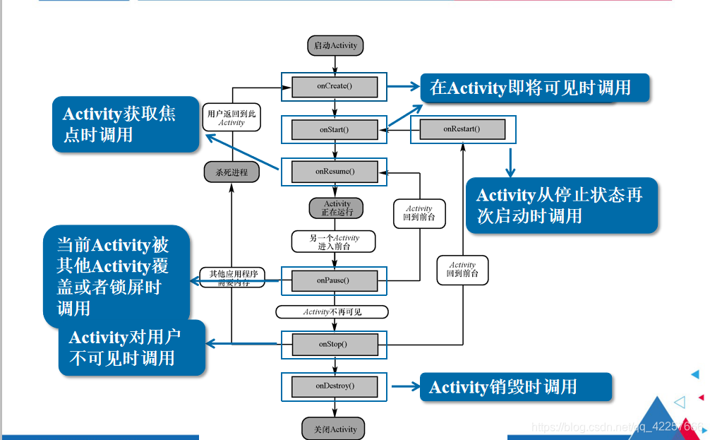
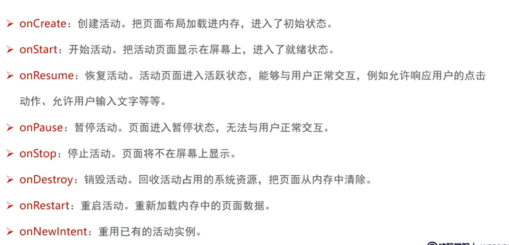
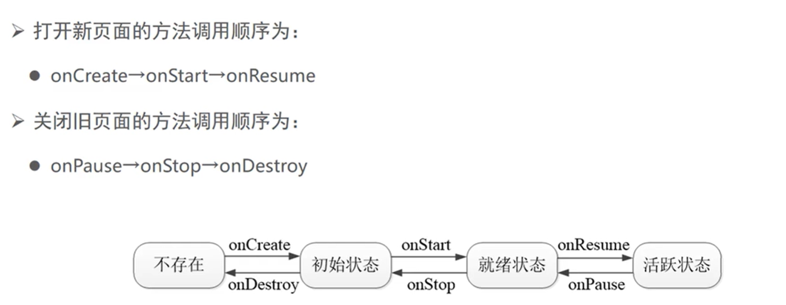
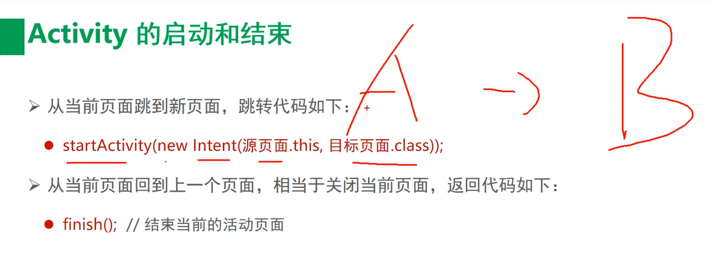
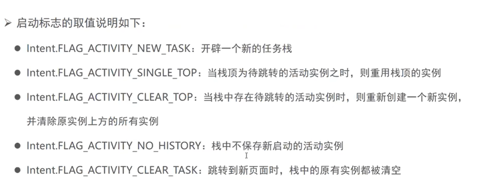
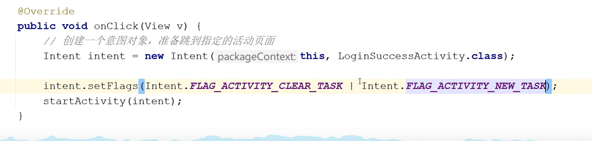
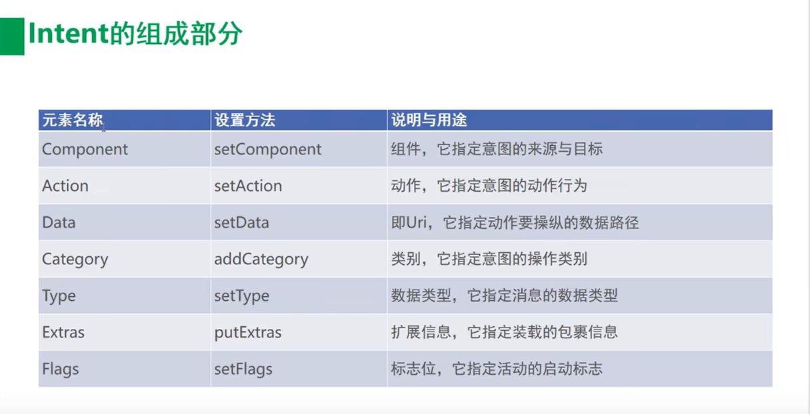
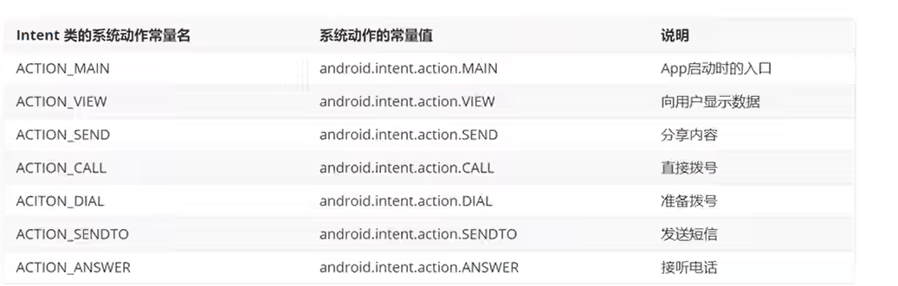
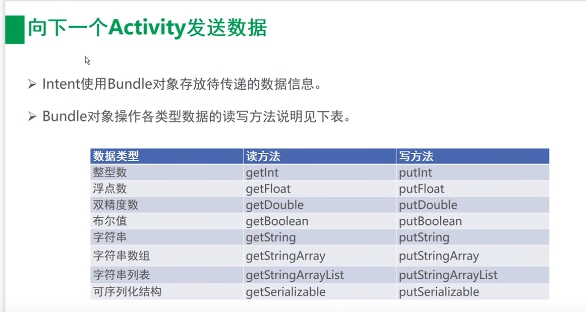

# 启动过程

这个流程图里应该有很多奥秘

就像是学习dll的加载流程一样，dll加载，dll卸载，......










# 页面跳转

dqx013

```java
startActivity(new Intent( MainActivity.this, page2.class));
```




在页面跳转中，非常重要的一步就是在Androidmanifest注册页面，否则无法跳转。


# 启动模式


dqx014: 实验了clearTOP

这个启动模式，感觉没太懂，感觉很重要又不是很重要。

另外可以在xml中设置启动模式，也可以在java中设置启动模式。


standard：标准默认启动，依次入 任务栈

> singleTop：栈顶复用，提高利用率。大概就是栈顶已经存在，直接使用，无线入栈出栈。

适合开启渠道多、多应用开启调用的Activity，通过这种设置可以避免已经创建过的Activity被重复创建，多数通过动态设置使用。

> singleTask：大概也是提高利用率，栈内出现的，必须用。用不到就pop其它的直到拿到目标activity

程序主界面:我们肯定不希望主界面被创建多次，而且在主界面退出的时候退出整个App是最好的效果.

耗费系统资源的Activity:对于那些及其耗费系统资源的Activity，我们可以考虑将其设为singleTask模式，减少资源耗费。

> singleInstacne 给新的activity创建单独的栈



关于登录页面：

标志很多，注意那几个常用的。

关于那个登录页面的设计。自己以后可以尝试去写一下有输入输出的登录页面。




# activity启动另外的app





显式跳转：dqx015

隐式跳转：dqx016, diy启动dqx015





# 向下一个activity传递数据  

字符串例子：dqx017




# 向上一个activity传递数据  

A-B，然后B传递数据给A，B自我结束。

dqx018


结束一个activity

```
context的finish()
android.os.process的killProcess()
```

