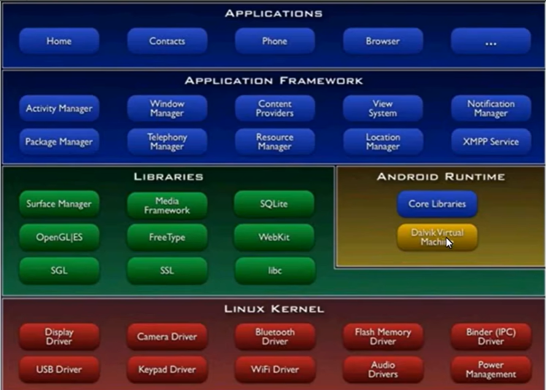

# 安卓操作系统架构





> Linux Kernel

在所有层的最底下是 Linux，它提供了基本的系统功能，比如进程管理，内存管理，设备管理（如摄像头，键盘，显示器）


> Android Runtime

有了这个,dex可以跑在Linux上

zygote：所有进程的孵化器进程


> Libraries

Android包含一个C/C++库的集合，供Android系统的各个组件使用。这些功能通过Android的应用程序框架（application framework）暴露给开发者


> Application Framework

通过提供开放的开发平台，Android使开发者能够编制极其丰富和新颖的应用程序。


> Applications

应用框架层以 Java 类的形式为应用程序提供许多高级的服务。

# 安卓应用程序组件


**四个主要组件**

| 组件名              | 描述                                    |
| :------------------ | :-------------------------------------- |
| Activities          | 描述UI，并且处理用户与机器屏幕的交互    |
| Services            | 处理与应用程序关联的后台操作            |
| Broadcast Receivers | 处理Android操作系统和应用程序之间的通信 |
| Content Providers   | 处理数据和数据库管理方面的问题          |


**附加组件**


| 组件名    | 描述                                           |
| :-------- | :--------------------------------------------- |
| Fragments | 代表活动中的一个行为或者一部分用户界面         |
| Views     | 绘制在屏幕上的UI元素，包括按钮，列表等         |
| Layouts   | 控制屏幕格式，展示视图外观的View的继承         |
| Intents   | 组件间的消息连线                               |
| Resources | 外部元素，例如字符串资源、常量资源及图片资源等 |
| Manifest  | 应用程序的配置文件                             |

 

# 拆分apk文件


```
assets: 资源文件，音频，数据库，网页，配置文件
res： 资源文件
resources.asrs 资源加密
classes.dex 源代码
lib：so文件
META-INF //apk的签名
```

如果直接修改二进制的话，文件的校验值就发生了改变，所以我们还需要去修改头部的checksum。


## Androidmanifest


