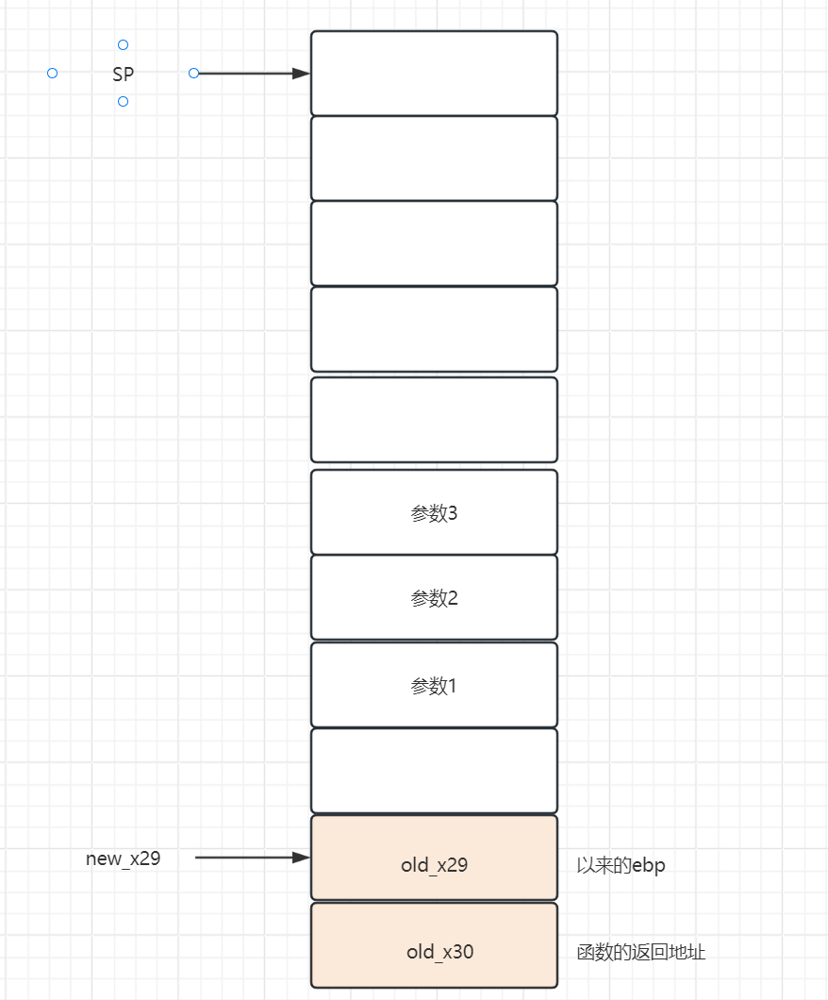

# arm64汇编学习

环境

Android Studio Jellyfish | 2023.3.1 Patch 1

NDK 26.1

arm64的可执行程序

ps：如何在Windows下把C语言编译为ARM汇编?[点我](https://www.cnblogs.com/xia-weiwen/p/13720864.html)


学习方法：

（前期）

前期没怎么系统的看文章，拿着菜鸟教程的100个C语言例子编译。

编译后把可执行程序托入IDA反汇编，然后看汇编代码。

# 首先认识寄存器


1. **X0 - X30**: 这些是 64 位通用寄存器。
2. **W0 - W30**: 这些是对应 X 寄存器的低 32 位部分。比如 W8 就是 X8 寄存器的低 32 位。


特殊用途的寄存器：

X29类似于EBP

X30存放函数返回地址

PC：当前程序运行的一个EIP

SP：类似于一个ESP的存在

PSR：类似于一个eflag的存在，标志位寄存器

# 取值存值


LDP 8字节取出，L就是Load加载的意思

STP 8字节存入，S就是Storage存储的意思

---

LDR 加载数据，但寻址计算用的**正数**运算,

LDUR  加载数据，但寻址计算用的**负数**运算 

LDRSW 有符号加载4字节

LDRH    取2字节

LDRSH  取2字节，符号扩充

LDURB 取1字节，无符号扩充

LDRB: 类似与这种带B的，意思是

STRH  存低2字节进去

# 寻址

LDRSW  X9, [X10,X11,LSL#2]   ；在x10+x11*4的地方取值， LSL#2意思是X11左移2位，也就是x4

STP X29, X30, [SP, #0x10] ； 把X29和X30的寄存器值存入SP+0x10的地方

LDP X29, X30, [SP, #0x10]  ；从内存地址 SP+0x10 取出数据到 X29, X30


# 跳转


## 无条件跳转

B ；类似于jmp

BL ；类似于call

BR     X8  ；跳转到x8寄存器指向的地址


## 条件跳转


### 大小比较|间接PSR


有符号的跳转 E: eaqul

```assembly
B.LT ;<
B.GT ;>
B.LE ;<=
B.GE ;>=
```

无符号的跳转,S:same

```assembly
B.LO ;<
B.HI ;>
B.LS ;<=
B.HS ;>=
```

B.EQ 等于跳转 

B.NE 不等于跳转


### 直接PSR

`B.CS        loc_182C` 如果PSR.C是1就跳转，不然继续往下执行

`B.PL    	loc_191C ` 如果PSR.N==0&&PSR.Z==0 才跳转，不然继续往下执行


### 其它条件

CBZ  寄存器==0跳转

CBNZ ：寄存器!=0跳转

TBZ    W8, #0, loc_18C8  ；如果w8第0个bit位是0，那么跳转。否则继续向下执行。

TBNZ W8, #0x1F, loc_18AC ；如果w8第0个0x1F位是1，那么跳转。否则继续向下执行。


# 常规运算

MOV 赋值

MOVI

SUBS 影响PSR的减法

SUB 不影响PSR的减法


# 位运算


`AND    W8, W8, #7`

`MVN    W8, W8` W8取反

`LSL    X8, X8, #3` 逻辑左移动3位

`LSR    W8, W8, #4` 逻辑右移动4位

`EOR    W8, W8, #3` w8=w8^3

`ORR   W8, W8, #7` w8=w8|7


# 其它指令


ADRL：lea取远地址

ADR：lea取近地址

CSET   W8, EQ ：如果PSR.Z=0，那么w8=1.不然w8=0

SMADDL  X8, W8, W10, X12   运算x8=w8*w10+x12


# 栈帧




