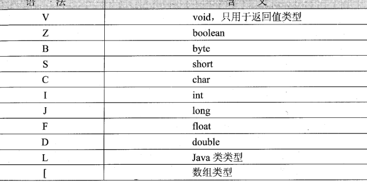

# 常见指令


## 跳转指令


### 无条件跳转

```
goto                :56
```


### 条件跳转

```
 if-ne               v1, v2, :26
 if-ge               v3, v4, :3A
 if-eqz              v2, :3C
```


## 四则运算

赋值：

```
const/16            v2, 72
const/4             v2, -1
const-string        v3, "He"


```


```
sub-long            v7, v4, v0 ;long类型的v7=v4-v0
add-int/lit8        v1, p2, 1  ;v1=p2+1
add-int/2addr 类似于add-int，但优于它
```


## 位运算


```
neg-int             v3, v2; 相对于v3=~v2
```


## 数组操作


```
array-length        v4, v2 ;计算v2数组的长度，记录到v4中
aget-object         v6, v2, v3 ;相当于v6=v2[v3]
aget                v2, p1, v0 ;相当于v2=p1[v0]
aput-object         v3, v1, v2 ;相当于v1[v2]=v3
new-array           v1, v0, [String ; 新建数组，String v1[v0]
filled-new-array    [Obect, v2 ; 相对于 new Object[v2] 创建数组
filled-new-array    [I, v2, v3, v4, v0, v1 ;创建一个int数组，成员是v2,...,v1。然后把结果返回
fill-array-data     v0, :68 ;用:68标注的位置取出数据填充到数组v0中，数组的初始化操作
invoke-static       Array->newInstance(Class, [I)Object, v2, v0; 创建一个v2类型的数组，该数组维度由v0决定。
```


创建多维数组的方式有点特殊

```
00000000  const/4             v0, 6
00000002  const/4             v1, 7
00000004  const/4             v2, 3
00000006  const/4             v3, 4
00000008  const/4             v4, 5
0000000A  filled-new-array    [I, v2, v3, v4, v0, v1
00000010  move-result-object  v0
```


## 函数

调用函数的方式

```
 invoke-super     调用父类函数
 invoke-static    调用静态函数
 invoke-virtual   调用普通函数
 invoke-direct    调用构造函数
 invoke-interface 调用接口方法
```

在 Smali 中，函数参数使用 **p 寄存器** 来表示。具体来说：

- **p0**：代表当前类的实例（`this` 指针）。
- **p1**：代表第一个参数。
- **p2**：代表第二个参数。
- **p3**：代表第三个参数。
- ...
- static修饰的函数是没有this指针的，所以p0此刻就不是this了，而是一个参数。


函数返回值通过move-result 给予

```
move-result         v1
move-result-object  v3
move-result-wide    v4 ;wide后缀表示和64位的数据长度有关
```




L<类名>;  // 对象类型
I  // 整数类型
Z  // 布尔类型
B  // 字节类型
S  // 短整型
C  // 字符类型
F  // 浮点数类型
D  // 双精度浮点数类型
V  // void 类型
[  // 数组类型

J //long 8字节

Object

String

[String

[Integer


# smali文件介绍

下面是一个smali的节选，我做一些解释

```smali
.class public Lcom/droider/crackme0502/MainActivity;
.super Landroid/app/Activity;
.source "MainActivity.java"


# annotations
.annotation system Ldalvik/annotation/MemberClasses;
    value = {
        Lcom/droider/crackme0502/MainActivity$SNChecker;
    }
.end annotation


# instance fields
.field private btnAnno:Landroid/widget/Button;

.field private btnCheckSN:Landroid/widget/Button;

.field private edtSN:Landroid/widget/EditText;


# direct methods
.method public constructor <init>()V

    .prologue
    .line 19
    invoke-direct {p0}, Landroid/app/Activity;-><init>()V

    return-void
.end method
```

首先我们观察前3行

```smali
.class public Lcom/droider/crackme0502/MainActivity;
.super Landroid/app/Activity;
.source "MainActivity.java"
```

第一行：该文件属于哪一个类

这个信息来自dex文件中，class_def.class_idx

第二行：该文件的父类是谁

这个信息来自dex文件中，class_def.superclass_idx

第三行：该文件的源文件名字

这个信息来自dex文件中，class_def.source_file_idx

## 成员变量

```smali
# instance fields
.field private btnAnno:Landroid/widget/Button;

.field private btnCheckSN:Landroid/widget/Button;

.field private edtSN:Landroid/widget/EditText;
```

这些是当前类的成员变量

该信息来自dex结构的

class_def.class_data.static_fields_size

class_def.class_data.instance_fields_size

class_def.class_data.static_fields

class_def.class_data.instance_fields

## 函数介绍

```smali
# direct methods
.method public constructor <init>()V
    .registers 1
    .prologue
    .line 19
    invoke-direct {p0}, Landroid/app/Activity;-><init>()V

    return-void
.end method
```

函数大概的样子也就是这样

对于非静态函数，p0：this指针，p1，p2，p3...分别是对应的参数

对于静态函数，p0，p1，p2...分别是对应的参数

.registers 说明当前函数要使用的寄存器个数

.prologue 指定函数代码开始的地方

.line 指定该行代码出现在源代码的多少行

## 反编译的特点

baksmali在反编译dex时，会给每一个类生成一个smali文件。

于是可以得出结论，一个smali文件就对应了一个类

但apktool在解包的时候，为什么会出现那么多莫名其妙的smali呢？

### 内部类+匿名类

```
MainActivity$1.smali
MainActivity$2.smali
MainActivity$SNChecker.smali
MainActivity.smali
```

比如此处的SNChecker就MainActivity的一个内部类

MainActivity$1.smali，MainActivity$1.smali 就是匿名类

### 注解类

1)），MemberClasses注解，描述一个类有哪些之类

如果一个类有子类，那么在它的smali文件中你就可以看见类似于下面这种的

```smali
# annotations
.annotation system Ldalvik/annotation/MemberClasses;
    value = {
        Lcom/droider/crackme0502/MainActivity$SNChecker;
    }
.end annotation
```

这种注解交代了该类有哪些子类

2），EnclosingMethod注解，描述作用范围 

```smali
.annotation system Ldalvik/annotation/EnclosingMethod;
    value = Lcom/droider/crackme0502/MainActivity;->onCreate(Landroid/os/Bundle;)V
.end annotation
```

3），EnclosingClass注解，描述作用范围是一个类，比如子类的范围是父类

```smali
.annotation system Ldalvik/annotation/EnclosingClass;   
    value = Lcom/droider/crackme0502/MainActivity;
.end annotation
```

4），InnerClass注解，

```smali
.annotation system Ldalvik/annotation/InnerClass;
    accessFlags = 0x1
    name = "SNChecker"
.end annotation
```

## 自动生成的类

1），资源R类

```
    R$attr.smali
    R$dimen.smali
    R$drawable.smali
    R$id.smali
    R$layout.smali
    R$menu.smali
    R$string.smali
    R$style.smali
    R.smali
```

2），BuildConfig类

这个类中只有一个boolean类型的名为DEBUG的字段，用来标识程发布版本，它的值默认是true，即程序以调试版本发布。

3），注解类