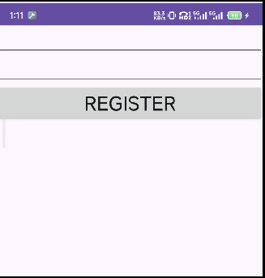
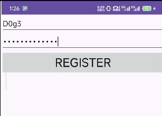

原理是把apk解包，在目标smali代码中插入log.d的代码，然后回编译。

# 案例1

链接：https://pan.baidu.com/s/1MRfTN4A_xDVk2EmREwzi8A?pwd=3mvv 

提取码：3mvv




功能：输入用户名和密码，点击按钮，会弹出正确和错误。

在输入用户名时，我们想要查看对应的密码

于是分析一下

先jadx分析，然后apktool解包分析

于是找到我们要注入的位置 

apk-body\smali_classes3\com\example\crackme_02\MainActivity$1.smali

```smlai
    iget-object v2, p0, Lcom/example/crackme_02/MainActivity$1;->this$0:Lcom/example/crackme_02/MainActivity;

    invoke-virtual {v2, v0}, Lcom/example/crackme_02/MainActivity;->calcSN(Ljava/lang/String;)Ljava/lang/String;

    move-result-object v2
    
    .line 38
    .local v2, "realSN":Ljava/lang/String;
    invoke-virtual {v1, v2}, Ljava/lang/String;->equalsIgnoreCase(Ljava/lang/String;)Z

    move-result v4
```

我们需要打印变量v2

1），增加当前函数局部变量个数

.locals 6 -> .locals 7

ps：为什么会有这一步？因为调用Log.d时需要一个tag参数，为了不影响其它参数，我们只能增加一个参数来存储字符串tag，我之前乱用寄存器，导致app无法正常启动。


2），插入代码

```smali
    iget-object v2, p0, Lcom/example/crackme_02/MainActivity$1;->this$0:Lcom/example/crackme_02/MainActivity;

    invoke-virtual {v2, v0}, Lcom/example/crackme_02/MainActivity;->calcSN(Ljava/lang/String;)Ljava/lang/String;

    move-result-object v2

    const-string v6, "dqx_logcat" 

    invoke-static {v6,v2}, Landroid/util/Log;->d(Ljava/lang/String;Ljava/lang/String;)I

    .line 38
    .local v2, "realSN":Ljava/lang/String;
    invoke-virtual {v1, v2}, Ljava/lang/String;->equalsIgnoreCase(Ljava/lang/String;)Z

    move-result v4
```

3），apk打包，然后MT管理器签名。

4），测试

我们开启adb logcat，然后对输出做一个过滤 find "dqx_logcat"

然后我们输入用户名和密码，然后点击按钮

```
C:\Users\tinyx
λ adb logcat | find "dqx_logcat"
```



然后得到输出

```
C:\Users\tinyx
λ adb logcat | find "dqx_logcat"
06-16 01:26:31.126 29661 29661 D dqx_logcat: c63308ab3ac99512c7bf78bae7e6a991
```


# 案例2

如果像之前一样插入代码的话，会有一些问题

1），为了保险起见，得增加当前函数参数个数

2），在调用log.d时，要传入2个参数，对于参数1其实我们不是很在意

3），如果要对log.d自定义，个性化时，插入代码貌似很麻烦，同时那一句代码好长好长

所以，我们可以写一个logcat的类，比如叫做crack.smali，又或者叫做logcat.smali

当我们在目标文件调用log.d时，直接调用我们自定义的log类即可。

相当于我们对log.d进行了一个封装

l0gcat.smali如下

```smali
.class public Ll0gcat;
.super Ljava/lang/Object;
.source "l0gcat.java"
 
.method public static log(Ljava/lang/String;)V
    .locals 1
    .prologue
 
    const-string v0, "dqx_info"
    invoke-static {v0, p0}, Landroid/util/Log;->d(Ljava/lang/String;Ljava/lang/String;)I
    return-void
.end method
```

把l0gcat.smali放到smali_classes的根目录，比如

```
├── AndroidManifest.xml
├── apktool.yml
├── kotlin
├── META-INF
├── original
├── res
├── smali
├── smali_classes2
├── smali_classes3
│   ├── com
│   │   └── example
│   │       └── crackme_02
│   │           ├── MainActivity$1.smali
│   │           └── MainActivity.smali
│   └── l0gcat.smali
```

然后在目标代码插入如下

```smali
    iget-object v2, p0, Lcom/example/crackme_02/MainActivity$1;->this$0:Lcom/example/crackme_02/MainActivity;

    invoke-virtual {v2, v0}, Lcom/example/crackme_02/MainActivity;->calcSN(Ljava/lang/String;)Ljava/lang/String;

    move-result-object v2
    # 插入部分
    invoke-static {v2}, Ll0gcat;->log(Ljava/lang/String;)V

    .line 38
    .local v2, "realSN":Ljava/lang/String;
    invoke-virtual {v1, v2}, Ljava/lang/String;->equalsIgnoreCase(Ljava/lang/String;)Z
```

之后就是apktool打包，然后签名安装，adb监听

```
C:\xxx\code\file>adb logcat | find "apple"
06-16 12:52:02.870  8264  8264 D apple   : 21232f297a57a5a743894a0e4a801fc3
06-16 12:52:18.006  8264  8264 D apple   : 2af36ef69ea753ce7f80c51add1b5354
```

发现是可以成功的