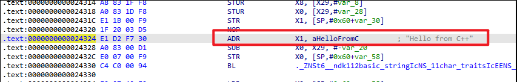
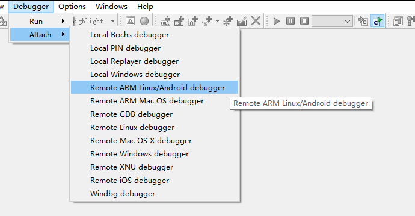
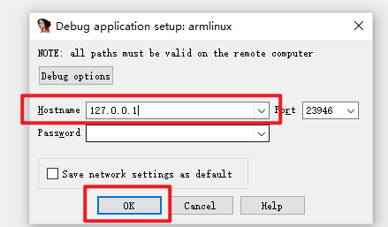
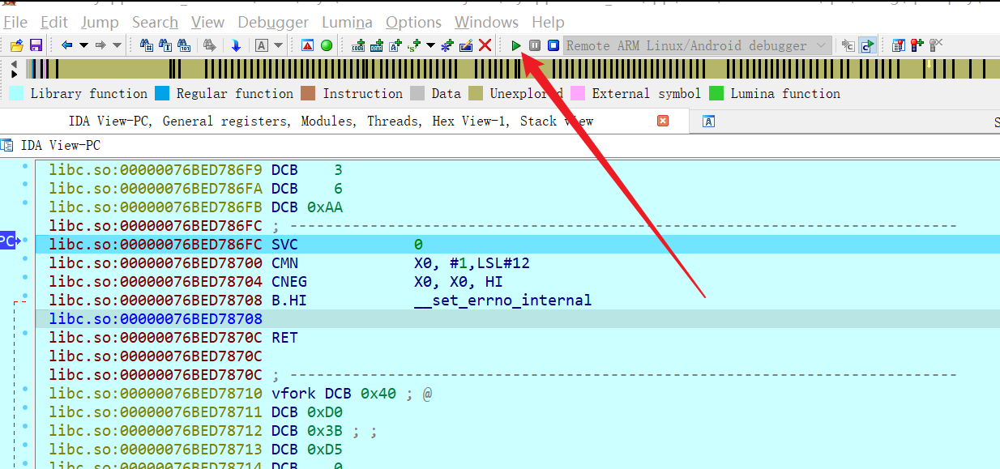
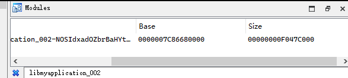
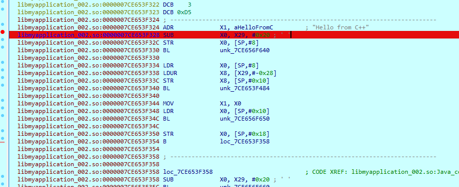
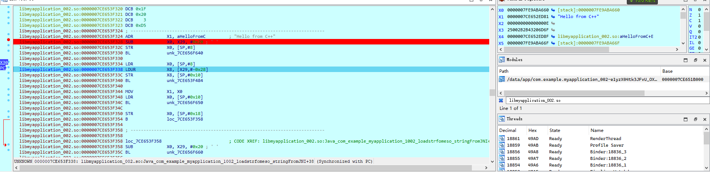

# 环境

root的oppo r15x 

IDA 7.5

链接：https://pan.baidu.com/s/14J5AXLbw6XjY4GF8UYQU7A?pwd=wnom 

提取码：wnom

apk程序的包名叫 com.example.myapplication_002

apk的安装

```
C:\xxxx\code\file>adb install -t loadso-middle.apk
Performing Streamed Install
Success
```


# 准备工作

解包apk，提取出so文件，逆向分析apk，IDA逆向分析so

如果不简单看看apk内容是干嘛的，您可能不太看得懂我下面的一些内容。

# 自动加载

也就是程序启动的时候就加载so了，而不是等用户去触发。

以load-start.apk为例。

我们定位字符串 `Hello from C++`

大概在引用字符串`Hello from C++`下断点



也就是我们在Base+0x24324的地方下断点

接下来准备调试so

1），root模式启动android_server64

```
PBCM10:/data/local/tmp/dbg # ./android_server64
IDA Android 64-bit remote debug server(ST) v7.7.27. Hex-Rays (c) 2004-2022
Listening on 0.0.0.0:23946...
```

2），adb端口转发

```
C:\Users\xxxx>adb forward tcp:23946 tcp:23946
23946
```

3），debug模式启动手机上的目标apk，（如果没安装就安装）

```
adb shell am start -D -n com.example.myapplication_002/com.example.myapplication_002.MainActivity
```

4），新开一个空白的IDA，附加我们的apk进程



然后输入ip



然后在列表中找到我们的进程，然后双击它。找不到就search

ps：如果不是root模式启动android_server64，就看不到这么多进程


附加成功之后，进入IDA界面，这时IDA会分析1-2秒钟，然后我们再F9。



5），然后打开ddms，或者叫做AppData\Local\Android\Sdk\tools\monitor.bat

这工具需要在JDK8下运行。


正常情况下，你没开Android Studio ，或者你关闭了Android Studio，或者其它之类的情况

图中会显示一个红色的虫子（必须是这个红色的虫子），然后最右边会显示一个端口号8600,或者其它端口8700......

接下来是3种不成熟的情况，麻烦依次看完


## 可能遇到的问题


#### 异常报错很频繁


> way1

在 \IDA\7.7\data\cfg\exceptions.cfg中，屏蔽一些常见的异常报错

方法是 把stop变为nostop

```
; Linux exceptions
.linux
1    stop mask warn SIGHUP    Hangup
2    stop mask warn SIGINT    Interrupt
3    stop mask warn SIGQUIT   Quit
4    nostop mask warn SIGILL    Illegal instruction
5    nostop mask warn SIGTRAP   Trace trap
6    nostop mask warn SIGABRT   Abort
7    stop mask warn SIGBUS    BUS error
8    stop mask warn SIGFPE    Floating-point exception
```


> way2


选择change exception definition，然后定义

这种方法和way-1不同的是，way2是临时的，way1是永久的。

way1的异常是有限的，way2的异常可以是没定义的new exception


## 情况1 IDA卡死

6），根据自己需要去设置一些条件断点，本案例的情况1，不需要去设置


然后, 输入 jdb -connect相关指令

涉及指令中的端口来自ddms，其它不需要修改

```
C:\Users\tinyx>jdb -connect com.sun.jdi.SocketAttach:hostname=127.0.0.1,port=8600
设置未捕获的java.lang.Throwable
设置延迟的未捕获的java.lang.Throwable
正在初始化jdb...
>
```

然后IDA正常运转。我们寻找so的模块，去目标的地址下断点

右键模块，jump to module base。

然后IDA卡死...本情况结束


如果你选择 Analyza module，但他会分析得很慢很慢，超级慢。

只能被迫取消 Analyza module，取消后再jump to module base。

当时我发现可以jump过去，但是jump过去后又卡死了。

## 情况2

在情况1基础上



可以发现base=0x7c86680000

然后我们去base+0x24324的地方下断点。

这里我们不是jump to modue base

而是按键 g，然后输入0x7c86680000+0x24324

然后在对应地方C一下，并在那里下断点breakpoint F2


然后我们点击按钮，就可以看见IDA断下来了


## 情况3

在IDA attach后，分析完毕，然后F9。

此刻我们设置条件断点, 也就是 `步骤5）`


然后输入下面这条指令 

```
jdb -connect com.sun.jdi.SocketAttach:hostname=127.0.0.1,port=8600
```

结果如下

```
C:\Users\xxxx>jdb -connect com.sun.jdi.SocketAttach:hostname=127.0.0.1,port=8600
设置未捕获的java.lang.Throwable
设置延迟的未捕获的java.lang.Throwable
正在初始化jdb...
>
```

然后IDA就会停下来，我们一步一步F9，加载模块

```
The initial autoanalysis has been finished.
7CE8A05000: loaded /apex/com.android.runtime/lib64/libopenjdkjvmti.so
7CE8993000: loaded /apex/com.android.runtime/lib64/libart-dexlayout.so
7CE8920000: loaded /apex/com.android.runtime/lib64/libjdwp.so
7CE88DA000: loaded /apex/com.android.runtime/lib64/libnpt.so
7CE43D1000: loaded /apex/com.android.runtime/lib64/libdt_fd_forward.so
7C8648C000: loaded /data/app/com.example.myapplication_002-NOSIdxadOZbrBaHYt4g3mQ==/lib/arm64/libmyapplication_002.so
```

当加载到目标模块时，jump to module base


然后再base+0x24324的地方下断点


然后debugger->debugger option->取消我们之前的event条件断点

然后F9。

当我们按下按钮，IDA就会停下来


# 触发加载

很多操作类似于`自动加载`

只不过触发加载中，so的加载是用户直接或者间接触发的

以load-mindle.apk为例。

我们的断点仍然在base+0x24324的地方，定位的依据仍然是字符串的引用`Hello from C++`


1），root启动server

```
c:\>adb shell
PBCM10:/ $ su
PBCM10:/ # cd /data/local/tmp/dbg
PBCM10:/data/local/tmp/dbg # ./android_server64-v7.7
IDA Android 64-bit remote debug server(ST) v7.7.27. Hex-Rays (c) 2004-2022
Listening on 0.0.0.0:23946...
```

2），端口转发

```
C:\Users\tinyx>adb forward tcp:23946 tcp:23946
23946
```

3），手机启动app

也就是在手机中双击启动

4），打开空白的IDA


之后填写ip 127.0.0.1

然后在进程列表找到 目标进程com.example.myapplication_002，双击，IDA加载apk进程后，

让IDA分析2-3秒，然后F9

5），设置event条件断点

工具栏->debugger->debug option


用户触发，然后so被load，此刻我们可以停止一下

当我们点击按钮，IDA停下来，因为so被加载了


然后在modules模块找到目标so，然后去往基地址


然后在base+0x24324地方下断点



然后继续F9，就可以发现它断在了base+0x24324了

 

