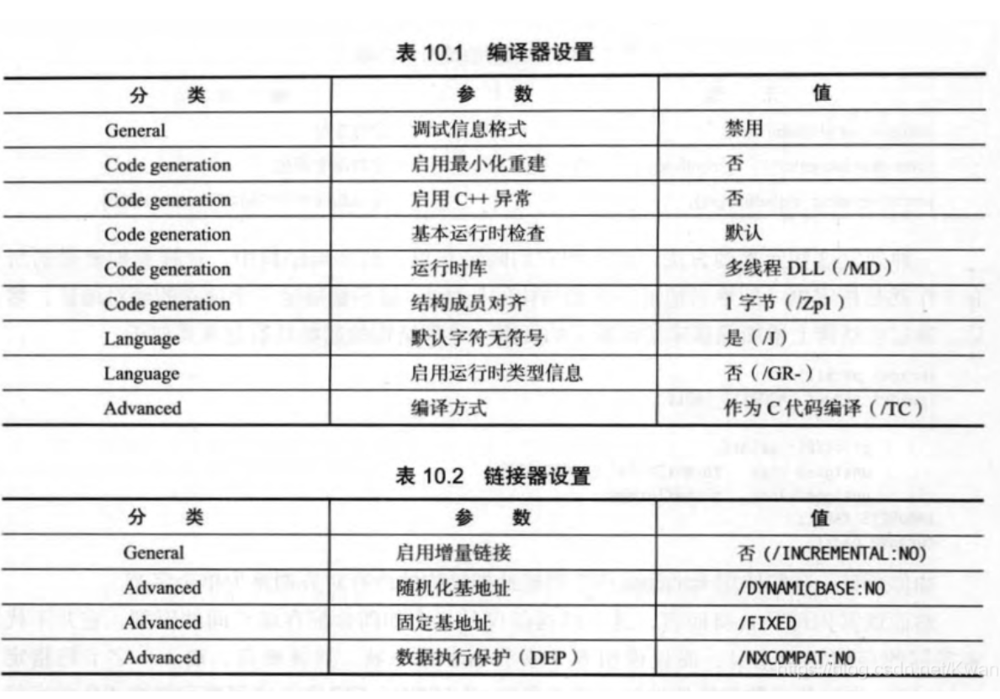

---
title: vs2019之C代码生成shellcode应注意什么
---


# 一些编译器的项目配置

项目->配置属性->链接器->高级->入口点中添加MyMian字段

项目->配置属性->C/C++->代码生成->安全检查，点击禁用安全检查

项目->配置属性->常规->平台工作集，选用Visual Studio 2017 - Windows XP (v141_xp)

项目->配置属性->链接器->清单文件->生成清单，改成否

项目->配置属性->链接器->调试->生成调试信息，改为否

项目->配置属性->C/C++->优化，修改为已禁用

项目->配置属性->C/C++->代码生成->运行库，改成MT格式

项目->配置属性->C/C++->语言->符合模式，改成否格式

因为编译器正常设置编译完的程序会默认带有一些安全设置，就比如checkEsp，相关的调用约定的函数调用完都有检查堆栈是否平衡等



在vs中,可以去配置这些设置

另外还要禁用优化,,,虽然我不知道是有什么影响


# 避免null字节


也就是我们的shellcode,要尽量的去避免00字节的出现


```c
#include <stdio.h>

void shell_code()
{
    for (;;)
        ;
}
void __declspec(naked) END_SHELLCODE(void) {}
int main(int argc, char *argv[])
{
    int sizeofshellcode = (int)END_SHELLCODE - (int)shell_code;

    // Show some info about our shellcode buffer
    printf("Shellcode starts at %p and is %d bytes long", shell_code. sizeofshellcode);

    // Now we can test out the shellcode by calling it from C!
    shell_code();

    return 0;
}
```


 
