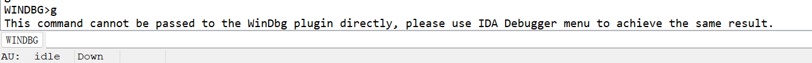

参考教材

```
https://www.cnblogs.com/kuangke/p/9397757.html
https://www.cnblogs.com/iBinary/p/13322607.html
https://blog.csdn.net/lixiangminghate/article/details/82631934
https://cloud.tencent.com/developer/article/2223542
```


# network调试

环境

```
win10 x64 21h2
IDA 7.5
WDK10
```


首先第一步我们需要配置要将 Windbg的路径设置到IDA

首先去IDA的安装目录,进入到 **CFG** 文件夹, 找到 **ida.cfg** 并且以文本文档形式打开

在文档中搜索 **DBGTOOLS** 如果找到,你的可能是注释的. 也就是前面有 // 去掉即可.

找到windbg的路径设置进去. 这里需要注意的是 设置的字符串一定是 双斜杠

```
DBGTOOLS = "E:\\InstallFile\\Rolan\\IBinaryToolsPacket\\RolanFile\\DebugTools\\Windbg\\X64\\";
```

这个写进去的是目录,不是文件的路径


然后win10开启调试模式

```
```


然后IDA开始附加

点击ida64.exe


然后点击`Debug options`


然后点击`Set spceific options`


然后选择内核调试


因为是用`network`调试

所以继续回来

在里面输入`net:port=50000,key=1.2.3.4`


然后OK

设置成功就会出现一下提示和相关界面


此时选中kernel 点击OK即可.


然后重点来了

再附加之后,,,,IDA会卡死,,,也可以说是假死

一直出现 加载中,,或者出现未响应的界面


这个时候

1), 你需要开VPN,因为IDA要去外网下载符号文件,,如果一直无法下载,,那就一直卡

2), 即使出现 未响应或者正在加载的界面,,,也要耐心等待了


最后成功的界面


可以看见我可以正确使用windbg命令


有些指令是不支持的

比如g命令




所以之后就是自己慢慢调试了


如果要正常脱离调试

需要我们int3暂停

然后选择deatch from process 脱离调试


# pipe调试

没使用这种方式
