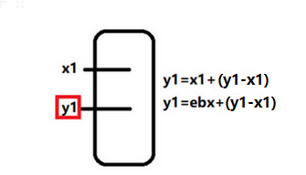
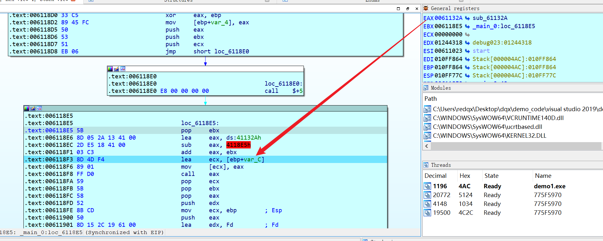
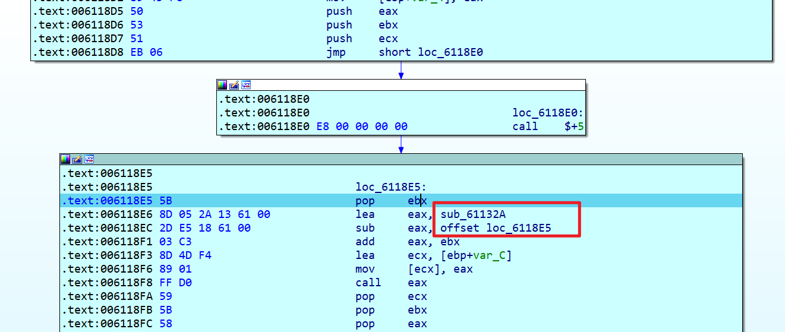
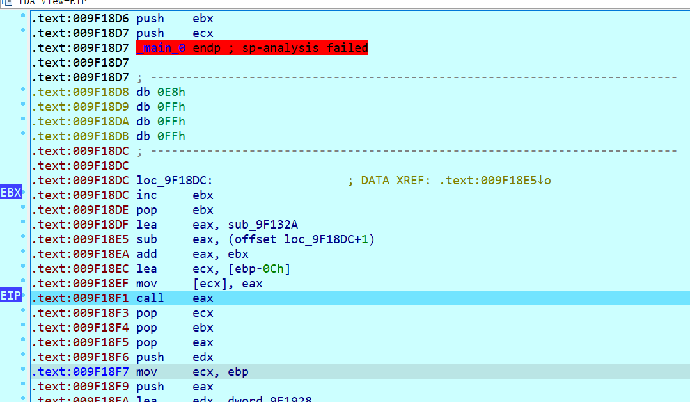

# x86之shellcode如何获取自己的eip

# 为什么会提出这个问题呢


一些shellcode在对自己的资源重定位上,,,会用到自我的eip定位

比如或者一些xxxx,如全局的变量,,如字符串,,,如函数,,,

这些都需要通过定位来实现,,,于是就引出如何获取eip这个问题了


# 方法


## 方法一:  call的入栈

就是把返回地址入栈

返回地址就是一个很真实的东西

常见的模型如下

```assembly
call tag;
tag:
pop eax;
```

这样就获取了`pop eax`汇编所在的eip地址了

然后通过后期的一些处理,,,就可以定位到自己的字符串


举一个例子



比如我们已知x1的地址,,如何获取y1的地址

那就是x1的真实地址+一个相对偏移,,然后就可以定位到y1

这个相对偏移,,比如是(y1地址-x1地址)

无论x1地址怎么变化,,,我们只要拿着x1的真实地址,,然后x1+一个偏移,,就可以获取y1的真实地址

所以,,大概就是这么一个道理,,,如果读者读不懂,,可以多看几遍


于是见一下代码

ps: 这个例子不太妥当,,,但是也想不到其它例子了

```c
#include<Windows.h>
#include<stdio.h>
void lpfuncAddr() {
    printf("you got me!\n");
    return;
}
int main() {
    DWORD* lp_apiAddr;

    __asm {
        push eax;
        push ebx;
        push ecx;
    label_code:
        call label_reloc;
    label_reloc:
        pop ebx;

        //重定位lpfuncAddr;
        lea eax, lpfuncAddr;
        sub eax, label_reloc;
        add eax, ebx;

        lea ecx, lp_apiAddr;
        mov[ecx], eax;

        call eax;

        pop ecx;
        pop ebx;
        pop eax;
    }


}
```

比如我们获取函数`lpfuncAddr`的地址,,存入到`lp_apiAddr`,并调用函数

ebx就是一个真实地址,,,然后`label_reloc`也是`pop ebx;`的一个原始地址,`label_reloc`也是一个原始地址

在汇编里面,下面这2巨汇编涉及的地址会被写死的

```assembly
        //重定位lpfuncAddr;
        lea eax, lpfuncAddr;
        sub eax, label_reloc;
```


然后我们尝试调试一下




可以看到真实的基地址是`00600000`,原始的是`00400000`

然后通过定位好,,可以看到,,,eax已经获取了目标函数了


为什么说,,这个例子举得不好,,,

因为exe会重定位的,,,就针对本代码而言



只不过,,之前的


是被我手动修改了罢了,,,但也不影响


## 方法二: call 重构


call类型来实现代码重构,,,

那是什么意思???


可以看到`  call    near ptr loc_9F18D8+4`

call的地址是0F18DC,然后返回地址`009F18DD`会入栈

然后call之后,,第一句执行的却是 `FFC3`

FFC3是inc ebx,,,虽然这个C3可以自定义,,比如inc eax是FFC2

所以FFC3其实就是一个代码重构,,拿着`E8 FF FF FF FF `的FF和C3一起重构为inc ebx

然后再来一个0x5B,也就是pop ebx,,把栈的返回值给拿出来,,,一样的实现了方法一的效果

只不过会比方法1多消耗一个字节,,,方法1用6字节,,,方法2用7字节,,,但是干扰效果比方法1好




例子如下

```c
#include<Windows.h>
#include<stdio.h>
void lpfuncAddr() {
    printf("you got me!\n");
    return;
}
int main() {
    DWORD* lp_apiAddr;

    __asm {
        push eax;
        push ebx;
        push ecx;
        _emit 0xE8;
        _emit 0xFF;
        _emit 0xFF;
        _emit 0xFF;
        _emit 0xFF; //上面完整的形成了一条汇编指令,,然后label_relo就是要入栈的地址
    label_reloc: 
        _emit 0xC3;
        _emit 0x5B;
        //重定位lpfuncAddr;
        lea eax, lpfuncAddr;
        sub eax, label_reloc;
        add eax, ebx;

        lea ecx, lp_apiAddr;
        mov[ecx], eax;

        call eax;

        pop ecx;
        pop ebx;
        pop eax;
    }


}
```


为什么我们在`_emit 0xFF;`后写`label_reloc: `,而不是其它字节之后呢???

```assembly
        _emit 0xE8;
        _emit 0xFF;
        _emit 0xFF;
        _emit 0xFF;
        _emit 0xFF; //上面完整的形成了一条汇编指令,,然后label_relo就是要入栈的地址
    label_reloc: 
```

这要追溯到方法1的原理了


ebx是call入栈的地址,,,也是x1的真实地址,,

我们要保证栈中的地址和x1地址是有关系的,,,,x1是原始的,,栈的是真实的

这就是为什么我们要在xxx后面写label_reloc地址了

```assembly
        _emit 0xE8;
        _emit 0xFF;
        _emit 0xFF;
        _emit 0xFF;
        _emit 0xFF; //上面完整的形成了一条汇编指令,,然后label_relo就是要入栈的地址
    label_reloc: 
```


## 方法三:  浮点运指令特性

什么特性呢?

在一个浮点数指令执行后,,,,他的执行地址会被特殊的保存起来

然后我们可以把保存的地址pop导出到栈中,然后读取出来


案例1

```assembly
.text:00A65084 D9 EE                         fldz
.text:00A65086 D9 74 24 F4                   fnstenv byte ptr [esp-12]
.text:00A6508A 5B                            pop     ebx
```


案例2

```assembly
debug043:00E00000 DA C5                         fcmovb  st, st(5)
debug043:00E00002 B8 5B 43 B1 DA                mov     eax, 0DAB1435Bh
debug043:00E00007 D9 74 24 F4                   fnstenv byte ptr [esp-12]
debug043:00E0000B 5D                            pop     ebp
```

案例3

```assembly
.data:0041A005 DA C9                         fcmove  st, st(1)
.data:0041A007 D9 74 24 F4                   fnstenv byte ptr [esp-12]
.data:0041A00B 5F                            pop     edi;edi直接获取0041A005
```

案例4

```assembly
.data:0041A01B fcmovbe st, st(2)
.data:0041A01D fnstenv byte ptr [esp-12]
.data:0041A021 pop     eax;eax直接获取0041A01
```

案例5

```assembly
.data:0041A036 fldpi
.data:0041A038 mov     ebx, 0F575EA6Bh
.data:0041A03D
.data:0041A03D loc_41A03D 
.data:0041A03D  fnstenv byte ptr [esp-12]
.data:0041A041 pop     ebp ;ebp直接获取0041A036 
```


总结规律

` fnstenv byte ptr [esp-12]` 会把最近最靠近的那个浮点数操作指令的地址入栈

然后pop 出来就是那个地址


所以常见浮点数操作

```assembly
D9 EE                         fldz
D9 EB                         fldpi
D9 C2                         fld     st(2)
DD C6                         ffree   st(6)
D9 CE                         fxch    st(6)
D9 E9                         fldl2t
DB D0                         fcmovnbe st, st
DA C9                         fcmove  st, st(1)
DA D2                         fcmovbe st, st(2)
DB C3                         fcmovnb st, st(3)
DA C5                         fcmovb  st, st(5)
DA D6                         fcmovbe st, st(6)
DB CF                         fcmovne st, st(7)
```


 

## 其它方法

中断: 说用int 2Eh 或者 int 2Ch 可以把下一条地址入ebx,没有实验成功

异常:  通过异常,可以记录异常发生的位置eip

但是没有超过过

# 后期

关于x64如何获取自己的RIP

