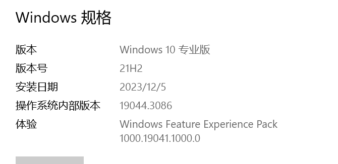
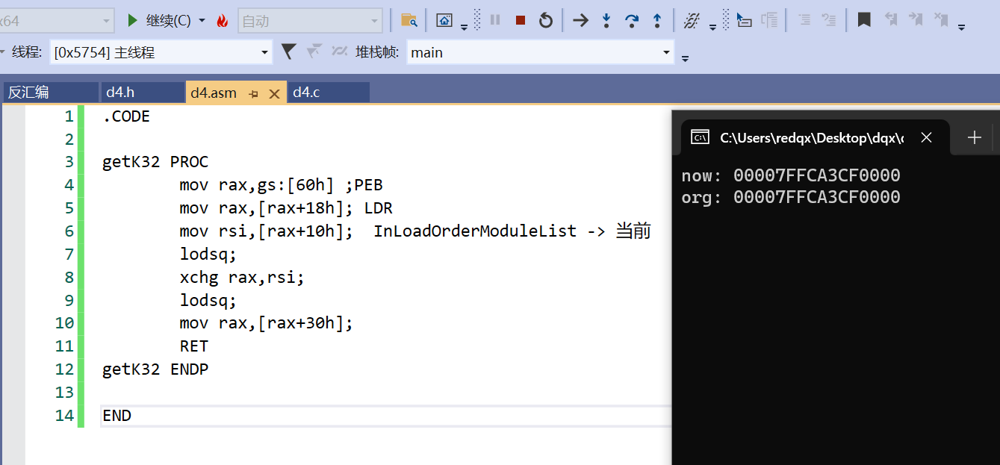
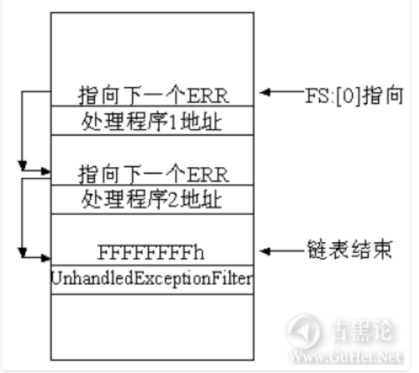
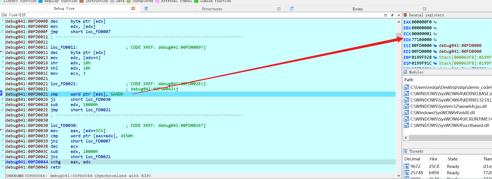

# shellcode之kernel32基地址获取

# PEB信息遍历


```
.CODE
  GetPeb PROC
    mov rax,gs:[60h]
  ret
  GetPeb ENDP
 END
```


原理:  PEB结构体信息遍历

使用前提: 好像没什么过分的环境要求

遍历的链子如下

```c
TEB->-PEB->Ldr->
	{
        InLoadOrderModuleList;
        InMemoryOrderModuleList;
        InInitializationOrderModuleList;
	}->DllBase
```

我们通过结构体遍历,,,可以获取目标的imagebase

另外还涉及其它结构体

```
_PEB_LDR_DATA
_LDR_DATA_TABLE_ENTRY
```

总涉及的结构体

```
TEB
PEB
Ldr
_PEB_LDR_DATA
_LDR_DATA_TABLE_ENTRY
```

我们可以直接获取PEB的地址, 然后通过结构体去找到PEB->Ldr->{1,2,3}->dllbase

PEB的寻找是通过汇编,,,汇编会写死,,所以就有了x86和x64区分

其余结构体会自动结构体编译时的架构,,自动的修改结构体的大小


然后这个方法和电脑的系统有关系,,因为和内核信息打交道

系统内核版本更新可能会导致方法失败



 

32位进程使用FS段寄存器指向TEB，64位进程使用GS段寄存器指向TEB

| 进程位数                     | 32bit      | 64bit      |
| :--------------------------- | :--------- | :--------- |
| **指向TEB的指针**            | FS段寄存器 | GS段寄存器 |
| **PEB在TEB结构体中的偏移量** | 0x30       | 0x60       |

LDR结构体记录了用户模块列表的  `加载顺序、内存顺序、初始化顺序` 也就是

```
    struct _LIST_ENTRY InLoadOrderModuleList;                               //0xc
    struct _LIST_ENTRY InMemoryOrderModuleList;                             //0x14
    struct _LIST_ENTRY InInitializationOrderModuleList;                     //0x1c
```

通过这3种顺序,,我们都可以找到kernel32.dll的加载信息的


TEB32结构体

```c
struct _TEB32
{
    struct _NT_TIB32 NtTib;                                                 //0x0
    ULONG EnvironmentPointer;                                               //0x1c
    struct _CLIENT_ID32 ClientId;                                           //0x20
    ULONG ActiveRpcHandle;                                                  //0x28
    ULONG ThreadLocalStoragePointer;                                        //0x2c
    ULONG ProcessEnvironmentBlock;                                          //0x30
    ULONG LastErrorValue;                                                   //0x34
    ...
}
```


TEB64结构体

```c
//0x1838 bytes (sizeof)
struct _TEB64
{
    struct _NT_TIB64 NtTib;                                                 //0x0
    ULONGLONG EnvironmentPointer;                                           //0x38
    struct _CLIENT_ID64 ClientId;                                           //0x40
    ULONGLONG ActiveRpcHandle;                                              //0x50
    ULONGLONG ThreadLocalStoragePointer;                                    //0x58
    ULONGLONG ProcessEnvironmentBlock;                                      //0x60
    ULONG LastErrorValue;                                                   //0x68
   ...
}; 
```


PEB结构体

```c
//0x480 bytes (sizeof)
struct _PEB
{
    UCHAR InheritedAddressSpace;                                            //0x0
    UCHAR ReadImageFileExecOptions;                                         //0x1
    UCHAR BeingDebugged;                                                    //0x2
    union
    {
        UCHAR BitField;                                                     //0x3
        struct
        {
            UCHAR ImageUsesLargePages:1;                                    //0x3
            UCHAR IsProtectedProcess:1;                                     //0x3
            UCHAR IsImageDynamicallyRelocated:1;                            //0x3
            UCHAR SkipPatchingUser32Forwarders:1;                           //0x3
            UCHAR IsPackagedProcess:1;                                      //0x3
            UCHAR IsAppContainer:1;                                         //0x3
            UCHAR IsProtectedProcessLight:1;                                //0x3
            UCHAR IsLongPathAwareProcess:1;                                 //0x3
        };
    };
    VOID* Mutant;                                                           //0x4
    VOID* ImageBaseAddress;                                                 //0x8
    struct _PEB_LDR_DATA* Ldr;                                              //0xc
    struct _RTL_USER_PROCESS_PARAMETERS* ProcessParameters;                 //0x10
    ...
 }
```


LDR结构体

```c
//0x30 bytes (sizeof)
struct _PEB_LDR_DATA //也就是
{
    ULONG Length;                                                           //0x0
    UCHAR Initialized;                                                      //0x4
    VOID* SsHandle;                                                         //0x8
    struct _LIST_ENTRY InLoadOrderModuleList;                               //0xc
    struct _LIST_ENTRY InMemoryOrderModuleList;                             //0x14
    struct _LIST_ENTRY InInitializationOrderModuleList;                     //0x1c
    VOID* EntryInProgress;                                                  //0x24
    UCHAR ShutdownInProgress;                                               //0x28
    VOID* ShutdownThreadId;                                                 //0x2c
}; 
```


 _LDR_DATA_TABLE_ENTRY结构体

```c
typedef struct _LDR_DATA_TABLE_ENTRY
{
     LIST_ENTRY InLoadOrderLinks;
     LIST_ENTRY InMemoryOrderLinks;
     LIST_ENTRY InInitializationOrderLinks;
     PVOID DllBase;
     PVOID EntryPoint;
     ULONG SizeOfImage;
     UNICODE_STRING FullDllName;
     UNICODE_STRING BaseDllName;
     ULONG Flags;
     WORD LoadCount;
     WORD TlsIndex;
     union
     {
          LIST_ENTRY HashLinks;
          struct
          {
               PVOID SectionPointer;
               ULONG CheckSum;
          };
     };
     union
     {
          ULONG TimeDateStamp;
          PVOID LoadedImports;
     };
     _ACTIVATION_CONTEXT * EntryPointActivationContext;
     PVOID PatchInformation;
     LIST_ENTRY ForwarderLinks;
     LIST_ENTRY ServiceTagLinks;
     LIST_ENTRY StaticLinks;
} LDR_DATA_TABLE_ENTRY, *PLDR_DATA_TABLE_ENTRY;
```

因为Windows内核结构体不是公开的,所以本次提供的结构体,,,可能有误

 

 

## InLoadOrderModuleList 

这是从laod顺序获取kernel32.dll的信息


我们先正常遍历一下所有模块信息

### x86,x64 C代码


```c
#include <Windows.h>
#include <stdio.h>

#ifndef __NTDLL_H__

#ifndef TO_LOWERCASE
#define TO_LOWERCASE(out, c1) (out = (c1 <= 'Z' && c1 >= 'A') ? c1 = (c1 - 'A') + 'a': c1)
#endif

typedef struct _UNICODE_STRING
{
    USHORT  Length;
    USHORT  MaximumLength;
    PWSTR   Buffer;
} UNICODE_STRING, * PUNICODE_STRING;

typedef struct _PEB_LDR_DATA
{
    ULONG       Length;
    BOOLEAN     Initialized;
    HANDLE      SsHandle;
    LIST_ENTRY  InLoadOrderModuleList;
    LIST_ENTRY  InMemoryOrderModuleList;
    LIST_ENTRY  InInitializationOrderModuleList;
    PVOID       EntryInProgress;
} PEB_LDR_DATA, * PPEB_LDR_DATA;

// 这里我们不想使用任何由外部模块导入的函数

typedef struct _LDR_DATA_TABLE_ENTRY {
    LIST_ENTRY InLoadOrderLinks;
    LIST_ENTRY InMemoryOrderLinks;
    LIST_ENTRY InInitializationOrderLinks;
    PVOID DllBase;
    PVOID EntryPoint;
    ULONG SizeOfImage;
    UNICODE_STRING FullDllName;
    UNICODE_STRING BaseDllName;
    ULONG Flags;
    WORD LoadCount;
    WORD TlsIndex;
    union
    {
        LIST_ENTRY HashLinks;
        struct
        {
            PVOID SectionPointer;
            ULONG CheckSum;
        };
    };
    union
    {
        ULONG TimeDateStamp;
        PVOID LoadedImports;
    };
    struct _ACTIVATION_CONTEXT* EntryPointActivationContext;
    PVOID PatchInformation;
    LIST_ENTRY ForwarderLinks;
    LIST_ENTRY ServiceTagLinks;
    LIST_ENTRY StaticLinks;
} LDR_DATA_TABLE_ENTRY, * PLDR_DATA_TABLE_ENTRY;


typedef struct _PEB {
    BOOLEAN InheritedAddressSpace;
    BOOLEAN ReadImageFileExecOptions;
    BOOLEAN BeingDebugged;
    BOOLEAN SpareBool;
    HANDLE Mutant;

    PVOID IMAGEBaseAddress;
    PPEB_LDR_DATA Ldr;
} PEB, * PPEB;

#endif

inline LPVOID get_module_by_name(WCHAR* module_name)
{
    PPEB peb = NULL;
#if defined(_WIN64)
    peb = (PPEB)__readgsqword(0x60);//读gs
#else
    peb = (PPEB)__readfsdword(0x30);//读fs
#endif
    PPEB_LDR_DATA ldr = peb->Ldr;
    PLDR_DATA_TABLE_ENTRY Flink = (PLDR_DATA_TABLE_ENTRY)ldr->InLoadOrderModuleList.Flink;
    PLDR_DATA_TABLE_ENTRY curr_module = Flink;

    while (curr_module != NULL && curr_module->DllBase != NULL)
    {
        if (curr_module->BaseDllName.Buffer == NULL)
            continue;
        WCHAR* curr_name = curr_module->BaseDllName.Buffer;
        size_t i = 0;
        wprintf(L"%s\n", curr_name);
        //for (i = 0; module_name[i] != 0 && curr_name[i] != 0; i++) 
        //{
        //    WCHAR c1, c2;
        //    //统一大小一下
        //    TO_LOWERCASE(c1, module_name[i]);
        //    TO_LOWERCASE(c2, curr_name[i]);
        //    if (c1 != c2) 
        //        break;
        //}
        //if (module_name[i] == 0 && curr_name[i] == 0) //说明比到最后了
        //{
        //    return curr_module->DllBase;
        //}
        curr_module = (PLDR_DATA_TABLE_ENTRY)curr_module->InLoadOrderLinks.Flink;
    }
    return NULL;
}
int main() {
    get_module_by_name(L"kernel32.dll");
    return 0;
}
```


输出如下


说明我们的kernel32.dll是第3个加载的

所以如果写汇编一次性获取的话

### x86内联汇编

```c
#include <windows.h>
#include <stdio.h>
 
void test(){
	HMODULE x86_kernel_base;
	HMODULE xx = GetModuleHandleA("kernel32.dll");
	//原理是InMemoryOrderModuleList的第一个结构体指向就是kernel32的,然后从结构体获取Dirbase
	__asm{
		push eax;
		mov eax, dword ptr fs : [30h];// 指向PEB结构
		mov eax, dword ptr[eax + 0Ch]; //指向LDR Ptr32 _PEB_LDR_DATA
		mov eax, dword ptr[eax + 0Ch]; //指向的是当前进程
		mov eax, dword ptr[eax]; //指向ntdll.exe
		mov eax, dword ptr[eax]; //指向kernel32.dll
		mov eax, dword ptr[eax + 0x18]; //指向DllBase基址
		mov x86_kernel_base, eax;
		pop eax;
	}
	printf("now: %p\n", x86_kernel_base);
	printf("org: %p\n", xx);
	return;
}
int main(){
 
	test();
	return 0;
}
```

输出如下


### x64汇编引用

vs2019: x64不能内敛汇编


demo.asm

```assembly
.CODE
 
getK32 PROC
		mov rax,gs:[60h] ;PEB
		mov rax,[rax+18h]; LDR
		mov rsi,[rax+10h];  InLoadOrderModuleList -> 当前
		lodsq;
		xchg rax,rsi;
		lodsq;
		mov rax,[rax+30h];
		RET
getK32 ENDP

END
```

demo.c

```c
#define  _CRT_SECURE_NO_WARNINGS
#include "demo.h"  
#include <windows.h>
#include <stdio.h>
 
void test() {
	PVOID peb;
	
	HMODULE x64_kernel_base;
	HMODULE xx = GetModuleHandleA("kernel32.dll");
	x64_kernel_base = getK32();
	printf("now: %p\n", x64_kernel_base);
	printf("org: %p\n", xx);
	return;
}
int main() {

	test();
	return 0;
}
```

demo.h

```c
#pragma once

#ifndef __ASMCODE_H
#define __ASMCODE_H

void* __stdcall getK32();

#endif
```


最后成功获取





## InMemoryOrderModuleList

这是从内存顺序获取kernel32.dll的信息

代码如下 注意,,我们的结构体`struct _LDR_DATA_TABLE_ENTRY`已经发生了变化

### x86,x64 C代码


```c
#include <Windows.h>
#include <stdio.h>

#ifndef __NTDLL_H__

#ifndef TO_LOWERCASE
#define TO_LOWERCASE(out, c1) (out = (c1 <= 'Z' && c1 >= 'A') ? c1 = (c1 - 'A') + 'a': c1)
#endif

typedef struct _UNICODE_STRING
{
    USHORT  Length;
    USHORT  MaximumLength;
    PWSTR   Buffer;
} UNICODE_STRING, * PUNICODE_STRING;

typedef struct _PEB_LDR_DATA
{
    ULONG       Length;
    BOOLEAN     Initialized;
    HANDLE      SsHandle;
    LIST_ENTRY  InLoadOrderModuleList;
    LIST_ENTRY  InMemoryOrderModuleList;
    LIST_ENTRY  InInitializationOrderModuleList;
    PVOID       EntryInProgress;
} PEB_LDR_DATA, * PPEB_LDR_DATA;

// 这里我们不想使用任何由外部模块导入的函数

typedef struct _LDR_DATA_TABLE_ENTRY {
    //LIST_ENTRY InLoadOrderLinks;
    LIST_ENTRY InMemoryOrderLinks;
    LIST_ENTRY InInitializationOrderLinks;
    PVOID DllBase;
    PVOID EntryPoint;
    ULONG SizeOfImage;
    UNICODE_STRING FullDllName;
    UNICODE_STRING BaseDllName;
    ULONG Flags;
    WORD LoadCount;
    WORD TlsIndex;
    union
    {
        LIST_ENTRY HashLinks;
        struct
        {
            PVOID SectionPointer;
            ULONG CheckSum;
        };
    };
    union
    {
        ULONG TimeDateStamp;
        PVOID LoadedImports;
    };
    struct _ACTIVATION_CONTEXT* EntryPointActivationContext;
    PVOID PatchInformation;
    LIST_ENTRY ForwarderLinks;
    LIST_ENTRY ServiceTagLinks;
    LIST_ENTRY StaticLinks;
} LDR_DATA_TABLE_ENTRY, * PLDR_DATA_TABLE_ENTRY;


typedef struct _PEB {
    BOOLEAN InheritedAddressSpace;
    BOOLEAN ReadImageFileExecOptions;
    BOOLEAN BeingDebugged;
    BOOLEAN SpareBool;
    HANDLE Mutant;

    PVOID IMAGEBaseAddress;
    PPEB_LDR_DATA Ldr;
} PEB, * PPEB;

#endif

inline LPVOID get_module_by_name(WCHAR* module_name)
{
    PPEB peb = NULL;
#if defined(_WIN64)
    peb = (PPEB)__readgsqword(0x60);//读gs
#else
    peb = (PPEB)__readfsdword(0x30);//读fs
#endif
    PPEB_LDR_DATA ldr = peb->Ldr;
    PLDR_DATA_TABLE_ENTRY Flink = (PLDR_DATA_TABLE_ENTRY)ldr->InMemoryOrderModuleList.Flink;
    PLDR_DATA_TABLE_ENTRY curr_module = Flink;

    while (curr_module != NULL && curr_module->DllBase != NULL)
    {
        if (curr_module->BaseDllName.Buffer == NULL)
            continue;
        WCHAR* curr_name = curr_module->BaseDllName.Buffer;
        size_t i = 0;
        wprintf(L"%s\n", curr_name);
        //for (i = 0; module_name[i] != 0 && curr_name[i] != 0; i++) 
        //{
        //    WCHAR c1, c2;
        //    //统一大小一下
        //    TO_LOWERCASE(c1, module_name[i]);
        //    TO_LOWERCASE(c2, curr_name[i]);
        //    if (c1 != c2) 
        //        break;
        //}
        //if (module_name[i] == 0 && curr_name[i] == 0) //说明比到最后了
        //{
        //    return curr_module->DllBase;
        //}
        curr_module = (PLDR_DATA_TABLE_ENTRY)curr_module->InMemoryOrderLinks.Flink;
    }
    return NULL;
}
int main() {
    get_module_by_name(L"kernel32.dll");
    return 0;
}
```

输出如下


### x86内联汇编


```c
#include <windows.h>
#include <stdio.h>

void test() {
	HMODULE x86_kernel_base;
	HMODULE xx = GetModuleHandleA("kernel32.dll");
	//原理是InMemoryOrderModuleList的第一个结构体指向就是kernel32的,然后从结构体获取Dirbase
	__asm {
		push eax;
		mov eax, dword ptr fs : [30h] ;// 指向PEB结构
		mov eax, dword ptr[eax + 0Ch]; //指向LDR Ptr32 _PEB_LDR_DATA
		mov eax, dword ptr[eax + 14h]; //指向当前进程
		mov eax, dword ptr[eax]; //指向ntdll
		mov eax, dword ptr[eax]; //指向Kernel32.dll
		mov eax, dword ptr[eax + 10h]; //指向DllBase基址
		mov x86_kernel_base, eax;
		pop eax;
	}
	printf("now: %p\n", x86_kernel_base);
	printf("org: %p\n", xx);
	return;
}
int main() {

	test();
	return 0;
}
```


### x64汇编引用

其它代码见上一个例子

demo.asm

```assembly
.CODE
 
getK32 PROC
		mov rax,gs:[60h] ;PEB
		mov rax,[rax+18h]; LDR
		mov rsi,[rax+10h + 2*8];  InLoadOrderModuleList -> 当前
		lodsq;
		xchg rax,rsi;
		lodsq;
		mov rax,[rax+30h - 2*8];
		RET
getK32 ENDP

END
```


## InInitializationOrderModuleList


这是从初始化顺序获取kernel32.dll的信息

代码如下 注意,,我们的结构体`struct _LDR_DATA_TABLE_ENTRY`已经发生了变化

### x86,x64通用代码

```c
#include <Windows.h>
#include <stdio.h>

#ifndef __NTDLL_H__

#ifndef TO_LOWERCASE
#define TO_LOWERCASE(out, c1) (out = (c1 <= 'Z' && c1 >= 'A') ? c1 = (c1 - 'A') + 'a': c1)
#endif

typedef struct _UNICODE_STRING
{
    USHORT  Length;
    USHORT  MaximumLength;
    PWSTR   Buffer;
} UNICODE_STRING, * PUNICODE_STRING;

typedef struct _PEB_LDR_DATA
{
    ULONG       Length;
    BOOLEAN     Initialized;
    HANDLE      SsHandle;
    LIST_ENTRY  InLoadOrderModuleList;
    LIST_ENTRY  InMemoryOrderModuleList;
    LIST_ENTRY  InInitializationOrderModuleList;
    PVOID       EntryInProgress;
} PEB_LDR_DATA, * PPEB_LDR_DATA;

// 这里我们不想使用任何由外部模块导入的函数

typedef struct _LDR_DATA_TABLE_ENTRY {
    //LIST_ENTRY InLoadOrderLinks;
    //LIST_ENTRY InMemoryOrderLinks;
    LIST_ENTRY InInitializationOrderLinks;
    PVOID DllBase;
    PVOID EntryPoint;
    ULONG SizeOfImage;
    UNICODE_STRING FullDllName;
    UNICODE_STRING BaseDllName;
    ULONG Flags;
    WORD LoadCount;
    WORD TlsIndex;
    union
    {
        LIST_ENTRY HashLinks;
        struct
        {
            PVOID SectionPointer;
            ULONG CheckSum;
        };
    };
    union
    {
        ULONG TimeDateStamp;
        PVOID LoadedImports;
    };
    struct _ACTIVATION_CONTEXT* EntryPointActivationContext;
    PVOID PatchInformation;
    LIST_ENTRY ForwarderLinks;
    LIST_ENTRY ServiceTagLinks;
    LIST_ENTRY StaticLinks;
} LDR_DATA_TABLE_ENTRY, * PLDR_DATA_TABLE_ENTRY;


typedef struct _PEB {
    BOOLEAN InheritedAddressSpace;
    BOOLEAN ReadImageFileExecOptions;
    BOOLEAN BeingDebugged;
    BOOLEAN SpareBool;
    HANDLE Mutant;

    PVOID IMAGEBaseAddress;
    PPEB_LDR_DATA Ldr;
} PEB, * PPEB;

#endif

inline LPVOID get_module_by_name(WCHAR* module_name)
{
    PPEB peb = NULL;
#if defined(_WIN64)
    peb = (PPEB)__readgsqword(0x60);//读gs
#else
    peb = (PPEB)__readfsdword(0x30);//读fs
#endif
    PPEB_LDR_DATA ldr = peb->Ldr;
    PLDR_DATA_TABLE_ENTRY Flink = (PLDR_DATA_TABLE_ENTRY)ldr->InInitializationOrderModuleList.Flink;
    PLDR_DATA_TABLE_ENTRY curr_module = Flink;

    while (curr_module != NULL && curr_module->DllBase != NULL)
    {
        if (curr_module->BaseDllName.Buffer == NULL)
            continue;
        WCHAR* curr_name = curr_module->BaseDllName.Buffer;
        size_t i = 0;
        wprintf(L"%s\n", curr_name);
        //for (i = 0; module_name[i] != 0 && curr_name[i] != 0; i++) 
        //{
        //    WCHAR c1, c2;
        //    //统一大小一下
        //    TO_LOWERCASE(c1, module_name[i]);
        //    TO_LOWERCASE(c2, curr_name[i]);
        //    if (c1 != c2) 
        //        break;
        //}
        //if (module_name[i] == 0 && curr_name[i] == 0) //说明比到最后了
        //{
        //    return curr_module->DllBase;
        //}
        curr_module = (PLDR_DATA_TABLE_ENTRY)curr_module->InInitializationOrderLinks.Flink;
    }
    return NULL;
}
int main() {
    get_module_by_name(L"kernel32.dll");
    return 0;
}
```

输出如下,,这一次输出不同了


少了当前进程模块

### x86内联汇编

然后用汇编一次性获取

```c
#include <windows.h>
#include <stdio.h>

void test() {
	HMODULE x86_kernel_base;
	HMODULE xx = GetModuleHandleA("kernel32.dll");
	//原理是InMemoryOrderModuleList的第一个结构体指向就是kernel32的,然后从结构体获取Dirbase
	__asm {
		push eax;
		mov eax, fs: [30h] ;
		mov eax, dword ptr[eax + 0ch];
		mov eax, dword ptr[eax + 1ch];// ntdll.dll
		mov eax, dword ptr[eax];// KERNELBASE.dll
		mov eax, dword ptr[eax];// KERNEL32.DLL
		mov eax, [eax + 08h];
		mov x86_kernel_base, eax;
		pop eax;
	}
	printf("now: %p\n", x86_kernel_base);
	printf("org: %p\n", xx);
	return;
}
int main() {

	test();
	return 0;
}

```


输出如下


### x64汇编引用

其它代码见上一个例子

```assembly
.CODE
 
getK32 PROC
		mov rax,gs:[60h] ;PEB
		mov rax,[rax+18h]; LDR
		mov rsi,[rax+10h + 2*8 + 2*8];  InLoadOrderModuleList -> 当前
		lodsq;
		xchg rax,rsi;
		lodsq;
		mov rax,[rax+30h - 2*8 - 2*8];
		RET
getK32 ENDP

END
```


## 优化问题

什么是优化问题,,,就是基于字节码的优化,,让尽可能少的字节码去获取kernel32的基地址

比如原始的

```assembly
mov eax, dword ptr fs : [30h] ;// 指向PEB结构
mov eax, dword ptr[eax + 0Ch]; //指向LDR Ptr32 _PEB_LDR_DATA
mov eax, dword ptr[eax + 14h]; //指向当前进程
mov eax, dword ptr[eax]; //指向ntdll
mov eax, dword ptr[eax]; //指向Kernel32.dll
mov eax, dword ptr[eax + 10h]; //指向DllBase基址
mov x86_kernel_base, eax;
```

优化后

```assembly
xor ecx, ecx
mov eax, fs: [ecx + 0x30] ;//获取PEB
mov eax, [eax + 0xc];// 获取LDR
mov esi, [eax + 0x14]; //获取 InMemOrder,然后已经指向了当前进程
lodsd;  //指向ntdll
xchg eax, esi;   //数据交换
lodsd; //指向Kernel32.dll
mov ebx, [eax + 0x10]; //获取Base address
```

下面这种,在字节码上可能存在更小的空间


# 基于暴力搜索法


其实原理是

```assembly
_declspec(naked) void test01() {
	__asm {
		//在这里,我们得提供ebx是一个kernel32的基地址
		shr edx, 16;//
		shl edx, 16;//
	tag_Next:
		//xor dx, dx; //尾部清0
		cmp  word ptr[edx], 0x5A4D;
		jz tag_IsPe;
		sub edx, 0x10000;
		jmp tag_Next;
	tag_IsPe:
		mov  eax, [edx + 0x3c];
		cmp  word  ptr[eax + edx], 0x4550;
		jnz  tag_Next;
		xchg  eax, edx;
	}
}
```


当我们提供一个kernel32.dll的地址

然后跟着这个地址往上遍历,,,就可以找到kernel32.dll的PE头了

关于汇编代码的一点讲解

kernel32.dll的**块对齐值是00001000h**, 并且一般**DLL以1M为边界**，

所以我们可以通过**10000h** (64k) 作为**跨度**，进行一个遍历

该方法的不足: 一是代码比较多，二是要处理搜索无效页面引发的异常


有很多地方我们都可以找到kernel32.dll的某个函数,,通过这个函数地址我们就可以追踪到kernel32的基地址

当然通过一些dll的顺序,,,比如我们获取了ntdll,,,从ntdll遍历上一个dll,没准就是kernel32.dll

这些都是可以的


## 特征1

原理; 远处线程注入的时候,,,,线程执行时,,特殊的栈环境

使用的前提: 需要在线程函数开始执行的地方获取


在远处线程注入的时候,先是之后就到了我们自己的线程了

下面是`ntdll_RtlUserThreadStart` 其中eax指向了我们的线程函数


当我们的线程得以执行的时候


可以看到,,,此刻栈顶是

```
018FFC38  76E200C9  KERNEL32.DLL:kernel32_BaseThreadInitThunk+19
```

那么我们就可以利用 76E200C9 去获取kernel32了

然后我们就可以利用这样的方式去获取kernel32的基地址

```assembly
_declspec(naked) void test01() {
	__asm {
		mov  edx, [esp];//
		shr edx, 16;//
		shl edx, 16;//
	tag_Next:
		//xor dx, dx; //尾部清0
		cmp  word ptr[edx], 0x5A4D;
		jz tag_IsPe;
		sub edx, 0x10000;
		jmp tag_Next;
	tag_IsPe:
		mov  eax, [edx + 0x3c];
		cmp  word  ptr[eax + edx], 0x4550;
		jnz  tag_Next;
		xchg  eax, edx;
	}
}
```

我把这样的x86的shellcode注入到x86进程后

下面是线程执行的情况


执行完毕后,,可以看见我们已经获取了kernel32.dll的基地址了` 0x76E00000`


## 特征2

原理: SEH处理链最后一个处理函数是kern32的

使用前提: 目前,,我的vs2019编译出来的东西,,最后一个处理函数他不是kernel32.dll的某个函数,,所以失败


基于特殊的SEH处理函数



然后UnHandleExceptionFilter是位于kernel32的

于是我们就可以利用这个去遍历kern32的基地址的

但是....

这个方法目前已经失效了

为什么...因为最后异常处理函数不再是UnHandleExceptionFilter

而是什么???


可以看到这是最后一个处理函数


其处理函数是指向ntdll的

所以不是kernel32的基地址了


那么我们可不可以从ntdll往上遍历呢....

从ntdll到wow64cpu.dll,然后到kernel32.dll

这看上去也还是一个不错的方法的


但是会遇到一个问题...

那就是内存访问异常,,,,

我遇到的情况是当遍历了wow64cpu.dll,,然后往上遍历



此刻,,,,edx是771B0000,,,,

出现了缺页的异常,,,,该地址没有对应的物理页,,,,

所以我们还得加一个异常处理,,,,,

但是这就会显得很麻烦了

重要的是,,如果你无法关闭目标进程的safeseh机制,,你的shellcode代码无法注册进seh处理链条


下面是一个例子,,,,是在目标进程成功利用seh机制的情况下

```assembly
	__asm {
		call tag_demo;
		tag_demo:
		pop edx;
		lea eax, tag_except;
		sub eax, tag_demo;
		add edx, eax;
		push edx;
		push dword ptr fs : [0] ;
		mov  dword ptr fs : [0] , esp

		mov  edx, fs : [00] ;
	tag_Next :
		inc [edx];
		jz tag_Krnl;
		dec[edx];
		mov  edx, [edx];
		jmp tag_Next;
	tag_Krnl:
		dec  [edx];
		mov  edx, [edx + 4];
		shr edx, 16;
		shl edx, 16;
		mov ecx, 3;
	tag_Loop :
		nop;
		cmp  word ptr [edx], 0x5A4D;
		jz tag_IsPe;
		sub edx, 0x10000;
		jmp tag_Loop;
	tag_IsPe:
		mov  eax, [edx + 0x3c];
		cmp  word ptr [eax + edx], 0x4550;
		jnz tag_Next;
		sub edx, 0x10000;
		dec ecx;
		jnz tag_Loop;
		xchg  eax, edx;

		mov eax, [ESP];
		mov FS : [0] , EAX;
		add esp, 8;
		ret;
	tag_except:
		xor eax, eax;
		dec eax;// EXCEPTION_CONTINUE_EXECUTION 是-1??
		ret
	//其实在遍历的时候,还是要处理一下内存访问的异常,,,,

	}
}
```

 


# 其它


其实我们找到一个kernel32.dll相关的函数,,,就可以找到kernel32的基地址了

这个函数不论是什么,,,,只要属于kernel32就行

当然通过其它dll,,,然后找到kernel32也行


# 关于start入口点的stack情况


在我们程序进入start后如下


在栈里面,,我们看到一些特殊的数据,,比如`75B000C9`和`75B000B0`

我们读取这个数据,,然后从75B000C9往上找,

从75B0000往上找,找到的第一个模块就是kernel32.dll的模块

如何找到第一个模块?

那就是看它是不是一个模块了,,比如是不是MZ开头,,,,也就是判断知否含有一个PE文件该有的身份特征了


比如通过如下方式去寻找

```c
DWORD32 GetKernel32_Addr(DWORD32 init_addr)
{
    unsigned int High_Page; // edi

    High_Page = init_addr & 0xFFFF0000;
    while (1)
    {
        if (*(DWORD*)High_Page == 0x00905A4D && *(DWORD*)(*(DWORD*)(High_Page + 60) + High_Page) == 0x00004550)//寻找PE和MZ标志
        {
            break;
        }
        High_Page -= 0x10000;
        if (High_Page < 0x70000000)
        {
            return 0;
        }
    }
    return High_Page;
}
```


# 后来的发现


我发现一些结构体,,,其实微软已经公开了

但是在哪一个头文件,,,以前不知道罢了

```
#include <winternl.h>
```


比如结构体 

```c
//LDR_DATA_TABLE_ENTRY
typedef struct _LDR_DATA_TABLE_ENTRY {
    PVOID Reserved1[2];
    LIST_ENTRY InMemoryOrderLinks;
    PVOID Reserved2[2];
    PVOID DllBase;
    PVOID Reserved3[2];
    UNICODE_STRING FullDllName;
    BYTE Reserved4[8];
    PVOID Reserved5[3];
#pragma warning(push)
#pragma warning(disable: 4201) // we'll always use the Microsoft compiler
    union {
        ULONG CheckSum;
        PVOID Reserved6;
    } DUMMYUNIONNAME;
#pragma warning(pop)
    ULONG TimeDateStamp;
} LDR_DATA_TABLE_ENTRY, *PLDR_DATA_TABLE_ENTRY;

```


```c
//_PEB_LDR_DATA 
typedef struct _PEB_LDR_DATA {
    BYTE Reserved1[8];
    PVOID Reserved2[3];
    LIST_ENTRY InMemoryOrderModuleList;
} PEB_LDR_DATA, *PPEB_LDR_DATA;
```


```c
//PEB
typedef struct _PEB {
    BYTE Reserved1[2];
    BYTE BeingDebugged;
    BYTE Reserved2[1];
    PVOID Reserved3[2];
    PPEB_LDR_DATA Ldr;
    PRTL_USER_PROCESS_PARAMETERS ProcessParameters;
    PVOID Reserved4[3];
    PVOID AtlThunkSListPtr;
    PVOID Reserved5;
    ULONG Reserved6;
    PVOID Reserved7;
    ULONG Reserved8;
    ULONG AtlThunkSListPtr32;
    PVOID Reserved9[45];
    BYTE Reserved10[96];
    PPS_POST_PROCESS_INIT_ROUTINE PostProcessInitRoutine;
    BYTE Reserved11[128];
    PVOID Reserved12[1];
    ULONG SessionId;
} PEB, *PPEB;
```

可以看到`winternl.h`中还是有很多东西的,,,,只不过没有详细的给出,,,但是也够用了

在_PEB中,我们可以找到 `PPEB_LDR_DATA Ldr`

在` _PEB_LDR_DATA`中,我们可以找到`InMemoryOrderModuleList`

在` _LDR_DATA_TABLE_ENTRY `中,我们可以找到`DllBase`和`ullDllName`

所以微软也还是提供了一些优先的信息的


通过以下链接,,我找到了一份代码并分析了一下

```
https://nickharbour.wordpress.com/2010/07/01/writing-shellcode-with-a-c-compiler/
https://segmentfault.com/a/1190000000375591
```


