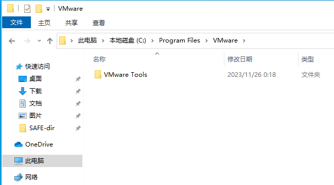
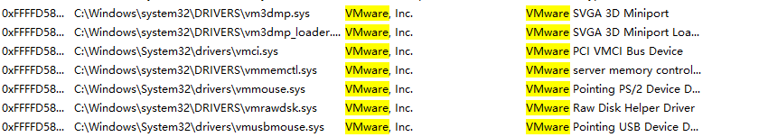
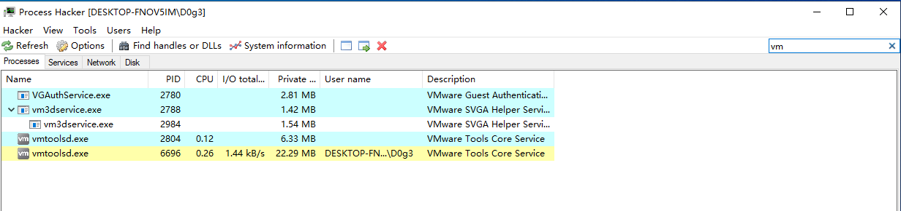
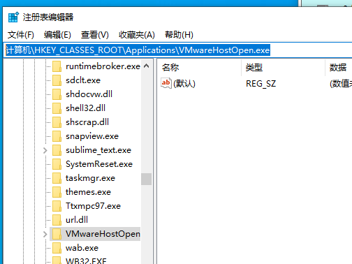
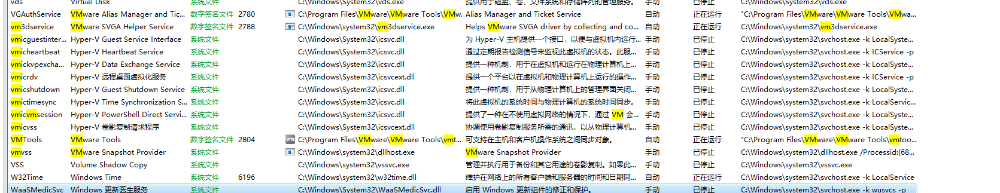

> wik-log\1.Wiki\RE\winRe\反调试\1.R3\反虚拟机

# 参考链接links

[一种简单的反虚拟机调试方法](https://drunkmars.top/2021/07/05/vmtest/)


# ---

其实就个人而言的话,,我认为反虚拟机技术就是检测虚拟机的特征

虚拟机会有哪些特征?

- 目录/文件的特征
- 进程的特征
- 服务的特征
- 基于底层指令的特征
- ...

同时,,请注意,,,一些特征信息具有时效性..

也就是随着版本的更新,,,一些信息会消失了

比如某个进程特征没了,,,感觉也是很正常的


# 目录特征


## wmare

```
C:\Program Files\VMware
C:\ProgramData\VMware
C:\Windows\Temp\vmware-SYSTEM
```




判断目录是否存在的api

```c
#include <shlwapi.h>
BOOL PathIsDirectory(
    LPCTSTR pszPath
);
```


# 文件检测

一些虚拟机特有的文件,当然也是基于目录的


## VMware


常规文件:

```
c:\windows\system32\drivers\vmtoolshook.dll
c:\windows\system32\drivers\vmtray.exe
c:\windows\system32\drivers\vmgfs.dll
```


驱动文件:

进入火绒剑,可以很好的观察



```
C:\Windows\system32\DRIVERS\vm3dmp.sys
C:\Windows\system32\DRIVERS\vm3dmp_loader.sys
C:\Windows\System32\drivers\vmci.sys
C:\Windows\system32\DRIVERS\vmmemctl.sys
C:\Windows\System32\drivers\vmmouse.sys
C:\Windows\system32\DRIVERS\vmrawdsk.sys
C:\Windows\System32\drivers\vmusbmouse.sys
C:\Windows\system32\DRIVERS\vsock.sys
C:\Windows\system32\DRIVERS\vmhgfs.sys
```


## VirtualBox

```
c:\windows\system32\drivers\VBoxMouse.sys
c:\windows\system32\drivers\vboxguest.sys
c:\windows\system32\vboxdisp.dll
c:\windows\system32\vboxhook.dll
```


# 进程信息

## VMware

比如只有vmware的虚拟机才特有的进程



于是我们就可以遍历进程,,如果发现有相关的进程,,,就说明此系统是vmware的虚拟机

ps: 进程遍历的代码还是比较简单的


从网上看到的其它信息

```
vm3dservice.exe
VGAuthService.exe
Vmtoolsd.exe
---
Vmwaretrat.exe
Vmwareuser.exe
Vmacthlp.exe
```


## VirtualBox

```
vboxservice.exe
vboxtray.exe
```

parakkeks desktop常见的进程

```
prl_tools.exe
```


# 注册表检测


通过读取主机具有虚拟机特性的注册表位置来判断是否处于虚拟机环境中。

## Vmware

```
计算机\HKEY_CLASSES_ROOT\Applications\VMwareHostOpen.exe
```




# 服务检测

去火绒剑找服务也是可以看到虚拟机特有的东西


## vmware





# MAC地址检测


## Vmware

```
00:05:69
00:0c:29
00:50:56
```


比如我去测试一下


## VirtualBox


```
08:00:27
```

