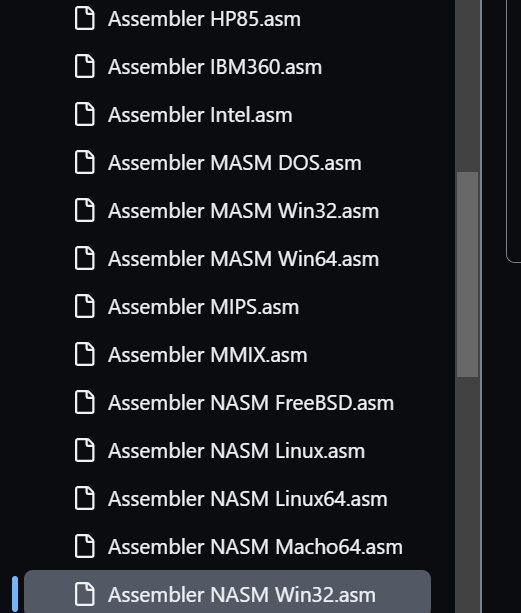

# helloworld仓库

在这个github仓库种,,有很多helloworld

https://github.com/ksdc2020/helloworld




# 函数调用约定

## cdecl

cdecl调用约定又称为C调用约定，是c/c++语言缺省的调用约定。参数按照从右至左的方式入栈，函数本身不清理栈，此工作有调用者负责，返回值在eax中。

由于由调用者清理栈，所以允许可变参数函数存在。

: 也就是在call 外面完成栈平衡

## stdcall

stdcall很多时候被称为pascal调用约定。pascal语言是早期很常见的一种教学用计算机程序设计语言，其语法严谨，参数按照从右至左的方式入栈，

函数自身清理堆栈，返回值在eax中。

: 也就是在call 内部完成栈平衡

## fastcall

fastcall的调用方式运行相对快，因为它通过寄存器来传递参数。它使用ecx和edx传送两个双字或更小的参数，

剩下的参数按照从右至左的方式入栈，函数自身清理堆栈，返回值在eax中。

: 也就是在call 内部完成栈平衡

## naked

naked是一个很少见的调用约定，一般不建议使用。编译器不会给这种函数增加初始化的清理代码，更特殊的是，

你不能用return返回返回值，只能用插入汇编返回结果，

此调用约定必须跟declspec同时使用，例如声明一个函数，如

```c
_declspec(naked) int add(int a,int b);
```


裸函数

我们写的代码一般会有主动的堆栈开辟

或者一些函数检测

裸函数就是没有这些东西哦,所有的代码都是自己写的

```c
#include<stdio.h>
void example5(int* a);

int main()
{
    int a = 10;
    example5(&a);
    printf("Flower_Dqx->%d", a);
}
//extern "C"  __declspec(naked) void func()
void __declspec(naked)__cdecl example5()//naked裸函数，开辟和释放堆栈由我们自己写。
{
    //你也可以在里面写一些C语言的东西,这是说不是有初始化,什么检测,什么堆栈开辟之类的
    _asm{
        ret;
    }
}
```


## pascal(废弃了)

这是pascal语言的调用约定，跟stdcall一样，参数按照从右至左的方式入栈，函数自身清理堆栈，返回值在 eax中，vc已经废弃了这种调用方式，因此在写vc程序时，建议使用stdcall。

## thiscall

这是c++语言特有的一种调用方式，用于类成员函数的调用约定。

如果参数确定，this指针存放于ecx寄存器，函数自身清理堆栈；

如果参数不确定，this指针在所有参数入栈后再入栈，调用者清理栈。

Thiscall不是关键字，程序员不能使用。参数按照从右至左的方式入栈。


# x64 寄存器调用约定


MASM（Microsoft Macro Assembler）用于编写 x64 架构的程序时，其汇编语法和寄存器调用约定如下：

1. - 前六个整型参数使用寄存器传递，按顺序依次是：RDI、RSI、RDX、RCX、R8、R9。
     - 如果有超过六个的整型参数，额外的参数将通过栈传递，从左到右依次压入栈中。
     - 浮点型参数使用 XMM0 到 XMM7 寄存器传递。
2. 返回值：
    - 整型和指针类型的返回值存储在 RAX 寄存器中。
    - 浮点型返回值使用 XMM0 寄存器。
3. Callee-Saved 寄存器：
    - RBP、RBX、R12、R13、R14、R15 被称为 Callee-Saved 寄存器，即被调用者保存的寄存器。
    - 在函数内部使用这些寄存器时，需要在函数开头保存其值，在函数末尾恢复其值。


# eflags

因为它的每一位代表不同的含义， 一般情况下我们只需要了解以下标志：

| 标志 | 位   | 含义                                                         |
| ---- | ---- | ------------------------------------------------------------ |
| CF   | 0    | 把一个寄存器看作无符号的,,加法进位和减法借位会导致CF=1       |
| PF   | 2    | 奇偶标志。 寄存器最后低8位看是不是有偶数个1,是的话PF=1       |
| AF   | 4    | 辅助进位标志。运算结果的最低字节的第三位向高位进位时，该标志为1，否则为0。 |
| ZF   | 6    | 0标志。运算结果未0时，该标志为1，否则为0。                   |
| SF   | 7    | 运输结果出现负数,SF=1,出现正数SF=0                           |
| DF   | 10   | 方向标志。该标志为1时，字符串指令每次操作后递减ESI和EDI，为0时递增。 |
| OF   | 11   | 计算的时候,把一个寄存器当作有符号的,如果\|负数+负数\|太大,或者\|正数+正数\|太大无法表示,那么OF=1 |

用按位与操作就可以得知某个标志是否为1。

OF=1: 有符号进位,借位

CF=1: 无符号的加法、减法和位移运中出现溢出

SF=1:  结果为负数, 否则非负数

ZF: 计算结果是0

PF: PF=0,偶数个1, 

# x86 短跳转 指令

我说的是短跳转指令,跳转范围只有-128,+128

0), JO/JNO: 0x70/0x71

1), JC/JNC: 0x72/0x73

> ps: 机器码,jc=jb=jnae,jnc=jnb=jae

2), JZ/JNZ: 0x74/0x75   

> ps:机器码,JE=JZ,JNE=JNZ

3), JBE/JA:0x76/0x77

4), JS/JNS: 0x78/0x79

5), JP/JNP: 0x7A/0x7B

6), JL/JGE: 0x7C/0x7D

7), JLE/JG: 0x7E/0x7F,

> ps:JLE=JNG

```
具体到条件的分类:
ZF = 1 或 SF = 1: JLE/JNG
ZF = 0 且 SF = 0: JA/JNBE
SF^OF=0 :JGE/JL
SF ^OF=1: JL/JNGE
OF: OF=1就JO ,OF=0就JNO
SF: SF=1就JS,SF=0就JNS
CF: CF=1就JC/JB/JNAE,CF=0就JAE/JNC
ZF: ZF=1就JZ/JE,ZF=0就JNZ/JNE
```

# x86之pushad和pusha

在vs里面

写pusha会被编译为pushaw, popa会被编译为popaw

写pushad会被编译为pusha,popad会被编译为popa


pushad/popad和EAX,ECX,EDX,EBX,ESI,EDI,ESP,EBP有关

pusha/popa和AX,CX,DX,BX,SI,DI,SP,BP有关
