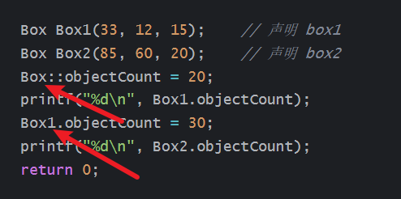

# class揭密

# 成员函数没什么特别的

比如我们有这样一个class

```cpp
class Box
{
public:
	int length;   // 长度
	int breadth;  // 宽度
	int height;   // 高度
	// 成员函数声明
	int get_public();
	void set(int len, int bre, int hei);
	friend int get_friendly(Box* box);
private:
	int get_private();
	char tmpMem1;
protected:
	int tmpMem2;
	int get_protected();
};
```

他的大小是多大呢? 是20字节=4x5, `tmpMem2和tmpMem3`占用4字节

同时先说一下,成员函数不占用,待会解释

```cpp
	int length;   // 长度
	int breadth;  // 宽度
	int height;   // 高度
	//占用3x4

	char tmpMem1//占用1x4,因为对齐
 
  int tmpMem2; //占用1x4
```

然后说一下,,为什么成员函数不占用class大小?

我们看看反汇编

```cpp
 	Box1.length = 1;
	Box1.breadth = 2;
	Box1.height = 3;

 
	Box2.length = 4;
	Box2.breadth = 5;
	Box2.height = 6;

	Box3 = new Box();
	Box1.set(10, 20, 30);
	Box2.set(40, 50, 60);
	Box3->set(70, 80, 90);

	volume = Box1.get_public();
	volume = Box2.get_public();
	volume = Box3->get_public();
```


可以看见调用成员函数

就直接调用了

根本没什么区别,,,除了每次都要传入ecx的this指针


所以成员函数它不属于单个类,,他是全局的,,,,

只要我们拿到一个成员函数的指针,然后传递ecx指针给成员函数

那么我们谁都可以去调用所有成员函数,不管是什么权限

一般的函数是

```cpp
int __cdecl func(int ,int )
```

而成员函数是

```cpp
int __thiscall func(int ,int )
```

# 毫无权限可言-成员变量

我们都知道,,成员变量是有权限的,,,

但是在反汇编的角度

是没有权限之分的,,只要我们拿到一个类的指针

我们就可以访问他的任意一个成员,,,,

比如下面

```cpp
class Box
{
public:
	char tmpMem1;

	// 成员函数声明
	int get_public();
	void set(int len, int bre, int hei);
	friend int get_friendly(Box* box);

private:
	int length;   // 长度
	int breadth;  // 宽度
	int height;   // 高度

	int get_private();

protected:
	int tmpMem2;

	int get_protected();

};
```

我们尝试拿到clas指针,然后访问它的`private`变量

其中

```cpp
// 成员函数定义
int Box::get_public()
{
	return length * breadth * height;
}
// 成员函数定义
int Box::get_protected()
{
	return length * breadth * height;
}
```

完整如下

```cpp
#include <stdio.h>

//using namespace std;

typedef int (*TYPE_get)(void*);

class Box
{
public:
	char tmpMem1;

	// 成员函数声明
	int get_public();
	void set(int len, int bre, int hei);
	friend int get_friendly(Box* box);

private:
	int length;   // 长度
	int breadth;  // 宽度
	int height;   // 高度

	int get_private();

protected:
	int tmpMem2;

	int get_protected();

};
int get_friendly(Box* th1s){
	int* arr = (int*)th1s;
	return arr[0] * arr[1] * arr[2];
	//因为length;breadth;height是连续的4字节
}
// 成员函数定义
int Box::get_public()
{
	return length * breadth * height;
}
void Box::set(int len, int bre, int hei)
{
	length = len;
	breadth = bre;
	height = hei;
}
int  get_outside(void* th1s){
	int* arr = (int*)th1s;
	return arr[1] * arr[2] * arr[3];
	//因为length;breadth;height是连续的4字节
}
//// 成员函数定义
//int Box::get_private()
//{
//	return length * breadth * height;
//}
//// 成员函数定义
//int Box::get_protected()
//{
//	return length * breadth * height;
//}

int main()
{
	Box Box1;        // 声明 Box1，类型为 Box
	Box Box2;        // 声明 Box2，类型为 Box
	Box *Box3;
	int volume = 0;     // 用于存储体积
	//void* func1;
	//void* func2;
 
  
	Box3 = new Box();
	Box1.set(10, 20, 30);
	Box2.set(40, 50, 60);
	Box3->set(70, 80, 90);

	volume = Box1.get_public();
	//volume = Box2.get_public();
	//volume = Box3->get_public();
	printf("%d %d", volume, get_outside(&Box1));
	
	return 0;
}
```

我们尝试输出一下


可以看见,就是我们的`get_outside` 不是成员函数,,也一样可以访问到私有的变量

# 继承

比如我们有这样一份代码

```cpp
#include <iostream>

using namespace std;

// 基类
class Shape
{
public:
	void setWidth(int w)
	{
		width = w;
	}
	void setHeight(int h)
	{
		height = h;
	}
protected:
	int width;
	int height;
};

// 派生类
class Rectangle : public Shape
{
public:
	int tmp;
	int getArea()
	{
		return (width * height);
	}
};

int main(void)
{
	Rectangle *Rect = new  Rectangle;//开辟了8个字节
	Rectangle *Rect2 = new  Rectangle;//开辟了8个字节
	Rect->setWidth(1);
	Rect->setHeight(2);
	Rect2->setWidth(3);
	Rect2->setHeight(4);
	// 输出对象的面积
	cout << "Total area: " << Rect->getArea() << endl;
	cout << "Total area: " << Rect2->getArea() << endl;
	return 0;
}
```

## 让自己的体积变大了

我们知道父类大小是8字节

那么子类大小是多少呢? 实际是12字节,,,,

因为编译器把父类的成员变揉进了子类中

我们看看反汇编


可以看见,我们new了12字节,意思就是子类拥有3个4字节,,,,

从内存角度,

那东西不是集成父类的,,本身就是子类的,,,

因为没有任何证据说明这些多出的8字节来自哪里….

## 父类函数调用

我们在之前就说过,,,

函数不属于任何一个类,,,

所以在反汇编眼里,,,没有调用父类函数这么一说的,,,,

只要传入ecx指针即可,谁都可以调用

## 父类成员引用

此刻,,,我得拿出之前class的定义了

```cpp
#include <iostream>

using namespace std;

// 基类
class Shape
{
public:
	void setWidth(int w)
	{
		width = w;
	}
	void setHeight(int h)
	{
		height = h;
	}
private:
	int width;
protected:
	int height;
};

// 派生类
class Rectangle : public Shape
{
public:
	int tmp = 0x10;
	int getArea(int* arr)
	{
		return (arr[0] * arr[1] * arr[2]);
	}
};

int main(void)
{
	Rectangle *Rect = new  Rectangle;//开辟了8个字节
	Rectangle *Rect2 = new  Rectangle;//开辟了8个字节
	Rect->setWidth(2);
	Rect->setHeight(2);
	Rect2->setWidth(2);
	Rect2->setHeight(2);
	// 输出对象的面积
	cout << "Total area: " << Rect->getArea((int*)Rect) << endl;
	cout << "Total area: " << Rect2->getArea((int*)Rect2) << endl;
	return 0;
}
```

首先,,我得说明

`tmp` 不是 `class Rectangle` 的第一个成员

`class Rectangle` 的在内存中第一个成员,来自父类的的第一个成员

但是也不完全是父类的,,还取决于爷爷类,,

但是也不完全是爷爷类的,,还取决于最根部那个类

现在又有一个问题….?

父类的所有成员,,,子类都会继承吗?

细心的我们会发现…答案是:确实继承了,,不管说明父类权限的成员,,都继承了

为什么?


因为子类大小是12字节…

并且….getArea可以正确计算数值

```cpp
	int getArea(int* arr)
	{
		return (arr[0] * arr[1] * arr[2]);
	}
```


# 拷贝构造是这么回事

示例代码如下

```cpp
#include <iostream>

using namespace std;

class Line
{
public:
	int getLength(void);
	Line(int len);             // 简单的构造函数
	Line(const Line& obj);      // 拷贝构造函数
	~Line();                     // 析构函数

private:
	int* ptr;
};

// 成员函数定义，包括构造函数
Line::Line(int len)
{
	//cout << "调用构造函数" << endl;
	// 为指针分配内存
	ptr = new int;
	*ptr = len;
}

Line::Line(const Line& obj)
{
	//cout << "调用拷贝构造函数并为指针 ptr 分配内存" << endl;
	ptr = new int;
	*ptr = *obj.ptr; // 拷贝值
}

Line::~Line(void)
{
	//cout << "释放内存" << endl;
	delete ptr;
}
int Line::getLength(void)
{
	return *ptr;
}

void display(Line obj)
{
	cout << "line 大小 : " << obj.getLength() << endl;
}
void display2(Line* obj)
{
	cout << "line 大小 : " << obj->getLength() << endl;
}

// 程序的主函数
int main()
{
	Line line1(10);

	Line line2 = line1; // 这里也调用了拷贝构造函数

	display(line1);// 这里也调用了拷贝构造函数,传递值
	display(line2);// 这里也调用了拷贝构造函数,传递值
	display2(&line2);//不触发拷贝构造,传递指针
	return 0;
}
```

然会反汇编


涉及3次拷贝构造,然看看具体的参数传递


上面的反汇编,对应的是

```cpp
	Line line2 = line1; // 这里也调用了拷贝构造函数
```

分别传递了2个指针进去

然后看看拷贝工作内部

```cpp
_DWORD *__thiscall sub_413030(_DWORD *this, _DWORD **a2)
{
  *this = operator new(4u);
  *(_DWORD *)*this = **a2;
  return this;
}
```

可以看见,2个参数,一个this指针,一个是a2

之前,我们在源代码中就提到,,,

display会默认调用拷贝构造


如果所示,,确实是这样的

同时还有一个比较有意思的事情,,,

```cpp
void display(Line obj)
{
	cout << "line 大小 : " << obj.getLength() << endl;
}
```

display函数会触发一个拷贝构造,,,

但是,,,,,拷贝构造开辟的内存,,,谁来释放???
一个类开辟的内存会在函数的末尾主动去释放,,比如


main函数一开头就有2个类,,自然就涉及2个析构函数

那么拷贝构造开辟的内存谁来释放???

答案可以在反汇编中看到

```cpp
int __cdecl sub_4142F0(char a1)
{
  int v1; // eax
  int v2; // eax
  int v4; // [esp-8h] [ebp-60h]
  int v5; // [esp-4h] [ebp-5Ch]

  v4 = sub_41141F(&a1, sub_41135C);
  v1 = sub_411249(std::cout, Str);
  v2 = std::ostream::operator<<(v1, v4, v5);
  std::ostream::operator<<(v2);
  return xg(&a1);
}
```

我们的display函数,,,会在末尾是这样返回的

```cpp
 return xg(&a1);
```

所以display会自动释放它临时调用的拷贝构造开辟的内容

正是因为如此….

```cpp
Line::Line(const Line& obj)
{
	//cout << "调用拷贝构造函数并为指针 ptr 分配内存" << endl;
	ptr = new int;
	*ptr = *obj.ptr; // 拷贝值
}
```

我们的拷贝构造不能写为

```cpp
Line::Line(const Line& obj)
{
	ptr = obj.ptr; // 拷贝值
}
```

因为,,,这样会导致我们多次释放同一块内存

# 友元会让class变胖吗?

代码如下

```cpp
class Box
{
    
public:
    int height;
    friend void printWidth(Box box);//这东西是否占用
    friend class BigBox;//这东西是否占用
    void setWidth(int wid);
    int width;
};
Box box1;
```

比如我尝试去输出box1和box1.width,box1.height的地址

如果BigBox占用Box的内存,,,那么width和height的地址就会差距ng

如果BigBox不占据内存,,,那么width和height的地址就会差距4

输出如下

```
00DFF96C
00DFF970
00DFF96C
```

然后发现width地址和box1地址一样,,,width地址和height地址差4

这说明了友元函数和友元类不会增加本类的大小

# 谈谈 **static**

为什么类的static函数不能访问类的成员变量?

类的static函数是程序已启动,运行到entrypoint就存在的

而类的成员变量是需要运行到指定地址,然后等待实例化,,才可以使用的

而且他们的生命周期不同,出生时间不同,所以不能直接调用

静态成员函数没有 this 指针，只能访问静态成员（包括静态成员变量和静态成员函数）。

普通成员函数有 this 指针，可以访问类中的任意成员

class的静态变量是全局的且只属于一个class,,,

而不是属于某一个对象

由同一个class实例化的对象共同使用一个static变量

类只是在源码中限制了该静态变量的访问,,,比如对他的访问权限什么的

示例代码如下

```cpp
#include <iostream>

using namespace std;

class Box
{
public:
    static int objectCount;
    // 构造函数定义
    Box(int l = 20, int b = 20, int h = 90)
    {
       // cout << "Constructor called." << endl;
        length = l;
        breadth = b;
        height = h;
        // 每次创建对象时增加 1
        objectCount++;
    }
    int Volume()
    {
        return length * breadth * height;
    }
    static int getCount()
    {
        return objectCount;
    }
private:
    int length;     // 长度
    int breadth;    // 宽度
    int height;     // 高度
};

// 初始化类 Box 的静态成员
int Box::objectCount = 0;

int main(void)
{

    // 在创建对象之前输出对象的总数
    //cout << "Inital Stage Count: " << Box::getCount() << endl;

    Box Box1(33, 12, 15);    // 声明 box1
    Box Box2(85, 60, 20);    // 声明 box2
    Box::objectCount = 20;
    printf("%d\n", Box1.objectCount);
    Box1.objectCount = 30;
    printf("%d\n", Box2.objectCount);
    return 0;
}
```

实际的输出

```
20
30
```

我通过类目Box修改静态变量

所有类的那个都跟着修改

我修改一个已经被实例化的静态变量

另外一个静态变量也跟着修改....

这说明了什么?? 别人就是一个全局变量,,,但加了一些类的属性进去罢了

不论你有多少个实例化的类,,属于该class的静态变量只有一个

然后我们尝试去逆向分析一下上面的代码


可以看到我们分别从不同的实例化的类去访问静态变量


可以看到,,他调用的是相同的变量

然后我们再来看看



分别从类名,,已经实例化的类去访问静态变量,,如何


可以看到我们仍然是访问了相同的变量位置

# 运算符重载是怎么回事