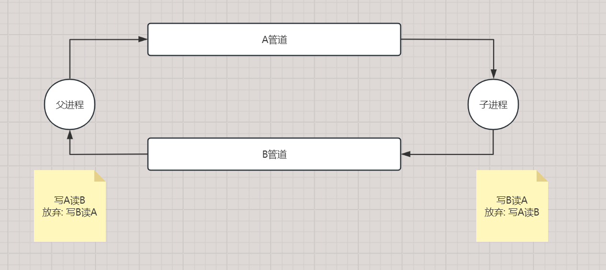

# 管道通信

# 参考链接links

```c
https://www.cnblogs.com/thankgoodness/articles/1762596.html
https://www.cnblogs.com/LyShark/p/17524996.html
https://www.cnblogs.com/zhangxuan/p/6704915.html
https://blog.csdn.net/qq_37232329/article/details/120393753
未看的:
https://ifmet.cn/posts/fe544e10/

```

# —

网上有对pipe的介绍,众说纷纭,层出不穷

自己也懒得查官方文档

自己的理解就是:

- 匿名管道是一种临时的管道，只能用于父子进程之间或兄弟进程之间的通信。它是一个双向的、无名的、半双工的通道，只能在创建它的进程及其子进程之间进行通信。
- 命名管道是一种具有名称的管道，可以用于在不同的进程之间进行通信。命名管道可以在不同的进程之间共享，并可以在多个进程之间传递数据。它可以是单向的或双向的，可以使用同步或异步方式进行通信。

自己遇到的

要么就是匿名管道,父进程子进程通信

命名管道,,同一计算机之间进程间通信

# 管道原理介绍

## 命名管道

命名管道是由服务器端的进程建立的，

管道的命名必须遵循特定的命名方法，就是 "\\.\pipe\管道名"，

当作为客户端的进程要使用时，使用"\\计算机名\\pipe\管道名" 来打开使用

具体步骤如下：

服务端通过函数 CreateNamedPipe 创建一个命名管道的实例并返回用于今后操作的句柄，

或为已存在的管道创建新的实例。

服务端侦听来自客户端的连接请求，

该功能通过 ConnectNamedPipe 函数实现。

客户端通过函数 WaitNamedPipe 来等待管道的出现，如果在超时值变为零以前，

有一个管道可以使用，则 WaitNamedPipe 将返回 True，

并通过调用 CreateFile 或 CallNamedPipe 来呼叫对服务端的连接。

此时服务端将接受客户端的连接请求，成功建立连接，

服务端 ConnectNamedPipe 返回 True 建立连接之后，

客户端与服务器端即可通过 ReadFile 和 WriteFile，

利用得到的管道文件句柄，彼此间进行信息交换。 

当客户端与服务端的通信结束，客户端调用 CloseFile，服务端接着调用 DisconnectNamedPipe。

最后调用函数CloseHandle来关闭该管道。

## 匿名管道

使用匿名管道的步骤如下：

使用 CreatePipe 建立两个管道，得到管道句柄，一个用来输入，一个用来输出

准备执行控制台子进程，首先使用 GetStartupInfo 得到 StartupInfo

使用

第一个管道句柄代替 StartupInfo 中的 hStdInput，

第二个管道代替 hStdOutput、hStdError，即标准输入、输出、错误句柄

使用 CreateProcess 执行子进程，这样建立的子进程输入和输出就被定向到管道中

父进程通过 ReadFile 读第二个管道来获得子进程的输出，

通过 WriteFile 写第一个管道来将输入写到子进程

父进程可以通过 PeekNamedPipe 来查询子进程有没有输出

子进程结束后，要通过 CloseHandle 来关闭两个管道。

如下面

 



# 相关API

**CreatePipe**

```c
BOOL CreatePipe(
  PHANDLE hReadPipe,                      // 读取管道数据的句柄指针
  PHANDLE hWritePipe,                     // 写入管道数据的句柄指针
  LPSECURITY_ATTRIBUTES lpPipeAttributes, // 指向安全属性结构的指针
  DWORD nSize                             // 管道缓冲区大小，若为0则使用默认大小
);
```

其中，`hReadPipe`和`hWritePipe`是`PHANDLE`类型的指针，

用于接收读取和写入管道的句柄。

`lpPipeAttributes`是指向`SECURITY_ATTRIBUTES`结构的指针，

用于指定管道的安全属性，通常设置为`NULL`。

`nSize`是管道缓冲区的大小，若为0则使用默认大小。

在使用`CreatePipe`函数创建匿名管道后，读者可以使用`WriteFile`函数往管道中写入数据，

也可以使用`ReadFile`函数从管道中读取数据。读取和写入管道的操作需要使用相应的句柄。

<aside>
💡 小提示：匿名管道只能在具有亲缘关系的进程之间使用，即父子进程或兄弟进程，


通过设置`CreateProcess`函数中的`bInheritHandles`属性为`True`则可实现父子进程，

如果需要在不同的进程之间使用管道进行通信，则应该使用命名管道。

</aside>

**PeekNamedPipe**

 

```c
BOOL PeekNamedPipe(
  HANDLE  hNamedPipe,        // 命名管道的句柄
  LPVOID  lpBuffer,          // 存储读取数据的缓冲区
  DWORD   nBufferSize,       // 缓冲区的大小
  LPDWORD lpBytesRead,       // 实际读取的字节数
  LPDWORD lpTotalBytesAvail, // 管道中可用的字节数
  LPDWORD lpBytesLeftThisMessage // 下一条消息剩余的字节数
);
```

该函数用于检查命名管道中的是否有数据，函数返回值为`BOOL`类型，

如果函数调用成功，则返回`TRUE`，否则返回`FALSE`

在调用成功的情况下，

`lpBytesRead`参数返回实际读取的字节数，

`lpTotalBytesAvail`参数返回管道中可用的字节数，

`lpBytesLeftThisMessage`参数返回下一条消息剩余的字节数。

如果命名管道为空，则函数会阻塞等待数据到来，

当接收到数据时则读者即可通过调用`ReadFile`在管道中读取数据，

或调用`WriteFile`来向管道写入数据，至此关键的API函数已经介绍完了；

ps: 好像他并不是一个阻塞函数的

# 案例1 双管道cmd通信

假如我们有2个管道

每一个管道都有2个句柄,一个用于读,一个用于写

读写貌似不能同时进行

一个管道pipe只能被A写入,然后被B读取,,

或者A对pipe读写全部揽了

如下面


我们尝试实现一个匿名管道…

子进程是cmd

父进程发指令

父进程对A发指令

子进程从A读取指令,然后执行,执行结果写入B

父进程从B读取执行结果

就这样有顺序的执行

A管道一直没消息,子进程就一直等待

代码示例

```c
#define _CRT_SECURE_NO_WARNINGS
#include <windows.h>
#include <stdio.h>

 
int main(int argc, char* argv[])
{

	HANDLE pA[2];
	HANDLE pB[2];

	SECURITY_ATTRIBUTES sa1 = { 0 };
	SECURITY_ATTRIBUTES sa2 = { 0 };
	STARTUPINFO          si = { 0 };
	PROCESS_INFORMATION pi = { 0 };

	sa1.nLength = sizeof(sa1);
	sa1.lpSecurityDescriptor = NULL;
	sa1.bInheritHandle = TRUE;

	sa2.nLength = sizeof(sa2);
	sa2.lpSecurityDescriptor = NULL;
	sa2.bInheritHandle = TRUE;

	/*
			1W-> A ->R0
(father)	 				(son)
			0R<- B <-W1
	*/

	CreatePipe(&pA[0], &pA[1], &sa1, 0);
	CreatePipe(&pB[0], &pB[1], &sa2, 0);
	GetStartupInfo(&si);
	si.cb = sizeof(STARTUPINFO);
	si.dwFlags |= STARTF_USESTDHANDLES;
	si.hStdInput = pA[0];
	si.hStdOutput = si.hStdError = pB[1];
	si.dwFillAttribute = 1000;

 
	if (!CreateProcess(
		"c:\\Windows\\System32\\cmd.exe",
		NULL, NULL, NULL, TRUE,
		CREATE_NO_WINDOW,
		NULL, NULL,
		&si, &pi)){
		printf("CreateProcess Error!\n");
	}

	//关闭 双管道通信不需要使用的句柄
	CloseHandle(pA[0]);
	CloseHandle(pB[1]);

	char bufA[256];
	char bufB[4096];
 

	DWORD dwByteWritten;
	DWORD dwByteRead;
	DWORD TotalBytesAvail;
	while (1)
	{
		printf("\n$ ");

		memset(bufA, 0, 256);
		gets(bufA);//不能 scanf
		
		if (strcmp(bufA, "cls") == 0){
			system("cls");
			continue;
		}
		if (strcmp(bufA, "exit") == 0){
			break;
		}

		strcat(bufA, "\r\n"); 
		WriteFile(pA[1], bufA, strlen(bufA), &dwByteWritten, 0);
		

		while (1)
		{
			//FlushFileBuffers(B_W);
			FlushFileBuffers(pB[0]);
			FlushFileBuffers(pA[1]);
			//FlushFileBuffers(A_R);
			if (PeekNamedPipe(pB[0], bufB, sizeof(bufB), &dwByteRead, &TotalBytesAvail, NULL))
			{
				if (TotalBytesAvail > 0)
				{
					memset(bufB, 0, sizeof(bufB));
					ReadFile(pB[0], bufB, TotalBytesAvail + 100, &dwByteRead, NULL);
					// 发送数据
					printf("%s", bufB);
				}
				else{
					break;
				}
			}
			Sleep(1000); // 延时等待，避免过多的CPU占用
		}
	}
	CloseHandle(pA[1]);
	CloseHandle(pB[0]);

	CloseHandle(pi.hProcess);
	CloseHandle(pi.hThread);
	 
}
```

运行如下


