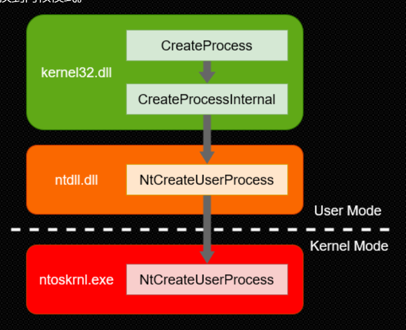
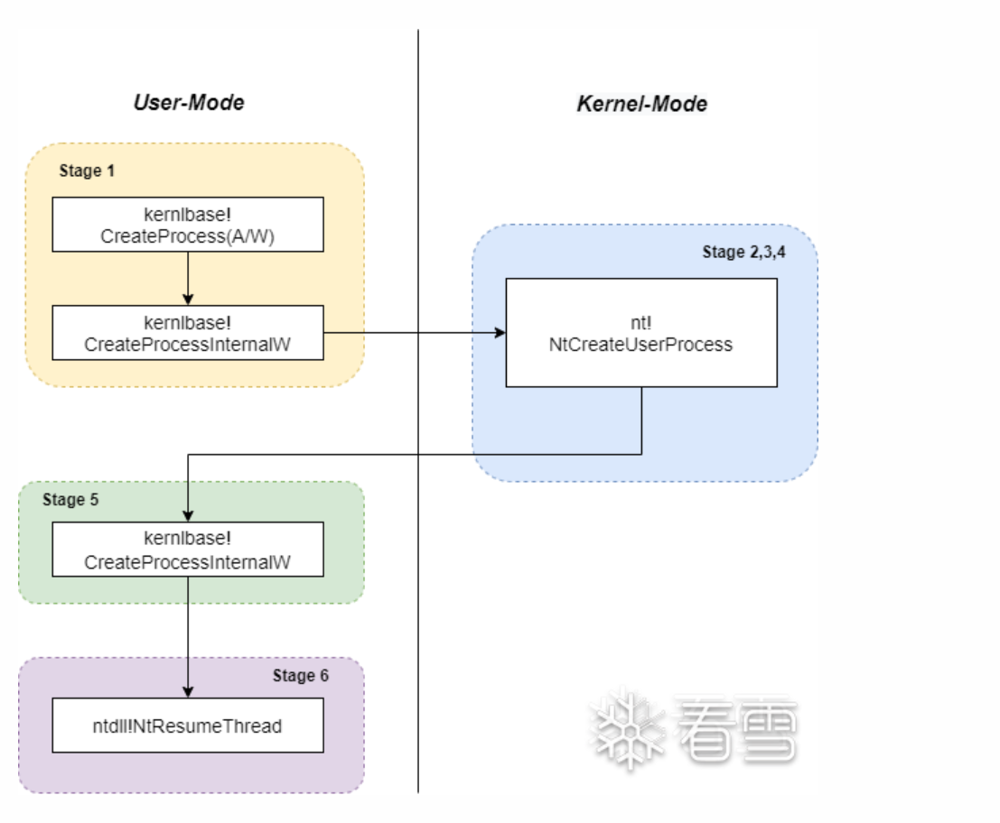

# win32.API.进程


首先，我们来了解一下进程的概念。当一个程序运行起来的时候，

操作系统一定要为这个程序(Program)创建一个进程(Process)，以方便管理。

有些同学也知道每个程序跑起来之后都被分配了一个进程ID，实际上在进程调度的时候，

操作系统还会为我们的程序分配进程的一些列事务：资源、虚拟内存地址空间、系统调用接口、优先级、环境变量等等。

​	


查看进程详细信息 CreateToolhelp32Snapshot

遍历进程 Process32First,Process32Next

获取进程句柄 OpenProcess 

终止进程 TerminateProcess

使用GetExitCodeProcess函数可以可以获取到进程退出时返回的值使用GetExitCodeThread 函数可以获取到线程退出时返回的值

更多函数可以查看[msdn ](https://learn.microsoft.com/zh-cn/windows/win32/procthread/process-and-thread-functions?redirectedfrom=MSDN)


关于一个进程,其实还是有很多信息的,比如

```
线程信息（Thread32First、Thread32Next）
模块信息（Module32First、Moudle32Next）
堆信息（Heap32ListFirst、Heap32Next）
内存使用情况（GetProcessMemoryInfo）
```


设置与获取环境变量（ GetEnvironmentStrings,GetEnvironmentVariable 和 SetEnvironmentVariable等） 


# 一个进程创建的前世今生






