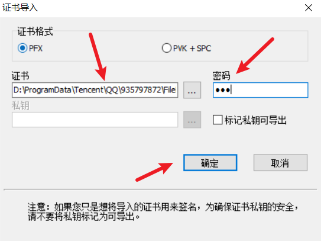
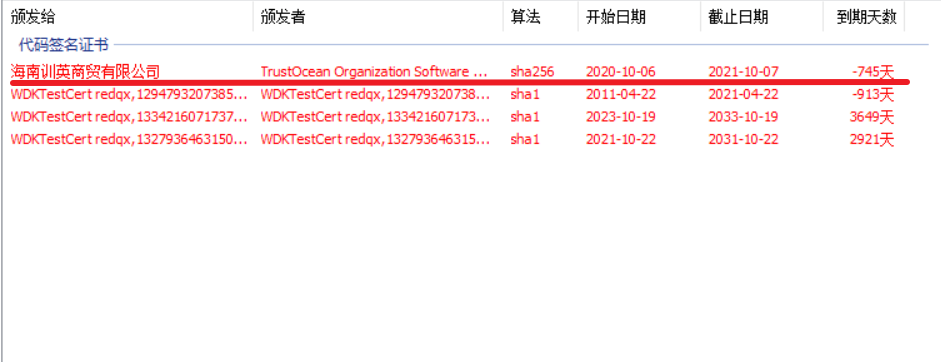
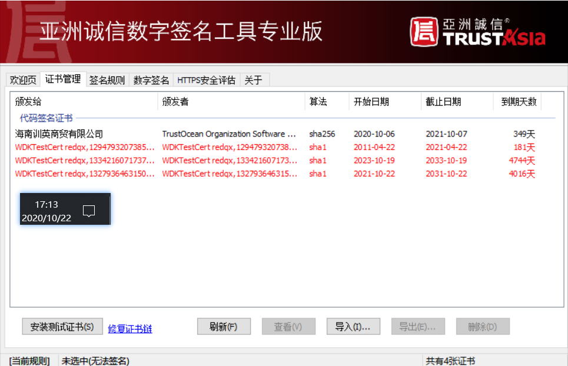
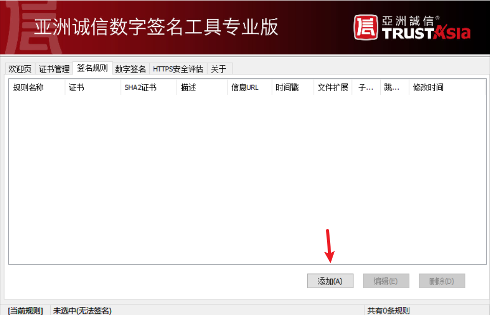
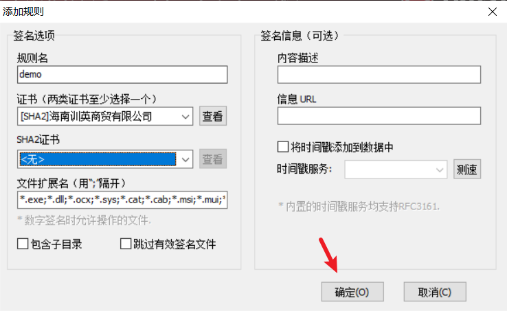
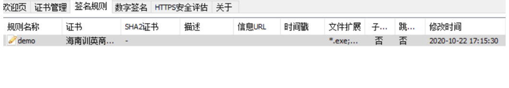
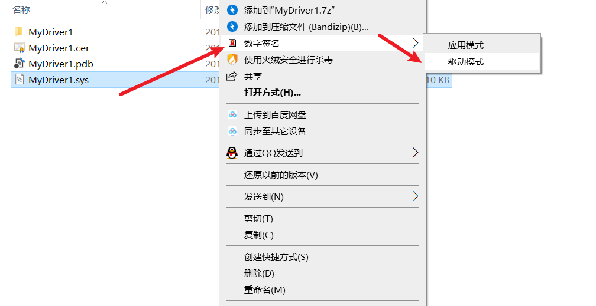
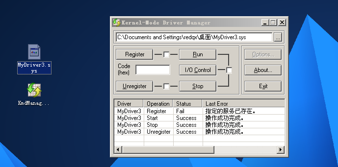
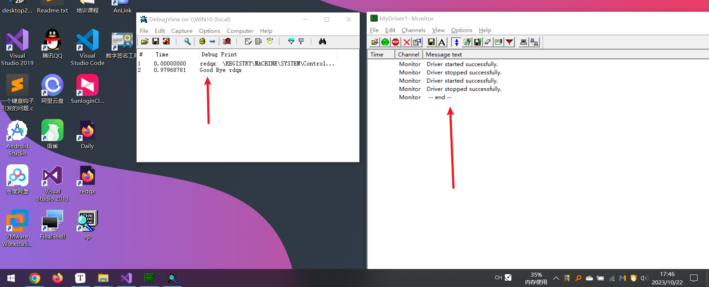

# 驱动怎么被加载

# 亚洲诚信使用(签名工具)

ps: 给驱动加签名

可以去官网下载工具 [https://www.trustasia.com/solution/sign-tools](https://www.trustasia.com/solution/sign-tools)

然后安装它,,,

首先我们得有一个证书文件,一般来说,后缀名是.pfx

比如`海南训英商贸有限公司.pfx`

ps: 我们很难拿到证书的

然后我们在 亚洲诚信中导入证书


然后



那个密码和签名是配套的,是一开始就有的,

然后我们可以看见,签名的日期已久过了,但是我们可以修改系统的时间,,



手动修改系统时间后



发现签名就没有过期了

然后我们添加签名规则



然后



然后就差不多大功告成了



然后我们就可以对一个驱动文件加签名了



ps: 这个安装版本的亚洲诚信,,,,会注册一些右键的菜单项,,,,绿色版的,,就可能没有

# 驱动加载工具 (如何加载驱动)

ps: 前提是你的驱动具备被加载的能力,一般情况是不具备的,,,,也只是一般情况

这东西在win10中,还得是管理员的方式启动

我接触了2种驱动加载工具

大同小异,,,,

```
KmdManager.exe
DriverMonitor.exe
```

我们以`KmdManager.exe`为例子

比如我们把sys拖到工具里面

然后点击`Register`,然后点击`Run`就可以成功加载

如果要卸载的话,,,先点击`stop`,然后点击`Unregister`



# 不同的操作系统该怎么加载呢

## 方法一 需要签名文件 win7及以上

这个方法..估计是g了

因为你得找到一个签名

这个签名的满足一下条件

1), 签名是会过期的,,所以得保证签名不过期...好像可以修改系统时间,,,来逃避这个问题

2), 签名不能被官方给吊销,,,意思就是官方知道这个签名已久被泄露了,,所以官方已久吊销了

这个签名,,,于是不可能加载成功的

3), 你得拥有这个签名哟

所以很难去获取一个签名

## 方法二 不需要签名文件 winxp

就是xp系统加载驱动,直接加载即可,,不需要其他的操作

## 方法三 进入 测试模式 win7

进入测试模式下加载驱动,,是不需要签名的

下面指出win7下如何进入测试模式, 仅限于win7

管理员模式启动cmd

```
bcdedit -set NOINTEGRITYCHECKS ON
bcdedit -set TESTSIGNING ON
bcdedit -set loadoptions DDISABLE_INTEGRITY_CHECKS

//关闭那个模式
//bcdedit /set testsigning off
```

## 方法四 关闭 强制签名 win10

设置 --> 更新和安全 --> 恢复 --> 立即重新启动 --> 启动设置，按数字键7

数字7代表的选项就是  `禁用驱动程序强制签名`

然后看看成效, 成功加载驱动并打印输出数据了



## 方法五 win10进入调试状态

其实就是win10进入调试状态下,

并且有windbg连接它,(必须要连接上才行)

windbg怎么连接虚拟机? 不是本篇文章要讲的

它就可以实现一个免签名的驱动加载

win10如何进入呢?

管理员模式启动cmd,重启之后就是管理员模式(临时的,再重启就没有了)

```
bcdedit /debug on
```

