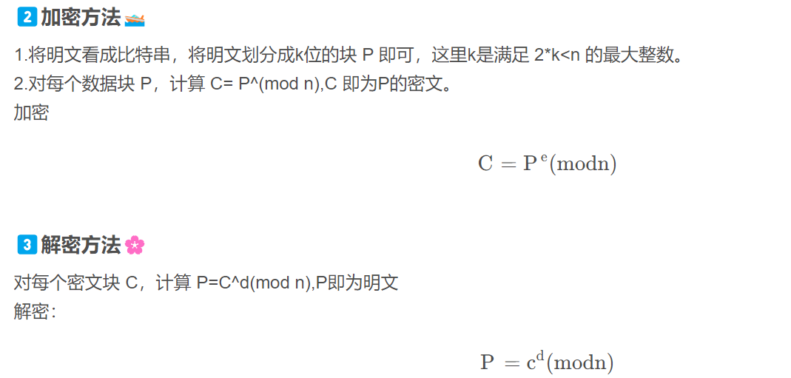

# 介绍





加密算法如下

```java
import gmpy2
from Crypto.Util.number import long_to_bytes
 
 
q = 189239861511125143212536989589123569301
p = 386123125371923651191219869811293586459
 
e = 65537
c = 28767758880940662779934612526152562406674613203406706867456395986985664083182
# n = 73069886771625642807435783661014062604264768481735145873508846925735521695159
n = q*p
# print(n)
d = gmpy2.invert(e, (p - 1) * (q - 1))
print("d=",d)
m = pow(c, d, n)
print(m)
print(long_to_bytes(m))
```


首先确定2个数字p,q

然后确定一个数字e,私钥

然后根据p,q得到n

然后根据p,q,e得到公钥d

然后加密c,得到m=pow(c, d, n)


一般,我们是拿着公钥d加密,然后拿着私钥e去解密

所以公开n,d是安全的

