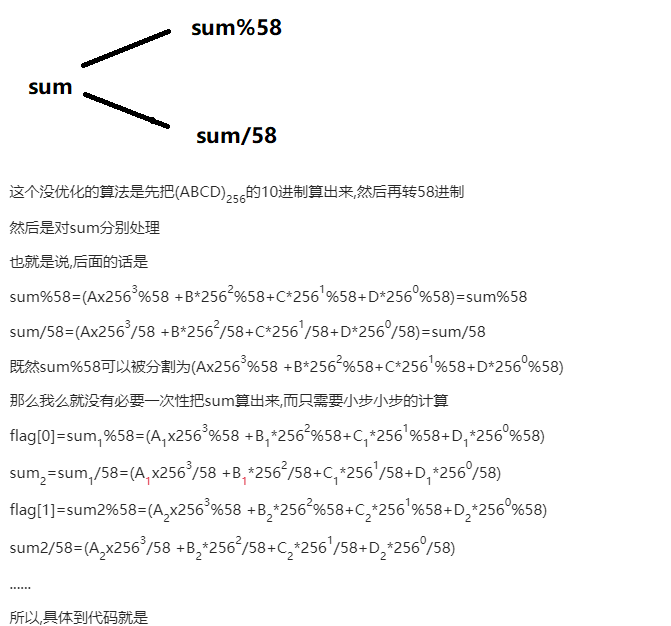

# base58

归根结底就是进制转化
base58不同于其它base64,base32....
在特定明文长度下,可以把base64当作当作256进制和64进制之间的转化
其它情况下不是等价的

```c
123456789ABCDEFGHJKLMNPQRSTUVWXYZabcdefghijkmnopqrstuvwxyz
```

# 优化问题

源代码 C

```c
#include <stdio.h>
#include <stdlib.h>
#include <string.h>
#include<Windows.h>
#include <math.h>
char* b58_enc2(BYTE* input, char* t58, int ilen, int tlen)  // 数据会溢出
{
    int i, j, k;
    unsigned long long sum = 0;
    size_t elen = ilen * 138 / 100 + 1;
    BYTE* output = malloc(elen + 1);
    memset(output, 0,elen + 1);
    for(i = 0; i < ilen; i++) 
    {
        sum += input[i] * pow(256,ilen-i-1);//转256进制
    }

    for (i = 0; i < elen; i++) //转58进制
    {
        output[i] = t58[sum % 58];//获取的是整体的最小位
        sum /= 58;
        if (sum==0)
        {
            break;
        }
    }
    return output;
}
BYTE* b58_enc1(BYTE* input,char* t58,int ilen,int tlen)  // 数据不会溢出
{
    size_t elen = ilen * 138 / 100 + 1;
    BYTE* output = malloc(elen + 1);
    DWORD mem,sum;
    int i, j, k;

    
    memset(output, 0, elen + 1);
    i = 0;
    k = 0;
    do
    {
        if (input[i])
        {
            sum = 0;
            for (j = i; j < ilen; j++)
            {
                mem = sum * 256;//转10进制
                sum = (mem + input[j]) % 58;
                input[j] = (mem + input[j]) / 58;//基于公式的化简罢了,和欧几里得算法没有直接关系
            }
            output[k] = t58[sum];
            k++;
        }
        else
        {
            i++;
        }

    } while (i < ilen);
    return output;//结果需要字符串转化一下,但是没必要
}
int main()
{
    static char* t58 = "123456789ABCDEFGHJKLMNPQRSTUVWXYZabcdefghijkmnopqrstuvwxyz";
    char flag[] = "Hbw";
    char* out;
    int ilen = strlen(flag);
    out = b58_enc1(flag, t58, ilen, 58);
    puts(out);//eAKR
    return 0;
}
```

源代码Python

```python
import string

# Base58 字符集（去除了易混淆的字符：0、O、I、l）
BASE58_ALPHABET = "123456789ABCDEFGHJKLMNPQRSTUVWXYZabcdefghijkmnopqrstuvwxyz"

def base58_encode(data):
    # 将字节数组转换为大整数
    num = int.from_bytes(data, 'big')

    encoded = ''
    while num > 0:
        num, remainder = divmod(num, 58)
        encoded = BASE58_ALPHABET[remainder] + encoded

    # 处理前导零
    num_zeros = 0
    for b in data:
        if b == 0:
            num_zeros += 1
        else:
            break

    encoded = BASE58_ALPHABET[0] * num_zeros + encoded
    return encoded

# 测试示例
data = b'Hello World'
encoded = base58_encode(data)
print(encoded)
```

任意进制转化

```c
#include <stdio.h>
#include <stdlib.h>
#include <string.h>
#include <Windows.h>

BYTE* base_swapt(BYTE* input, int ilen, int src_base, int dec_base)
{
    BYTE* output = NULL;
    DWORD sum1, sum2;  
    int   i, j, k;

    output = malloc(ilen * 2);
    memset(output, 0, ilen * 2);

    i=0;
    k = 0;
    while (i < ilen)
    {
        if (input[i])
        {
            sum1 = 0;
            for (j = i; j < ilen; j++)
            {
                sum2 = sum1 * src_base + input[j];
                sum1 = sum2 % dec_base;
                input[j] = sum2 / dec_base;
            }
            output[k++] = sum1;
        }
        else
        {
            i++;
        }
    }
    output[k] = 0xff;
    for (i = 0; i < k / 2; i++)//端序转化
    {
        sum1 = output[i];
        output[i] = output[k - 1 - i];
        output[k - 1 - i] = sum1;
    }
    return output;
}
void* findIndex(char* flag,int ilen,int tlen, char* t)
{
 
    int i = 0;
    int j = 0;

    for (i = 0; i < ilen; i++)
    {
        //用简单的查找,复杂的也行
        for (j = 0; j < tlen; j++)
        {
            if (flag[i] == t[j])
            {
                flag[i] = j;
                break;
            }
        }
    }
    return;
}
char* base58_enc(char* input, int ilen,int tlen,char* t58)
{

    BYTE* b58 = 0;
    int i = 0;

    b58 = base_swapt(input, ilen, 256, 58);
    for (i = 0; b58[i] != 0xff; i++)
    {
        b58[i] = t58[b58[i]];
    }
    b58[i] = 0;
    return b58;
}
char* base58_dec(char* input, int ilen,int tlen,char* t)
{
    BYTE* b58 = 0;

    findIndex(input,ilen,tlen, t);
    b58 = base_swapt(input, ilen, 58, 256);
    return b58;
}
int main()
{
    char table[] = "123456789ABCDEFGHJKLMNPQRSTUVWXYZabcdefghijkmnopqrstuvwxyz";
    char input[] = "HbwKqCOAOVXdHAbG0HeinZkez";
    char szEnc[] = "W8K52Mo7WeHbr1vUa5VKApQWmKeHc1YkAm";
    char* enc = 0;
    char* dec = 0;

    enc = base58_enc(input, strlen(input),58,table);
    printf("%s\n", enc);
    free(enc);

    dec = base58_dec(szEnc, strlen(szEnc), 58, table);
    printf("%s\n",dec);
    free(dec);
  
    return 0;
}
```

说一下,关于优化算法的原理

比如flag[]="ABCD"

他会把A当作高位,把D当作低位,,,至少都是这样的


然后对sum做处理



所以,具体到代码就是

```c
do
    {
        if (input[i])
        {
            sum = 0;
            for (j = i; j < ilen; j++)
            {
                mem = sum * 256;//转10进制
                sum = (mem + input[j]) % 58;
                input[j] = (mem + input[j]) / 58;//基于公式的化简罢了,和欧几里得算法没有直接关系
            }
            output[k] = t58[sum];
            k++;
        }
        else
        {
            i++;
        }

    } while (i < ilen);
```

# Python模块使用

```python
import base58
m="aKp41XiY5uSZI2RDodabywWW4"
c=base58.b58encode(m.encode()).decode()
print(c)
m=base58.b58decode(c.encode()).decode()
print(m)
c=base58.b58encode_check(m.encode()).decode()
print(c)
m=base58.b58decode_check(c.encode()).decode()
print(m)
```

# 浅谈进制转化和base64之间的关系

在开头我就说过

在特定明文长度下,base64等价于256进制和64进制之间的转化

那么这个长度是什么要求呢?

也就是明文长度是标准长度即可,也就是明文长度是3的倍数

那么256进制和64进制之间的转化和base64编码的结果是一致的

其它情况会有一些差异

为什么是等价的?

我么先说一下base58的原理

假如明文`char input[]="ABC";`

其中把ABC当作256进制,一共3位,每一位的范围是[0,255]

其中A是高位,B是低位

然后对"ABC"来一个转64进制,

假如进制转化的结果是"DEFG",其中D是高位,G是低位

我么只需要把DEFG作为索引值去table58索引即可

其中

A*pow(256,2)+B*pow(256,1)+C*pow(256,0)

=D*pow(64,3)+E*pow(64,2)+F*pow(64,1)+G*pow(64,0)

这很好理解,因为主打的就是一个进制转化功能

如何与base64联系呢? 我么把乘法变为右移,转化一下

A*pow(256,2)+B*pow(256,1)+C*pow(256,0)

=D*pow(64,3)+E*pow(64,2)+F*pow(64,1)+G*pow(64,0)

=D<<18 + E<<12 + F<<6 + G<<0

所以这和base64编码其实是一模一样的

但是如果明文长度不是3的倍数,该算法就不能和base64等价,而且差异还有点大...

这是为什么呢???

假设明文长度是2,char input[]="re";

64进制转化前(0x72 0x65)256,

64进制转化后(0x07 0x09 0x25)64

如果采用base64编码

编码后(0x1c 0x26 0x14)64

原始的二进制流

```
0111001001100101
```

被base64分割后

```
011100,100110,0101;
//因为要满足6的对齐
011100,100110,010100;
//其中0101变化后0101!=010100
```

我们是从高位开始,也就是从左边开始,每次取出6位,不足用0补齐

所以计算和数据的获取是从最高位开始

64进制转化后

```
0111,001001,100101;
//其实这里没有对齐,
000111,001001,100101;
//对齐后000111=0111,前后没发生变化
```

256进制转64过程中,我们每次取出的是最低位那一位,依次取出

所以计算和数据的获取是从最低位开始

这就造成了在数据对齐的时候,发生了差异

而且,因为不对齐的原因,导致数据读取的时候也发生了差异

bae64是`左-->右`

进制转化是`左<--右`

然而在对于标准长度的时候,无论怎么读取,都不会有对齐,

而且就算运算方向发生了改变,也不会产生影响

如何让进制转化和原始base64发生等价?bse64->进制转化: base64读取bit流的时候 `左<--右`

进制转化->base64: 好像不会....