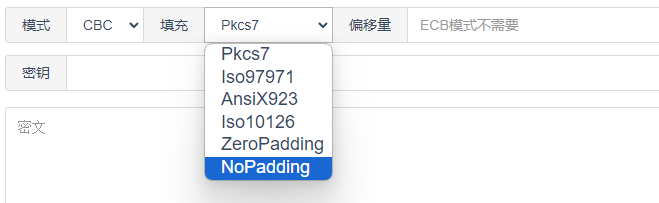

---
title: 数据块填充方式 padding
---

我们以AES为例

> PKCS7Padding

PKCS7Padding的填充方式为当数据长度不足数据块长度时,缺几位补几个几,

AES128算法其数据块为16Byte（数据长度需要为16Byte的倍数）,如果数据为”00112233445566778899AA”一共11个Byte,缺了5位,

采用PKCS7Padding方式填充之后的数据为“00112233445566778899AA0505050505”

特别注意的一点是

如果是数据刚好满足数据块长度也要在元数据后在按PKCS7规则填充一个数据块数据，这样做的目的是为了区分有效数据和补齐数据。

仍以AES128为例：如果数据为”00112233445566778899AABBCCDDEEFF”一共16个符合数据块规则

采用PKCS7Padding方式填充之后的数据为“00112233445566778899AABBCCDDEEFF10101010101010101010101010101010”