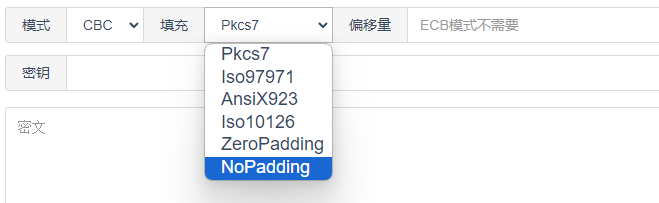

---
title: 常见算法的特征
---


# 哈希算法数据特征


> MD5

加密结果是16字节,,输出的是32字节的字符串


> SHA-1也叫SHA算法

单一的哈希函数

加密结果是20字节,,输出是40字节的字符串


> SHA-2

一组哈希函数,有SHA-256,SHA-256,SHA-256

```
SHA-224： 输出长度为224位。加密结果是28字节,输出56字节的字符串
SHA-256： 输出长度为256位。加密结果是32字节,输出是64字节的字符串
SHA-384： 输出长度为384位。加密结果是48字节,输出96字节的字符串,
SHA-512： 输出长度为512位。加密结果是64字节,输出128字节的字符串
```


> SHA-3


```
SHA3-224： 输出长度为224位。
SHA3-256： 输出长度为256位。
SHA3-384： 输出长度为384位。
SHA3-512： 输出长度为512位。
SHAKE128： 可变输出长度，可以生成任意长度的哈希值。
SHAKE256： 可变输出长度，同样可以生成任意长度的哈希值。
```


# 对称加密算法特征


## AES

AES分组加密的明文都是16字节的倍数,,,不足16就按照某种填充方式对齐

AES解密结果,,在长度上的特征也是16字节的倍数

但是在密钥和加密轮数上有一些区别

```
AES-128	加密10轮,密钥长度128bit(16字节)
AES-192	加密12轮,密钥长度128bit(24字节)
AES-256	加密14轮,密钥长度128bit(32字节)
```


## DES |3DES

先说DES

DES需要8字节的密钥,据说是56bit(有效密钥)+8bit(奇偶校验)

然后一次性加密8字节,也就是加密的数据必须是8字节的倍数


3DES使用3组个8字节的密钥。

3DES是就是进行了3次DES的操作,,,但是这3个过程,,,并不都都是利用密钥去加密

而是`加密->解密->再加密`

这3个过程,,使用的密钥分别是不同的,,,于是就达到了高强度的加密


# 数据块填充方式 padding


我们以AES为例




> PKCS7Padding

PKCS7Padding的填充方式为当数据长度不足数据块长度时,缺几位补几个几,

AES128算法其数据块为16Byte（数据长度需要为16Byte的倍数）,如果数据为”00112233445566778899AA”一共11个Byte,缺了5位,

采用PKCS7Padding方式填充之后的数据为“00112233445566778899AA0505050505”

特别注意的一点是

如果是数据刚好满足数据块长度也要在元数据后在按PKCS7规则填充一个数据块数据，这样做的目的是为了区分有效数据和补齐数据。

仍以AES128为例：如果数据为”00112233445566778899AABBCCDDEEFF”一共16个符合数据块规则

采用PKCS7Padding方式填充之后的数据为“00112233445566778899AABBCCDDEEFF10101010101010101010101010101010”