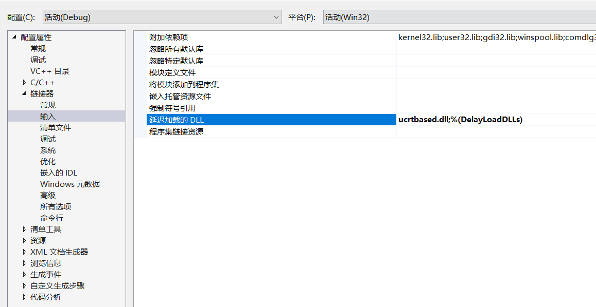

# 参考连接links


[从入门开始：恶意代码的那些事（1) ](https://docs.ioin.in/writeup/www.91ri.org/_15005_html/index.html)

[几种恶意代码常用技术解析](https://www.cnblogs.com/TJTO/p/13216584.html)


对此的一个分类

| 感染型病毒 | Virus     |
| ---------- | --------- |
| 蠕虫       | Worm      |
| 木马       | Trojan    |
| 黑客工具   | HackTool  |
| 间谍软件   | Spyware   |
| 风险软件   | Riskware  |
| 垃圾文件   | Junk file |
| 测试文件   | Test file |


后门: 恶意代码将自身安装到一台计算机来 允许攻击者来访问。后门程序通常让攻击者只需很少认证甚至无需认证，便可连接到 远程计算机上，并可以在本地系统执行命令。

僵尸网络: 

下载器: 

间谍软件:

启动器: 启动其它恶意程序

内核套件:

勒索软件:

发送垃圾邮件的恶意代码:

蠕虫或计算机病毒:


针对可疑文件进行扫描服务，

主要通过检测样本程序关键行为、进程行为、文件行为、网络行为、注册表行为等等，

判别文件行为是否为恶意代码程序

# 壳

壳指的是可执行文件所具有的压缩、加密、保护作用的东西。

**壳的类型**

1. 压缩壳：减小软件体积大小，加密保护不是重点。
2. 加密壳：种类比较多，不同的壳侧重点不同，一些壳单纯保护程序，另一些壳提供额外的功能，如提供注册机制、使用次数、时间限制等。

| 压缩壳    | 加密壳    | 虚拟机保护软件 |
| --------- | --------- | -------------- |
| ASPacK    | ASProtect | VMProtect      |
| UPX       | Themida   |                |
| PECompact | Armadillo |                |
| NsPack    | EXECrypto |                |
| ...       |           |                |


手工脱壳的常用方法：	

1. 单步跟踪法
2. ESP 定律
3. 两次断点法
4. 一步到达 OEP
5. 最后一次异常法
6. 模拟跟踪法
7. “SFX”法
8. 出口标志法


# 分析恶意代码

要分析恶意软件执行了哪些行为，首先需要知道恶意软件常见的一些行为，

如反弹shell，进程感染，文件隐藏，信息收集等。

而要弄清这些行为，恶意软件需要对文件，注册表，进程进行操作，

同时恶意软件要对感染的主机下发指令，传输收集到的信息，通常需要建立网络连接。

要更准确的分析需要知道使用了哪些WinAPI实现了这些功能


初级的分析方法:

要掌握常见的知识，以及一些工具的使用即可快速的掌握

分析文件的hash值，字符串，函数表，函数库依赖关系。 

另外可以运行恶意代码用工具监控恶意软件对文件，注册表，网络，进程的访问与操作


后期:

深入到代码层级去分析恶意代码

需要代码逆向分析的能力，需要读的懂汇编代码，熟练使用IDA进行分析，熟练使用ollydbg等调试工具


第一步就最好是拿多个反病毒软件扫描下这个文件,

比如vt扫描,比如自己拿虚拟机的杀软去测试


静态文件分析方法如下图所示


# 脱敏

比如自己写了一个恶意的exe

那么exe里面就会有很多的敏感信息

- 编译时间
- pdb路径
- ...


# 几种恶意代码常用技术解析

从一个病毒的释放、注入、隐藏和免杀等过程采用的思路和实现方法出发来进一步刨析这些代码的原理

这个在分析的两个勒索病毒都有发现，起先会检查自己是否在运行，在开始的时候都使用了一个函数

## 单一实例运行

这个在分析的两个勒索病毒都有发现，起先会检查自己是否在运行，在开始的时候都使用了一个函数

```c
WINAPI
CreateMutexA(
    _In_opt_ LPSECURITY_ATTRIBUTES lpMutexAttributes,     // 指向安全属性指针，可以为null
    _In_ BOOL bInitialOwner,  				  // 初始化互斥体对象的所有者
    _In_opt_ LPCSTR lpName				  // 指向互斥体对象名称指针
    );

```

需要注意的是，使用`CreateMutex()`创建的互斥体对象名称不能与现有的事件、信号量、或者文件映射对象名称相同，否则互斥体对象会创建失败


## 资源释放

 很多的木马程序会使用资源释放的技术，

这样可以让一些额外的`DLL`、`EXE`、文本和图片等文件作为资源插入到程序里面，

等到程序正式运行的时候再把他们释放到本地上，

这样编译出的只有一个exe文件，降低了被发现的风险

```c
// 发现资源
HRSRC
WINAPI FindResource(
    _In_opt_ HMODULE hModule,    // 模块名称
    _In_ LPCWSTR lpName,         // 指定资源名称
    _In_ LPCWSTR lpType          // 资源类型
    );

// 获取资源大小
DWORD
WINAPI SizeofResource(
    _In_opt_ HMODULE hModule,
    _In_ HRSRC hResInfo
    );

// 加载资源
HGLOBAL
WINAPI LoadResource(
    _In_opt_ HMODULE hModule,    // 模块名称
    _In_ HRSRC hResInfo          // 资源句柄
    );

// 锁定资源字节
LPVOID
WINAPI LockResource(
    _In_ HGLOBAL hResData
    );
// 其它详细的函数信息可以参见MSDN文档

```

实现原理

1. 通过`FindResource`定位程序里的资源，通过资源类型和资源名称来定位
2. 通过`SizeofResource`获取资源的大小之后再通过`LoadResource`把资源加载到程序内存中
3. 最后使用`LockResource`锁定加载到内存中的资源防止程序的其它操作影响这块内存，其中返回值就是资源在进程内存中的起始地址


## DLL延迟加载

`DLL`延迟加载是在正式调用`DLL`的时候，才会加载`DLL`文件，

这样在正式调用`DLL`前，都是可以正常执行的，只需要在VS的开发环境设置链接器即可完成，

ps: 延迟加载的dll不会出现在导入表里面,通过这种方式实现了dll的隐藏




## 进程启动方法


```c
UINT
WINAPI
WinExec(
    _In_ LPCSTR lpCmdLine,  // 要执行的程序的命令行
    _In_ UINT uCmdShow      // 显示选项
    );

```


```c
HINSTANCE ShellExecuteW(
    _In_opt_ HWND hwnd,           // 父窗口句柄
    _In_opt_ LPCWSTR lpOperation, // 要执行的操作:edit、explore、find、open等
    _In_ LPCWSTR lpFile,          // 指向shell名称空间对象
    _In_opt_ LPCWSTR lpParameters,// 指向一个可执行文件
    _In_opt_ LPCWSTR lpDirectory, // 指向默认操作的目录
    _In_ INT nShowCmd);           // 打开窗口如何显示 SW_HIDE

```


```c
BOOL
WINAPI
CreateProcessW(
    _In_opt_ LPCWSTR lpApplicationName,   // 执行模块名可以为 NULL
    _Inout_opt_ LPWSTR lpCommandLine,     // 执行命令行可以为NULL
    _In_opt_ LPSECURITY_ATTRIBUTES lpProcessAttributes, // 进程安全属性指针
    _In_opt_ LPSECURITY_ATTRIBUTES lpThreadAttributes,  // 线程安全属性指针
    _In_ BOOL bInheritHandles, 
    _In_ DWORD dwCreationFlags,     // 控制优先级和创建进程标志
    _In_opt_ LPVOID lpEnvironment,  // 指向新进程的环境块的指针
    _In_opt_ LPCWSTR lpCurrentDirectory,  // 指向进程当前目录的完整路径
    _In_ LPSTARTUPINFOW lpStartupInfo,    // STARTUPINFOW结构指针
    _Out_ LPPROCESS_INFORMATION lpProcessInformation // PROCESS_INFORMATION结构的指针
    );

```


# 开机自启

