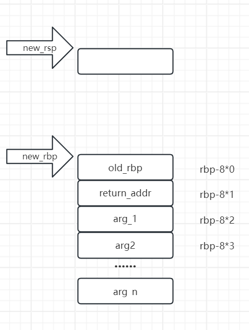

# stack-type1

elf , x86_x64

```assembly

;push arg1
;push arg2
;call func
	


push    rbp
mov     rbp, rsp
sub     rsp, 10h

;...

mov rsp,rbp
pop rbp
retn

```




当mov rsp, rbp时, [rsp]=old_rbp

pop rbp后, rbp=上一个函数的rbp, 同时  [rsp]=发挥地址