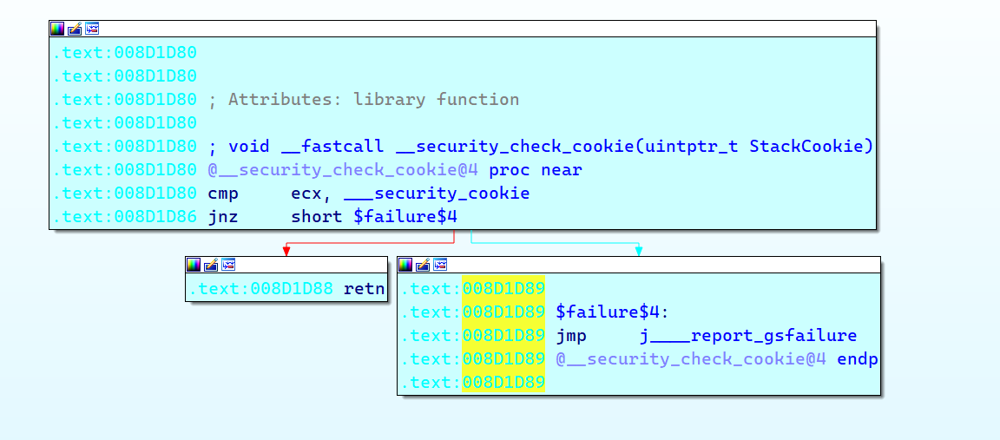

# GS初探

# links

```cpp
https://introspelliam.github.io/2017/07/04/0day/%E7%BB%95%E8%BF%87GS%E5%AE%89%E5%85%A8%E7%BC%96%E8%AF%91%E7%9A%84%E6%96%B9%E6%B3%95/
```

# 是什么

这东西汇编代码中的 Check_Security_Cookie() 有关


如何开启他


**GS工作原理**

- 在所有函数调用发生时，向栈帧中压入额外的随机DWORD，这个随机数被称作"canary"，在IDA中被标注为“Security Cookie”。
- Security Cookie位于EBP之前，系统还将.data的内存区域中存放一个Security Cookie副本
- 当栈发生溢出时，Security Cookie将被首先淹没，之后才是EBP和返回地址
- 在函数返回之前，系统将执行额外的安全验证操作，即Security Check
- 在Security Check过程中，系统将比较栈中原先存放的Security Cookie和.data中副本的值，如果两者不吻合，说明栈帧中的Security Cookie已被破坏，即栈中已经溢出
- 当检测处溢出时，系统将进入异常处理流程，函数不会被正常返回，ret指令也不会被执行


GS的保护,虽然在编译中开启,也并不是所有的地方都有GS的保护

****不会使用GS的情况 (满足其中一个,其他的就不看了)****

1. 函数不包括缓冲区
2. 函数被定义为具有变量参数列表
3. 函数使用无保护的关键字标记
4. 函数在第一个语句中包含内嵌汇编代码
5. 缓冲区不是8字节类型且大小不大于4字节

比如

```cpp
void bubble_sort(int arr[], int len) {
	int i, j, temp;
	for (i = 0; i < len - 1; i++)
		for (j = 0; j < len - 1 - i; j++)
			if (arr[j] > arr[j + 1]) {
				temp = arr[j];
				arr[j] = arr[j + 1];
				arr[j + 1] = temp;
			}
}
```

该函数

1. 函数不包括缓冲区 ( ❌ )
2. 函数被定义为具有变量参数列表 ✔
3. 函数使用无保护的关键字标记 ✔
4. 函数在第一个语句中包含内嵌汇编代码 ❌
5. 缓冲区不是8字节类型且大小不大于4字节 ❌

所以…计算开启了GS的保护,,,也并不是所有函数都用到了

当然，也可以使用`#pragma strict_gs_check(on`)为任意类型的函数添加Security Cookie

# GS升级

VS 2005及后续版本使用了变量重排技术，

在编译时根据局部变量的类型对变量在栈帧中的位置进行调整，

将字符串变量移动到栈帧的高地址。这样可以防止该字符串溢出时破坏其他的局部变量，

同时还会将指针参数的字符串参数复制到内存中的低地址，防止函数参数被破坏


# ****Security Cookie生成细节****

- 系统以.data节的第一个双字作为Cookie的种子，或原始Cookie

（所有函数的Cookie都用这个DWORD生成）

- 在程序每次运行时Cookie的种子都不同，因此种子具有很强的随机性
- 在栈帧初始化以后系统用ESP异或种子，作为当前函数的Cookie，

以此作为不同函数之间的区别，并增加 Cookie的随机性

- 在函数返回前，用ESP还原出（异或）Cookie的种子


种子生成


检查


可以看见,提取出加密值,然后xor ebp 解密

然后传入原始的cookie

进入函数`j_@__security_check_cookie@4` 查看



如果ecx和原始cookie不相同…说明ebp被破坏了

而ebp来自栈里面,,和返回地址eip 大多挨在一起的

# GS优点缺点

1. 修改栈帧中函数返回地址的经典攻击将被GS机制有效遏制
2. 基于改写函数指针的攻击，如C++虚函数的攻击，GS机制仍然很难防御
3. 针对异常处理机制的攻击，GS很难防御
4. GS是对栈帧的保护机制，因此很难防御堆溢出的攻击