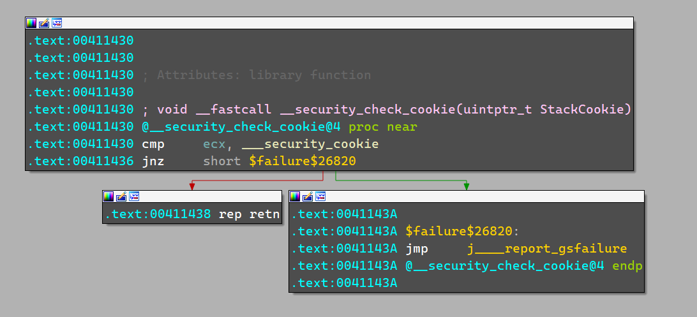
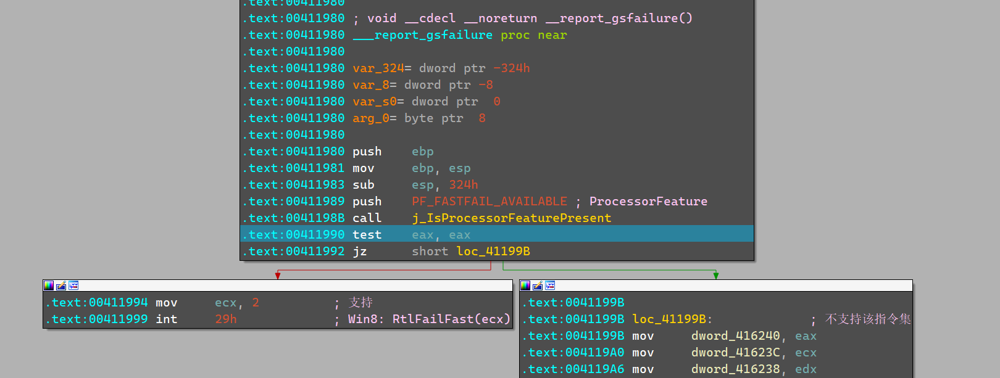

# GS逆向分析

# 逆向01

示例函数如下

环境

```cpp
//vs2013-x86-debug
#include <stdio.h>
void bubble_sort(int arr[], int len) {
	int i, j, temp;
	for (i = 0; i < len - 1; i++)
	for (j = 0; j < len - 1 - i; j++)
	if (arr[j] > arr[j + 1]) {
		temp = arr[j];
		arr[j] = arr[j + 1];
		arr[j + 1] = temp;
	}
}
void test1(){
	int arr[] = { 22, 34, 3, 32, 82, 55, 89, 50, 37, 5, 64, 35, 9, 70 };
	int len = (int) sizeof(arr) / sizeof(*arr);
	bubble_sort(arr, len);
	int i;
	for (i = 0; i < len; i++)
		printf("%d ", arr[i]);
	return 0;
}
int main() {
	test1();
	return 0;
}
```

首先我们来查看test1的函数头部

```nasm
.text:00411340 push    ebp
.text:00411341 mov     ebp, esp
.text:00411343 sub     esp, 84h
.text:00411349 mov     eax, ___security_cookie
.text:0041134E xor     eax, ebp
.text:00411350 mov     [ebp+dwLocal_security_cookie_xor], eax
.text:00411353 push    ebx
.text:00411354 push    esi
.text:00411355 push    edi
.text:00411356 mov     [ebp+var_3C], 16h
```

可以看见

eax获取了___security_cookie

然后eax和ebp进行异或

然后把结果存入当前函数栈的 [ebp+dwLocal_security_cookie_xor]

如果再细看反汇编, 只有函数末尾才会有___security_cookie的引用

```nasm
.text:00411401
.text:00411401 loc_411401:
.text:00411401 xor     eax, eax
.text:00411403 pop     edi
.text:00411404 pop     esi
.text:00411405 pop     ebx
.text:00411406 mov     ecx, [ebp+dwLocal_security_cookie_xor]
.text:00411409 xor     ecx, ebp        ; StackCookie
.text:0041140B call    j_@__security_check_cookie@4 ; __security_check_cookie(x)
.text:00411410 mov     esp, ebp
.text:00411412 pop     ebp
.text:00411413 retn
.text:00411413 sub_411340 endp
.text:00411413
```

可以看见

首先取出dwLocal_security_cookie_xor

然后把原始的ebp进行一个异或还原

然后调用`j_@__security_check_cookie@4` 

我们进入j_@__security_check_cookie@4 看看



首先拿着ecx和security_cookie比较,,,正常情况下,,二者是相同的

然后正常的`rep retn` 

如果不相同,,就进入了`j____report_gsfailure`

哪些情况会造成失败呢?

1. ebp不支持
    1. 缓冲区溢出,修改了ebp
    2. 本身函数的堆栈的平衡就有问题,导致ebp没有正确的还原
    3. …
2. [ebp+dwLocal_security_cookie_xor]被修改
3. ebp,ecx被调试器暂停,然后被修改了
4. …

然后我们进入`j____report_gsfailure` 看看



他会进入分支

经过调试发现

IsProcessorFeaturePresent(PF_FASTFAIL_AVAILABLE) 返回1

所以会进入中断 `mov ecx ,2 int 29h` 也就是失败了

右边的分支,,我们去看看

```nasm
.text:0041199B
.text:0041199B loc_41199B:             ; 不支持该指令集
.text:0041199B mov     dword_416240, eax
.text:004119A0 mov     dword_41623C, ecx
.text:004119A6 mov     dword_416238, edx
.text:004119AC mov     dword_416234, ebx
.text:004119B2 mov     dword_416230, esi
.text:004119B8 mov     dword_41622C, edi
.text:004119BE mov     word_416258, ss
.text:004119C5 mov     word_41624C, cs
.text:004119CC mov     word_416228, ds
.text:004119D3 mov     word_416224, es
.text:004119DA mov     word_416220, fs
.text:004119E1 mov     word_41621C, gs
.text:004119E8 pushf
.text:004119E9 pop     dword_416250
.text:004119EF mov     eax, [ebp+var_s0]
.text:004119F2 mov     dword_416244, eax
.text:004119F7 mov     eax, [ebp+4]
.text:004119FA mov     dword_416248, eax
.text:004119FF lea     eax, [ebp+arg_0]
.text:00411A02 mov     dword_416254, eax
.text:00411A07 mov     eax, [ebp+var_324]
.text:00411A0D mov     dword_416190, 10001h
.text:00411A17 mov     eax, dword_416248
.text:00411A1C mov     dword_41614C, eax
.text:00411A21 mov     dword_416140, 0C0000409h
.text:00411A2B mov     dword_416144, 1
.text:00411A35 mov     dword_416150, 1
.text:00411A3F mov     ecx, 4
.text:00411A44 imul    edx, ecx, 0
.text:00411A47 mov     dword_416154[edx], 2
.text:00411A51 mov     eax, 4
.text:00411A56 imul    ecx, eax, 0
.text:00411A59 mov     edx, ___security_cookie
.text:00411A5F mov     [ebp+ecx+var_8], edx
.text:00411A63 mov     eax, 4
.text:00411A68 shl     eax, 0
.text:00411A6B mov     ecx, dword_416004
.text:00411A71 mov     [ebp+eax+var_8], ecx
.text:00411A75 push    offset off_414930
.text:00411A7A call    j____raise_securityfailure
.text:00411A7F mov     esp, ebp
.text:00411A81 pop     ebp
.text:00411A82 retn
.text:00411A82 ___report_gsfailure endp
```

前期不知道在干什么

然后raise_securityfailure 是干嘛的? → 发生安全性失败时引发异常的一种方式。

所以会引发异常,执行就g掉

至于会引发什么样的异常,,简单查了一下,没发现

所以,,结论是什么?

我们得尽量让 `j_@__security_check_cookie@4` 不出现异常