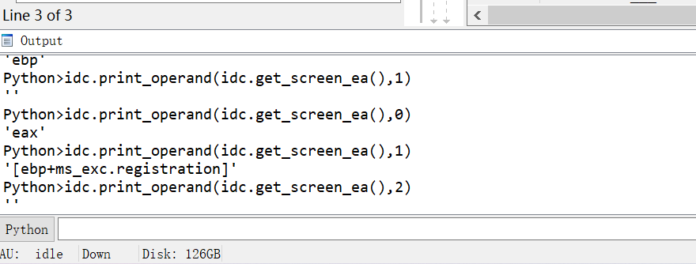

# IDA_python学习

实验环境  `IDA7.7` 



# links


```python
https://www.cnblogs.com/iBinary/p/14642662.html
https://hex-rays.com/products/ida/news/7_0/docs/api70_porting_guide/
```

导包

```python
import idc
import idaapi
import idautils
```


# 信息获取


我们获取地址的函数如下

当前地址获取使用 **idc.here()** 函数 或者 **idc.get_screen_ea()** 函数

最小地址可以使用: **ida_ida.inf_get_min_ea()**

最大地址可以使用: **ida_ida.inf_get_max_ea()**

当前选择地址的开始: **idc.read_selection_start()**

当前选择地址的结束:**idc.read_selection_end()**

如果判断地址是否存在可以使用: **idaapi.BADADDR**

**idc.get_inf_attr(INF_MIN_EA) 获得调用最小地址**

**idc.get_inf_attr(INF_MAX_EA)  获得调用最大地址**

```python
print("\naddr is start-->")
print(hex(idc.here()))          #获取当前地址
print(hex(idc.get_screen_ea())) #另一种获取当前地址的函数
print(hex(ida_ida.inf_get_min_ea())) #获取当前最小地址
print(hex(ida_ida.inf_get_max_ea())) #获取当前最大地址
print(hex(idc.read_selection_start()))
#如果你选择了某块地址 那么使用此函数则返回你选择的这块地址的起始地址
print(hex(idc.read_selection_end())) 
#同上 返回结束地址.
 
if idaapi.BADADDR == idc.here(): 
    print("BadAddress addr invalid")
else: 
    print("addr is ok<--")
```

```python
Python>idc.get_inf_attr(INF_MAX_EA)
0x41a170
Python>idc.get_inf_attr(INF_MIN_EA)
0x401000
```

当前段名字

```python
Python>idc.get_segm_name(idc.get_screen_ea())
'.text'
```

获取指定地址的整行汇编

```python
Python>idc.generate_disasm_line(idc.get_screen_ea(),0) #为什么是0?不知道
'mov     ebp, esp'
```

获取指定地址汇编的指令

```python
Python>idc.print_insn_mnem(idc.get_screen_ea())
'push'
```

获取指定地址汇编的参数

```python
Python>idc.print_operand(idc.get_screen_ea(),0) #参数0
'eax'
Python>idc.print_operand(idc.get_screen_ea(),1) #参数1
'[ebp+ms_exc.registration]'
Python>idc.print_operand(idc.get_screen_ea(),2) #参数2
''
```

获取指定地址的byte/word/dword/qword

```python
idc.get_wide_byte(addr)
idc.get_wide_word(addr)
idc.get_wide_dword(addr)
idc.get_qword(addr)
```

dmeo

```python
import idc
 
ea = idc.get_screen_ea()
value = idc.get_wide_byte(ea)
print("当前指令的硬编码为 {}".format(hex(value)));
```

获取段信息

```python
import idc
import idaapi
import idautils
for seg in idautils.Segments():
    print("%s, 0x%x, 0x%x" %(idc.get_segm_name(seg),idc.get_segm_start(seg),idc.get_segm_end(seg)))

#输出
'''
Python>
.textbss, 0x401000, 0x411000
.text, 0x411000, 0x416000
.rdata, 0x416000, 0x419000
.data, 0x419000, 0x41a000
.idata, 0x41a000, 0x41a170
'''
```

获取所有的函数

```python
import idc
import idaapi
import idautils
for func in idautils.Functions(): 
    print("0x%x, %s" % (func, idc.get_func_name(func)))
```

获取函数的边界,类型

```python
import idc
import idaapi
import idautils

ea=idc.here()
func = idaapi.get_func(ea)
print(type(func))
print(func.start_ea)
print(func.end_ea)

'''
输出
Python>
<class 'ida_funcs.func_t'>
4266864
4267431
'''
```

上面这个代码又可以

```python
import idc
import idaapi
import idautils

ea=idc.here()
func = idaapi.get_func(ea)
print(type(func))
print(idc.get_func_attr(ea, FUNCATTR_START))
print(idc.get_func_attr(ea, FUNCATTR_END))

'''
输出
Python>
<class 'ida_funcs.func_t'>
4266864
4267431
'''
```

打印指定地址的函数的整个汇编

```python
import idc
import idaapi
import idautils

ea=idc.here()
cur_addr=idc.get_func_attr(ea, FUNCATTR_START)
end=idc.get_func_attr(ea, FUNCATTR_END)
while cur_addr <= end:
   print("0x%x %s" % (cur_addr, idc.generate_disasm_line(cur_addr, 0)))
   cur_addr = idc.next_head(cur_addr, end)
```

上面的代码,也可以这样写

```python
import idc
import idaapi
import idautils

dism_addr = list(idautils.FuncItems(here()))
#dism_addr是一个list
for line in dism_addr: 
    print("0x%x %s" % (line,idc.generate_disasm_line(line, 0)))
```

函数性质获取

```python
import idc
import idaapi
import idautils

for func in idautils.Functions():
    flags = idc.get_func_attr(func,FUNCATTR_FLAGS)
    if flags & FUNC_NORET:                 #无返回标志的函数
        print("0x%x FUNC_NORET" % func)
    if flags & FUNC_FAR:                   # 这个标志很少出现，除非逆向软件使用分段内存。它的内部表示为一个整数 2。
        print("0x%x FUNC_FAR" % func)
    if flags & FUNC_LIB:  #此标志用于查找库代码，在内部表示为整数4。
        print("0x%x FUNC_LIB" % func)
    if flags & FUNC_STATIC: #此标志用于标识基于静态ebp框架的库函数
        print("0x%x FUNC_STATIC" % func)
    if flags & FUNC_FRAME:  # 这个标志表明该函数使用帧指针 EBP。使用帧指针的函数通常以设置堆栈框架的标准函数序言开始。
       print("0x%x FUNC_FRAME" % func)
    if flags & FUNC_USERFAR:    #这个标志是罕见的，hexrays 描述标志为“用户指定了函数距离”。它的内部值为 32。
        print("0x%x FUNC_USERFAR" % func)
    if flags & FUNC_HIDDEN:  #函数带 FUNC_HIDDEN 标志意味着他们是隐藏的将需要扩展到视图。如果我们转到一个被标记为隐藏的函数的地址，它会自动扩展。
        print("0x%x FUNC_HIDDEN" % func)
    if flags & FUNC_THUNK: #这标志标识函数是 thunk 函数。一个简单的功能是跳到另一个函数。
        print("0x%x FUNC_THUNK" % func)
    # if flags & FUNC_BOOTOMBP:          # 此标志用于跟踪帧指针。标识指针指向堆栈指针的函数
    #     print("0x%x FUNC_BOTTOMBP" % func)
```

获取参数传递的地址, 也就是在哪里实现了一个参数传递

比如

```python
.text:004E15D5 push    offset Format   ; "plz input\n"
.text:004E15DA call    ds:printf
.text:004E15E0 add     esp, 4
```

于是在004E15D5实现了参数的传递

```python
import idc
import idaapi
import idautils
ea = 0x004E15F8
args=idaapi.get_arg_addrs(ea)
print("----")
for i in args:
    print(hex(i))
#输出 
#----
#0x4e15d5
```

```python
import idc
import idaapi
import idautils

for func in idautils.Functions():
    flags = idc.get_func_attr(func, FUNCATTR_FLAGS)
    if flags & FUNC_LIB or flags & FUNC_THUNK:
        continue
    dism_addr = list(idautils.FuncItems(func))
    for line in dism_addr:  #循环每条指令访问下一条指令
        m = idc.print_insn_mnem(line)
        if m == 'call' or m == 'jmp':
            op = idc.get_operand_type(line, 0)
            #print(op)
            if op == o_reg:
                 print("0x%x %s" % (line, idc.generate_disasm_line(line,0)))
```

获取指定类型的call或者jmp

```python
import idc
import idaapi
import idautils

for func in idautils.Functions(): #获取所有的函数
    flags = idc.get_func_attr(func, FUNCATTR_FLAGS)#获取函数的性质
    if flags & FUNC_LIB or flags & FUNC_THUNK:
        continue
    dism_addr = list(idautils.FuncItems(func))#获取该函数的所有汇编
    for line in dism_addr:  #循环每条指令访问下一条指令
        m = idc.print_insn_mnem(line) #获取汇编指令
        if m == 'call' or m == 'jmp':
            op = idc.get_operand_type(line, 0)
            #print(op)
            if op == o_reg:
                print("0x%x %s" % (line, idc.generate_disasm_line(line,0)))
```

其中idc.get_operand_type可以返回的类型

- `o_void`：空操作数。常量值为 0。
- `o_reg`：寄存器操作数。常量值为 1。
- `o_mem`：内存操作数。常量值为 2。
- `o_phrase`：短语操作数（如基址+变址）。常量值为 3。
- `o_displ`：带有位移的操作数。常量值为 4。
- `o_imm`：立即数操作数。常量值为 5。
- `o_far`：远跳转操作数。常量值为 6。
- `o_near`：近跳转操作数。常量值为 7。

单个指令的细节提取

```python
import idc
import idaapi
import idautils

print("\n----")
ea = here()
print("cur:  0x%x,0x%x %s" % (ea,idc.next_addr(ea),idc.generate_disasm_line(ea,0)))
prev_instr = idc.prev_head(ea)#上一条指令
print("pre:  0x%x,0x%x %s" % (prev_instr,idc.prev_addr(ea),idc.generate_disasm_line(prev_instr,0)))
next_instr = idc.next_head(ea)#下一条指令
print("next: 0x%x,0x000000 %s" % (next_instr, idc.generate_disasm_line(next_instr,0)))

'''
org:
.text:004E36D0 56                            push    esi
.text:004E36D1 BE 98 7E 4E 00                mov     esi, offset unk_4E7E98
.text:004E36D6 8B C6                         mov     eax, esi
.text:004E36D8 3D 9C 80 4E 00                cmp     eax, offset unk_4E809C
.text:004E36DD 73 14                         jnb     short loc_4E36F3

output:
----

cur:  0x4e36d6,0x4e36d7 mov     eax, esi
pre:  0x4e36d1,0x4e36d5 mov     esi, offset unk_4E7E98
next: 0x4e36d8,0x000000 cmp     eax, offset unk_4E809C
'''

```

寻找特定指令集合

```python
import idc
import idaapi
import idautils

JMPS = [idaapi.NN_jmp, idaapi.NN_jmpfi, idaapi.NN_jmpni]
CALLS = [idaapi.NN_call, idaapi.NN_callfi, idaapi.NN_callni]

for func in idautils.Functions():#所有函数
    flags = idc.get_func_attr(func, FUNCATTR_FLAGS)
    if flags & FUNC_LIB or flags & FUNC_THUNK:
        continue
    dism_addr = list(idautils.FuncItems(func))#当前函数
    for line in dism_addr:
        ins = ida_ua.insn_t()
        idaapi.decode_insn(ins, line)
        if ins.itype in CALLS or ins.itype in JMPS: #如果含有call或者jmp
            if ins.Op1.type == o_reg:   #这就找到了call 和 jmp指令地址
                print("0x%x %s" % (line, idc.generate_disasm_line(line, 0)))
'''
输出
0x4e14cc call    eax
0x4e36b6 call    eax
0x4e36e6 call    eax
'''
```

获取指令的参数类型

**可以使用idc.get_operand_type(ea,n)得到的操作数的类型。ea 是地址，n 是索引**

这里有 8 中不同类型的操作数类

**o_void** 如果一个指令没有任何操作数它将返回 0

```
Python>print("0x%x %s" % (ea, idc.generate_disasm_line(ea, 0)))
>>> 0xa09166 retn
Python>print(idc.get_operand_type(ea,0))>>> 0
```

**o_reg**   如果一个操作数是一个普遍的寄存器将返回此类型。这个值在内部表示为 1。

```
Python>print("0x%x %s" % (ea, idc.generate_disasm_line(ea, 0)))
>>> 0xa09163 pop edi
Python>print(idc.get_operand_type(ea,0))>>> 1
```

**o_mem**   如果一个操作数是直接内存引用它将返回这个类型。这个值在内部表示为 2。这种类型是有用的在 DATA 段查找引用。

```
Python>print("0x%x %s" % (ea, idc.generate_disasm_line(ea, 0)))
>>> 0xa05d86 cmp ds:dword_A152B8, 0
Python>print(idc.get_operand_type(ea,0))>>> 2
```

**o_phrase**   这个操作数被返回则这个操作数包含一个基本的寄存器或一个索引寄存器。这个值在内部表示为 3。

```
Python>print("0x%x %s" % (ea, idc.generate_disasm_line(ea, 0)))
>>> 0x1000b8c2 mov [edi+ecx], eax
Python>print(idc.get_operand_type(ea,0))>>> 3
```

**o_displ**   这个操作数被返回则操作数包含寄存器和一个位移值，这个为位移值是一个整数，例如0x18。这是常见的当一条指令访问值在一个结构中。在内部，它表示为 4 的值。

```
Python>print("0x%x %s" % (ea, idc.generate_disasm_line(ea, 0)))
>>> 0xa05dc1 mov eax, [edi+18h]
Python>print(idc.get_operand_type(ea,1))>>> 4
```

**o_imm**   操作数是这样一个为整数的 0xc 的值的类型。它在内部表示为 5。

```
Python>print("0x%x %s" % (ea, idc.generate_disasm_line(ea, 0)))
>>> 0xa05da1 add esp, 0Ch
Python>print(idc.get_operand_type(ea,1))>>> 5
```

**o_far**   这个操作数不是很常见当逆向 x86 或 x86_64 时。它是用来寻找操作数的访问立即数远地址的。它在内部表示为 6。

**o_near**   这个操作数不是很常见当逆向 x86 或 x86_64 时。它是用来寻找操作数的访问立即数近地址的。它在内部表示为 7。

# 数值写入

```python
ida_bytes.patch_byte(addr,value)
ida_bytes.patch_word(addr,value)
ida_bytes.patch_Dword(addr,value)
ida_bytes.patch_Qword(addr,value)
```

demo

```python
ea = idc.get_screen_ea()
value = idc.get_wide_byte(ea)
print("我是没被修改的当前=  {}".format(hex(value)))
ida_bytes.patch_byte(ea,0x90)
 
value = idc.get_wide_byte(ea)
print("我被修改过了当前我的值为 {} ".format(hex(value)))
```

# 在其它方面的运用

**0xCA2BD06B是CreateThread的hash，这个哈希是通过每个字节ROR  13实现的。**

**通常叫z0mbie hashing 技术，或者 ROR-13技术**

ROR13的hash处理

```python
import idc
import idaapi
import idautils

import pefile
def ror32(val, amt):
    return ((val >> amt) & 0xffffffff) | ((val << (32 - amt)) & 0xffffffff)

def add32(val, amt):
    return (val + amt) & 0xffffffff
def z0mbie_hash(name):
    hash = 0
    for char in name:
        hash = add32(ror32(hash, 13), ord(char) & 0xff)
    return hash
    
def get_name_from_hash(file_name, hash):
    pe = pefile.PE(file_name)
    for exp in pe.DIRECTORY_ENTRY_EXPORT.symbols:
        if z0mbie_hash(exp.name) == hash:
            return exp.name
api_name = get_name_from_hash("kernel32.dll", 0xCA2BD06B)

if api_name:
    id = idc.add_enum(-1, "z0mbie_hashes", idaapi.hexflag())
    idc.add_enum_member(id, api_name, 0xCA2BD06B, -1)
```

说是处理之后可以变为

```python
seg000:00000015 mov [ebp-4], ebx
seg000:00000018 push CreateThread ; ROR 13 hash of CreateThread
seg000:0000001D push dword ptr [ebp-4]
```

# 交叉引用

代码被谁谁谁引用了

```python
import idc
import idaapi
import idautils

wf_addr = idc.get_name_ea_simple("printf") #获得字符串地址???
print("0x%x %s" % (wf_addr, idc.generate_disasm_line(wf_addr, 0)))
for addr in idautils.CodeRefsTo(wf_addr, 0): 
    print("0x%x %s" % (addr, idc.generate_disasm_line(addr, 0)))#获取交叉引用的地方
```

输出如下

```python
0x41a11c extrn printf:dword
0x4115da call    ds:printf
0x411625 call    ds:printf
//意思是extrn printf:dword在0x4115da 和 0x411625 引用
```

引用了哪一个地方

```python
import idc
import idaapi
import idautils

ea = 0x00411104
print("0x%x %s" % (ea, idc.generate_disasm_line(ea, 0)))
for addr in idautils.CodeRefsFrom(ea, 0): 
    print("0x%x %s" % (addr, idc.generate_disasm_line(addr, 0)))
```

输出如下

```python
0x4115bb call    sub_411104
0x411104 jmp     sub_411430
//意思是sub_411104指向了jmp     sub_411430
```

数据在哪里被引用

```python
import idc
import idaapi
import idautils

ea = 0x00416978
print("\n----")
print("0x%x %s" % (ea, idc.generate_disasm_line(ea, 0)))
for addr in idautils.DataRefsTo(ea):
    print("0x%x %s" % (addr, idc.generate_disasm_line(addr, 0)))
```

输出如下

```python
----
0x416978 db 'plz input',0Ah,0
0x4115d5 push    offset Format; "plz input\n"

'''
0x00416978指向了plz input
然后plz input被0x4115d5引用过
'''
```

引用了什么数据

```python
import idc
import idaapi
import idautils

ea = 0x004115D5
print("\n------")
print("0x%x %s" % (ea, idc.generate_disasm_line(ea, 0)))
for addr in idautils.DataRefsFrom(ea):
    print("0x%x %s" % (addr, idc.generate_disasm_line(addr, 0)))
```

输出

```python
------
0x4115d5 push    offset Format; "plz input\n"
0x416978 db 'plz input',0Ah,0
'''
意思是0x004115D5是push    offset Format; "plz input\n"
然后该地址引用了字符串"plz input\n"
'''
```

数据在哪里被引用,,,引用了什么

```python
import idc
import idaapi
import idautils

ea = 0x00419000
print("\n------")
print("0x%x %s" % (ea, idc.generate_disasm_line(ea, 0)))
for xref in idautils.XrefsTo(ea, 1):
    print("%i %s 0x%x 0x%x %i" % (xref.type, idautils.XrefTypeName(xref.type),xref.frm, xref.to, xref.iscode))
    # xref.frm 在哪里被引用
    # xref.to 引用了什么
```

输出如下

```python
0x419000 dd offset aHelloWorld
3 Data_Read 0x411637 0x419000 0
3 Data_Read 0x411654 0x419000 0

'''
.text:004115D3                 mov     esi, esp
.text:004115D5                 push    offset Format   ; "plz input\n"
.text:004115DA                 call    ds:printf
.text:004115E0                 add     esp, 4
.text:004115E3                 cmp     esi, esp
.text:004115E5                 call    j___RTC_CheckEsp
.text:004115EA                 mov     esi, esp
.text:004115EC                 lea     eax, [ebp+Source]
.text:004115F2                 push    eax
.text:004115F3                 push    offset aS_0     ; "%s"
.text:004115F8                 call    ds:scanf
.text:004115FE                 add     esp, 8
.text:00411601                 cmp     esi, esp
.text:00411603                 call    j___RTC_CheckEsp
.text:00411608                 lea     eax, [ebp+Source]
.text:0041160E                 push    eax             ; Source
.text:0041160F                 lea     ecx, [ebp+var_C]
.text:00411612                 call    sub_41119A
.text:00411617                 mov     esi, esp
.text:00411619                 lea     eax, [ebp+Source]
.text:0041161F                 push    eax
.text:00411620                 push    offset aS_0     ; "%s"
.text:00411625                 call    ds:printf
.text:0041162B                 add     esp, 8
.text:0041162E                 cmp     esi, esp

字符串地址dd offset aHelloWorld
0x411637 引用了它
0x411654 引用了它
'''
```

# 实际运用


## 寻找特定指令

```python
from idc import *

def main():
    print("|-----BEGIN-----|")

    FBin1 = "E8 87 FE FF"
    x = 0x10005FC3
    addresses = []
    while True:
        x = idc.find_binary(x, SEARCH_DOWN, FBin1)
        if x == BADADDR:
            break
        addresses.append(hex(x)[2:].zfill(8))
        x = x + 1 
    for address in addresses:
        print(address)
    
    print("|------END------|")

if __name__ == '__main__':
    main()
```


## patch90

```c
from idaapi import *
from idc import *

def main():
    x = get_inf_structure().start_ea
    FBin1 = "75 05 74 03"
    print("start")
    while x != BADADDR:
        x = idc.find_binary(x, SEARCH_DOWN, FBin1)
        if x != BADADDR:
            patch_dword(x, 0x90909090)
            x += 4
            patch_word(x, 0x9090)
            x += 2
            patch_byte(x, 0x90)
            x += 1

    FBin1 = "75 04 74 02"
    x = get_inf_structure().start_ea
    while x != BADADDR:
        x = idc.find_binary(x, SEARCH_DOWN, FBin1)
        if x != BADADDR:
            patch_dword(x, 0x90909090)
            x += 4
            patch_word(x, 0x9090)
            x += 2

    FBin1 = "75 03 74 01"
    x = get_inf_structure().start_ea
    while x != BADADDR:
        x = idc.find_binary(x, SEARCH_DOWN, FBin1)
        if x != BADADDR:
            patch_dword(x, 0x90909090)
            x += 4
            patch_byte(x, 0x90)
            x += 1

    print("end")

if __name__ == '__main__':
    main()
```

## 下断点

```python
import idaapi

addresses = [
    0x1002051E #要下地址的列表
]

# 下断点
for address in addresses:
    idaapi.add_bpt(address)

print("断点已设置.")
```

如果已经下了断点,是不应该再下了

```python
import idaapi

addresses = [
    0x1002051E  # 要下断点的地址列表
]

# 下断点
for address in addresses:
    # 检查地址是否已设置断点
    is_breakpoint_set = False
    for i in range(idaapi.get_bpt_qty()):
        bpt = idaapi.bpt_t()
        if idaapi.getn_bpt(i, bpt) and bpt.ea == address:
            is_breakpoint_set = True
            break

    if not is_breakpoint_set:
        idaapi.add_bpt(address)

print("断点已设置.")
```

## 写注释

```python
import idc

def add_comment(address, comment):
    idc.set_cmt(address, comment, 0)

# 示例用法
address = 0x10020526  # 替换为你想要添加注释的地址
comment = "这是一个注释"  # 替换为你想要添加的注释内容

add_comment(address, comment)
```

## 返回指定地址上一条指令的地址

```python
import idaapi

def get_previous_instruction_address(address):
    function = idaapi.get_func(address)
    if function is not None:
        return idaapi.prev_head(address, function.start_ea)
    return None

# 使用示例
address = 0x10006069  # 替换为你要查询的地址
previous_address = get_previous_instruction_address(address)
if previous_address is not None:
    print("Previous instruction address:" +hex(previous_address))
else:
    print("No previous instruction found.")
```