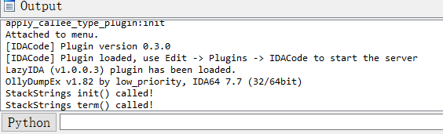
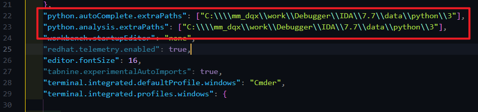
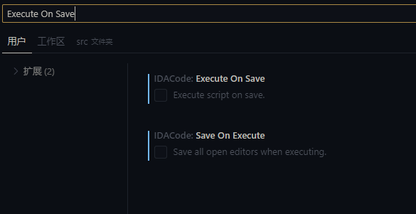
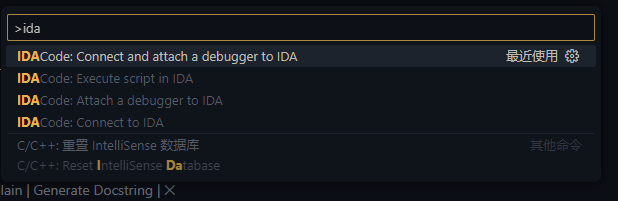
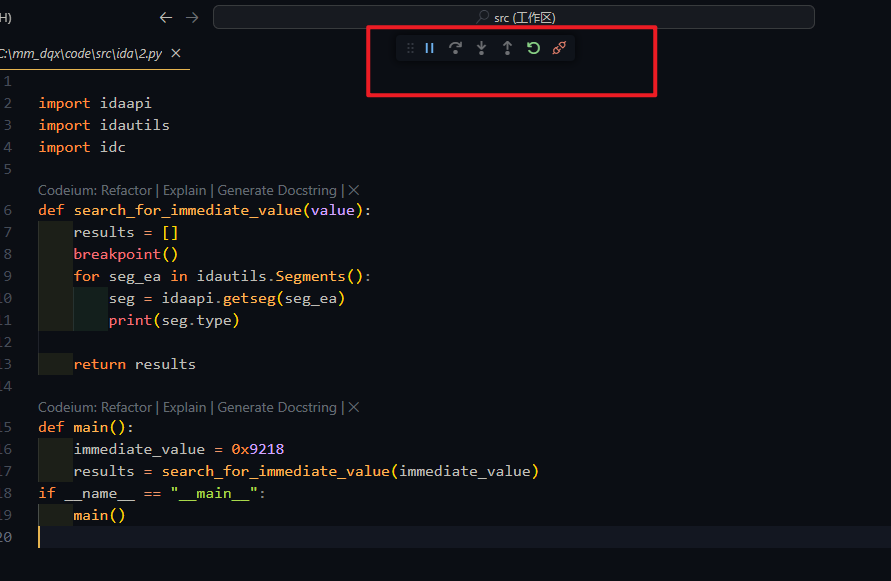
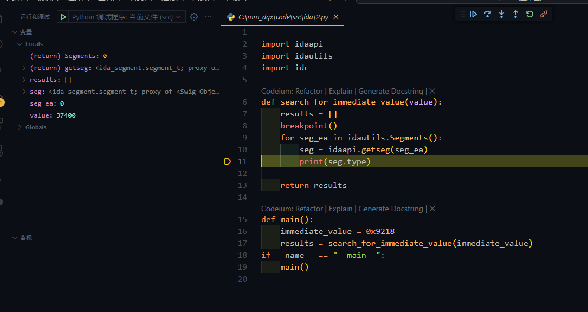

```
title: "post-wiki-tool-逆向工具-IDA-插件使用-IDAcode"
```


# Reference Documents


https://blog.csdn.net/qq_36535153/article/details/131404495

https://www.cnblogs.com/level5uiharu/p/16911765.html

https://byteage.com/166.html

https://cloud.tencent.com/developer/article/1978067


# step


## IDA

下载py 插件

```
pip install --user debugpy tornado
```


官网下载IDA插件 https://github.com/ioncodes/idacode

```
├── ida
│   ├── idacode.py
│   └── idacode_utils
│       ├── dbg.py
│       ├── hooks.py
│       ├── __init__.py
│       ├── plugin.py
│       ├── settings.py
│       └── socket_handler.py
├── idacode
├── images
├── README.md
└── tests
```

把ida文件里的内容 复制到` C:\mm_dqx\work\Debugger\IDA\7.7\data\plugins`

然后修改文件 `settings.py`

```
├── plugins
│   └── idacode_utils
│       ├── settings.py
```

修改字段{PYTHON}, 内容如下,其中{PYTHON}内容是你pc默认的python环境

```
HOST = "127.0.0.1"
PORT = 7065
DEBUG_PORT = 7066
PYTHON = "C:\\Users\\xxxx\\AppData\\Local\\Programs\\Python\\Python38\\python.exe"
LOGGING = False
```

然后打开IDA, 随便拖一个exe进去

在IDA启动的时候,最下面的输出栏会显示如下内容




然后点击 edit->plugins->idacode

然后会有如下内容输出

```
---------------------------------------------------------------------------------------------
[IDACode] Listening on 127.0.0.1:7065
```


## vscdoe

下载插件IDAcode

然后 ctrl+shift+p

输入open user setting , 或者一眼看到open user setting

点击它,编辑配置文件 settings.json , 修改内容如下



没有该选项就添加

```json
    "python.autoComplete.extraPaths": [
        "D:\\IDA_Pro_7.7\\python\\3"
    ],
    "python.analysis.extraPaths": [
        "D:\\IDA_Pro_7.7\\python\\3"
    ],
```


然后点击设置,输入Execute On Save, 取消勾选.

这样的会啊, 你的文件自动保存会, 不会被自动执行




然后ctrl+shift+p, 输入ida, 有4个选项



选项1: 连接并附加IDA脚本, 这个选项包含了选项3和4, 

选项2: 执行脚本, 建立在 connect和attach的基础上

选项3: attach, 附加到ida

选项4: connect, 连接ida. 此刻你得保证你的ida已经点击了 `edit->plugins->idacode`

通常情况下:

我们写好一个ida py脚本, 下了断点

只需要 ctrl+shift+p, 输入ida(或者最近选项中看见ida)

```
1), connect and attach a debugger to ida
2), 在1)下,他会让你确定你的项目目录,好像没啥用,按下enter即可
3), execute scrip in ida
-------------------------------------
之后脚本如果更新,要再次运行就再次点击 execute scrip in ida
```


如何下断点?

不能f2或者f9来下,

只能输入`breakpoint()`插入原代码来下断点


# 注意事项

貌似是idacode的不足

如果vscode连接了ida, 那么也只能连接1次, 第二次不能再连接成功. 

如果要再次连接, 只能关闭并重启ida.

但是你可以在一次连接的过程中,运行多个多次代码.


# 实际运行情况


```python

import idaapi
import idautils
import idc

def search_for_immediate_value(value):
    results = []
    breakpoint()
    for seg_ea in idautils.Segments():
        seg = idaapi.getseg(seg_ea)
        print(seg.type)

    return results

def main():
    immediate_value = 0x9218
    results = search_for_immediate_value(immediate_value)
if __name__ == "__main__":
    main()

```


1), ida->exit->plugins->idacode

2), vscode->ctrl shift p->输入ida->coonect and attach->enter那个目录




3), 然后 ctrl shift p->输入ida->excute script

4), F5跳出

5), 快乐的F5,F7,F8吧




如果你的脚本遇到异常, 导致

6), 脚本1运行完毕, 脚本2要运行直接ctrl shift p->输入ida->excute script