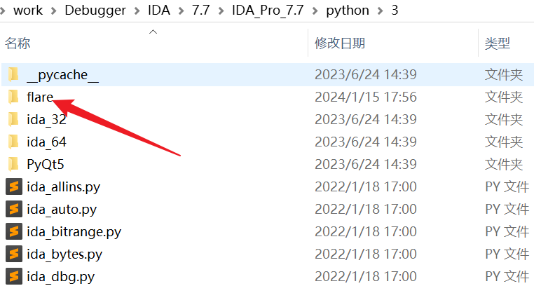
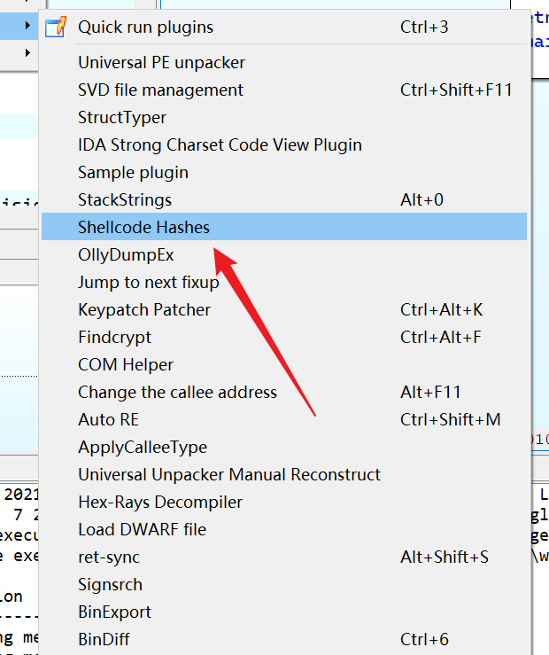
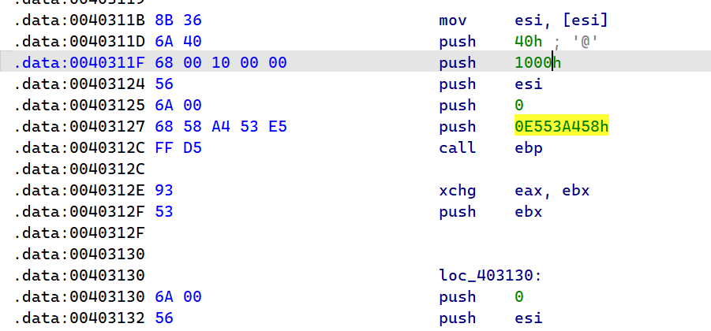
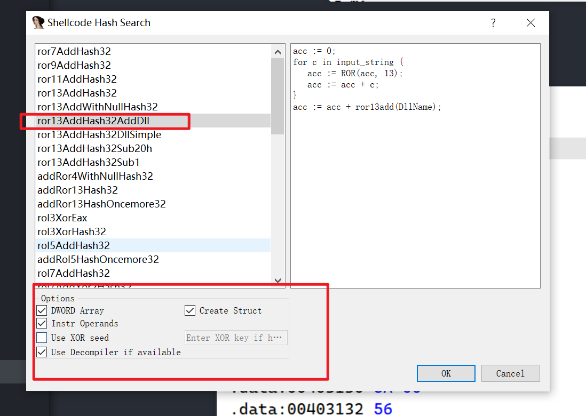
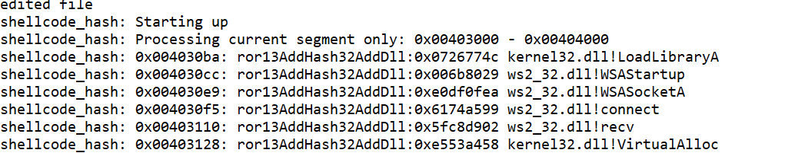

---
title: IDA普通插件安装
categories: wiki
---


# 插件安装

插件网站:

[https://github.com/fr0gger/awesome-ida-x64-olly-plugin](https://github.com/fr0gger/awesome-ida-x64-olly-plugin)

[https://bbs.kanxue.com/thread-275530.htm](https://bbs.kanxue.com/thread-275530.htm)


# findcrypt3


```
https://blog.csdn.net/marosri/article/details/131171634
```


下载脚本插件   [https://github.com/polymorf/findcrypt-yara](https://github.com/polymorf/findcrypt-yara)

把 findcrypt3.py和findcrypt3.rules放到IDA7.5/plugins目录下

然后  python3安装yara-[python](https://so.csdn.net/so/search?q=python&spm=1001.2101.3001.7020)

一般情况下安装yara-python

```
pip install yara-python
```

如果能够打开IDA，使用findcrypto失败，然后报错，Typeerror: 'yara.stringmatch' object is not subscriptable

这个时候，可能可能需要卸载以前的yara-python

```
pip uninstall yara-python
```

然后安装下面这个版本的yara-python

```
python -m pip install yara-python==3.11.0
```

安装完毕后如何使用?

打开Edit>Plugins>Findcrypt，  或者用快捷键 Ctrl+Alt+F

如何添加一个算法被识别的规则?

为findcrypt3添加国密SM4算法的识别规则打开findcrypt3.rules，在最后添加

```
rule SM4_FK {
	meta:
		author = "Basstorm"
		description = "Look for SM4_FKbox constants"
		date = "2020-08"
	strings:
		$c0 = { C6 BA B1 A3 50 33 AA 56 97 91 7D 67 DC 22 70 B2 }
	condition:
		$c0
}

rule SM4_CK {
	meta:
		author = "Basstorm"
		description = "Look for SM4_CKbox constants"
		date = "2020-08"
	strings:
		$c0 = { 15 0E 07 00 31 2A 23 1C 4D 46 3F 38 69 62 5B 54 85 7E 77 70 A1 9A 93 8C }
	condition:
		$c0
}

```


# flare-ida

安装过程很难受,,,文档什么的都没有说清楚,,,

可能是自己文档读不清楚吧,,,哭死

下载

```
https://github.com/mandiant/flare-ida
```

好像要安装flare模块吧,不太知道,,,

```
pip install -i http://mirrors.aliyun.com/pypi/simple/ --trusted-host mirrors.aliyun.com flare
```


然乎就是把flare-ida项目中的

下载下来

```
├─code_grafter
├─decompiler_scripts
├─examples
├─MSDN_crawler
├─plugins
├─python
│  └─flare
│      ├─IDB_MSDN_Annotator
│      │  └─img
│      ├─ironstrings
│      └─ui
└─shellcode_hashes
```

把plugins目录移植到IDA中同名文件夹,不多说,这不是重点

重点是???

以IDA7.7为例,,,

需要把`/python/flare`移动到`IDA_Pro_7.7\python\3`中



然后就可以使用了



使用???

比如kali的反弹shell中payload用到的



然后使用我们的插件

数据库db选择GitHub下载后提供的


然后根据情况配置参数



然后点击ok就行

然后结果会显示在output窗口




http://chensh.top/2017/09/06/IDA-Plugin-FRIEND/

https://bbs.kanxue.com/thread-223156.htm