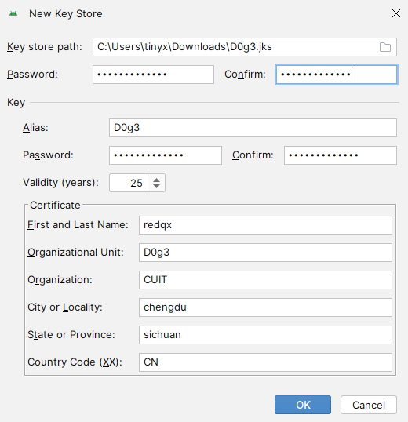
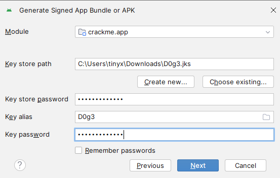

## 前言 

> **JKS**文件是一个java中的密钥管理库。

里面可以放很多的东西，这里只存放一类东西就是密钥，仓库当然会有一把锁，防范别人随便乱拿，这个就是JKS文件的密码。

里面存放的密钥也各有不同，每个密钥都有一个名字（在下面叫别名），

一类就密钥对，一类叫公钥，一类叫私钥，

密钥对就是包含公钥和私钥的。

这里的公钥只要你能进入仓库你就可以随便查看拿走，私钥则是有密码的，只允许有权限的人查看拿走。

> Keytool:Keytool 是一个JAVA环境下的安全钥匙与证书的管理工具

Keytool将密钥（key）和证书（certificates）存在一个称为keystore 的文件(受密码保护)中。

在keystore里，包含两种数据： 

- 

  Key entity (密钥实体)——密钥（secretkey）,也叫私钥和配对公钥（采用非对称加密）

- 

  trustedcertificate entries（可信任的证书实体）——只包含公钥 

## 生成JKS

```
keytool -genkey -keyalg RSA -keysize 1024 -validity 365 -dname "CN=test, OU=test,O=test, L=shanghai, ST=shanghai, C=CN" -alias csii_key -keypass 888888 -keystore csii.jks -storepass 123456
```


CN=(名字与姓氏), 

OU=(组织单位名称), 

O=(组织名称),

 L=(城市或区域名称),

ST=(州或省份名称), 

C=(单位的两字母国家代码)


读取JKS

```
┌──(kali㉿G16-7620)-[~]
└─$ keytool -list -v -keystore csii.jks -storepass 123456


```


```
┌──(kali㉿G16-7620)-[~]
└─$ keytool -genkey -keyalg RSA -keysize 1024 -validity 365 -dname "CN=redqx, OU=D0g3,O=CUIT, L=chengdu, ST=sichuan, C=CN" -alias D0g3 -keypass 2021.D0g3.com -keystore D0g3.jks -storepass 2021.D0g3.com
```


下面填写的信息要和keytool的信息一致	



下面这个图是Android Studio借用jks给当前项目的apk签名



我们用jks给第三方的给pk签名

```
┌──(kali㉿G16-7620)-[~/code/file]
└─$ apksigner sign --ks D0g3.jks --ks-key-alias D0g3 -ks-pass pass:2021.D0g3.com --key-pass pass:2021.D0g3.com --v1-signing-enabled true --v2-signing-enabled false --v3-signing-enabled true --out UnCrackable-Level2-signed.apk UnCrackable-Level2.apk 
```

输出文件是signed.apk

输入文件是crackme_02-debug-v1.1.apk

参数

```

 sign --ks D0g3.jks 
 --ks-key-alias D0g3 
 -ks-pass pass:2021.D0g3.com 
 --key-pass pass:2021.D0g3.com 

--v1-signing-enabled true 
--v2-signing-enabled false 
--v3-signing-enabled true 
```


```
查看apk签名详情：
java -jar apksigner.jar verify -v --print-certs test-signed.apk
 
查看apk签名类型：
android/prebuilts/sdk/tools/linux/bin/apksigner verify -v test.apk

查看apk 版本信息：
android/prebuilts/sdk/tools/linux/bin/aapt dump badging test.apk
```

