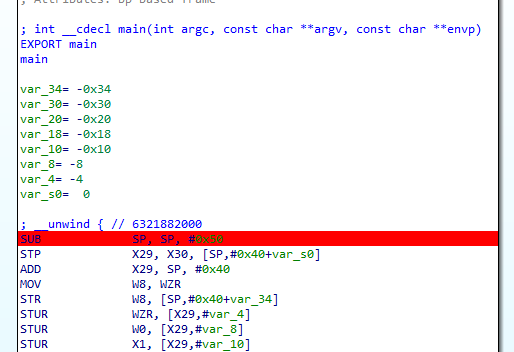
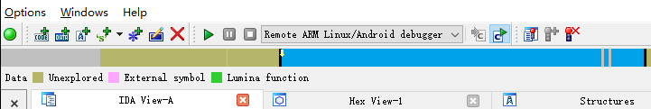
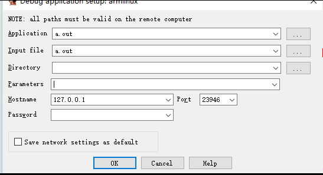
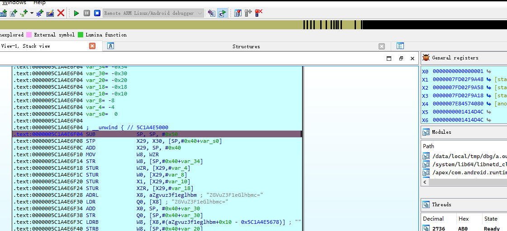

就是调试Android环境下可以执行的elf文件

# 64位的elf

链接：https://pan.baidu.com/s/137vgJthujyJyXJ6MSBiQgw?pwd=5sz5 

提取码：5sz5

## 环境

非root的Redmi K70

IDA 7.5

## 操作

1），把IDA\7.7\data\dbgsrv的android_server64上传到手机的指定目录

```
vermeer:/data/local/tmp/dbg $ chmod a+X ./android_server64
vermeer:/data/local/tmp/dbg $ ./android_server64
IDA Android 64-bit remote debug server(ST) v7.7.27. Hex-Rays (c) 2004-2022
Listening on 0.0.0.0:23946...
```

2），然后adb做端口转发

```
C:\Users\xxxxx>adb forward tcp:23946 tcp:23946
23946
```

3），断点：然后ida打开elf，在目标位置下一个断点



4），模式：ida debug模式选择



5），debugger->debug process option：

在hostname栏填写127.0.0.1或者localhost



然后F9开启调试即可



# 其它

## root的手机

root的手机没那么麻烦，在之前的步骤上

少了 adb的端口转发

```
C:\Users\xxxxx>adb forward tcp:23946 tcp:23946
23946
```

多了ip地址的获取

```
PBCM10:/data/local/tmp/dbg $ ip a
...
28: wlan0: <BROADCAST,MULTICAST,UP,LOWER_UP> mtu 1460 qdisc mq state UP group default qlen 3000
...
    inet 192.168.101.15/24 brd 192.168.101.255 scope global wlan0
...
```

在debugger process option中，我们就该填写192.168.101.15，而不是127.0.1了


## 32位elf

那就使用android_server,而不是android_server64了

其它差不多一样