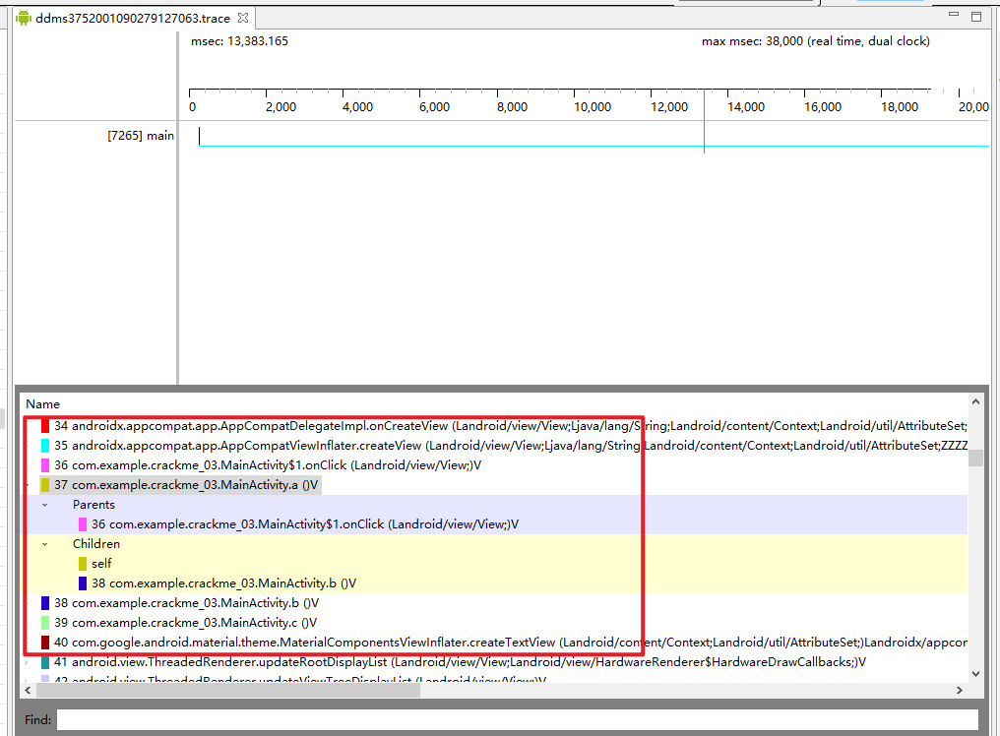

链接：https://pan.baidu.com/s/1tgdDFMVbe91ibT8pY8AtjA?pwd=ebsi 

提取码：ebsi

和之前的栈跟踪类似，只不过在呈现和操作方面升级了

但同样是栈跟踪。

通过此方法，你可以找到每个函数调用的父节点和子节点

这些信息构成了一个链表的数据结构。


我们把crackme_03-debug.apk安装到手机，然后打开程序

然后我们打开Android\Sdk\tools\monitor.bat

这东西也叫DDMS

在ddms中，找到手机的进程列表


选中目标进程crackme_03-debug.apk，然后点击右上角的某个按钮：start method profiling。

然后我们点击我们的按钮


然后回到ddms，在工具栏那里，找到stop method profiling （之前按钮是start method profiling 变成了stop method profiling）

stop后，ddms会自动弹出一个trace view窗口



在列表中，我们就可以看到目标API： onClick, Toast

我们也可以看到a()函数从哪里来，要去往哪里

除了这种方法，听book说，我们可以在apk源代码中插入

```java
android.os.debug.startMethodTracing("demo");
....
android.os.debug.stopMethodTracing("demo");
```

在进行一些其它操作后，最后apk运行，它会生成一个traceciew_demo.trace文件

这东西用traceview打开，效果和ddms那个一样，具体详情还是去《Android软件安全与逆向分析》8.3章节末尾看看