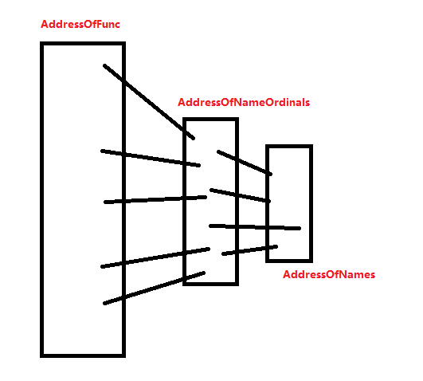

# 说明


导出数据所在的节通常名字是.edata

rdata也可以存储相关信息

export.size无用

```
Export Directory.RVA
Export Directory.SIZE 无用
```


导出表的作用有两个:

一般情况下,

DLL是导出,

exe是导入

当然Dll也可以导入,exe也可以导出

对于x86和x64的导出表, AddressOfFunctions, AddressOfNames 都指向一个DWORD的数组,成员都是4字节

但是对于x86和x64的带入表,就另说


```c
struct _IMAGE_EXPORT_DIRECTORY
{
    DWORD   Characteristics;    	//+0 未使用 导出表的特征标志，一般为0 
    DWORD   TimeDateStamp;      	//+4 时间戳 导出表的创建时间戳。
    WORD    MajorVersion;       	//+8h 未使用 导出表的主版本号
    WORD    MinorVersion;       	//+10 未使用 导出表的次版本号。

    DWORD   Name;               	//+12 字符串指针 dll的名字
    DWORD   Base;               	//+16 基址编号 导出表中所有函数的序号起始值，默认为1
    DWORD   NumberOfFunctions;  	//+20 导出表中的导出函数数量,其中是有空函数的
    DWORD   NumberOfNames;      	//+24 导出表中有字符串名称的导出函数数量
    DWORD   AddressOfFunctions;     //+28  dword数组, 实际函数的RvA数组 导出表中所有导出函数
    DWORD   AddressOfNames;         //+32 dword数组 导出表中所有有名称的导出函数的名称
    DWORD   AddressOfNameOrdinals;  //+36 word数组  导出表中所有有名称的导出函数序号,成员是(序号-BASE)的序列
} IMAGE_EXPORT_DIRECTORY, *PIMAGE_EXPORT_DIRECTORY;
```


```c
struct _IMAGE_EXPORT_DIRECTORY
{
    DWORD   Characteristics;    	//+0 未使用 导出表的特征标志，一般为0 
    DWORD   TimeDateStamp;      	//+4 时间戳 导出表的创建时间戳。
    WORD    MajorVersion;       	//+8h 未使用 导出表的主版本号
    WORD    MinorVersion;       	//+10 未使用 导出表的次版本号。

    DWORD   Name;               	//+12 字符串指针 dll的名字
    DWORD   Base;               	//+16 基址编号 导出表中所有函数的序号起始值，默认为1
    DWORD   NumberOfFunctions;  	//+20 导出表中的导出函数数量,其中是有空函数的
    DWORD   NumberOfNames;      	//+24 导出表中有字符串名称的导出函数数量
    DWORD   AddressOfFunctions;     //+28  dword数组, 实际函数的RvA数组 导出表中所有导出函数
    DWORD   AddressOfNames;         //+32 dword数组 导出表中所有有名称的导出函数的名称
    DWORD   AddressOfNameOrdinals;  //+36 word数组  导出表中所有有名称的导出函数序号,成员是(序号-BASE)的序列
} IMAGE_EXPORT_DIRECTORY, *PIMAGE_EXPORT_DIRECTORY;
```

x86和x64差异: AddressOfFunctions, AddressOfNames 都指向一个DWORD的数组,成员都是4字节

Base一般是首个导出函数的导出编号

AddressOfNameOrdinals是一个word数组,内部会有0填充的成员


```c
DWORD32* AddressofName; // x86还是x64都是dword*
DWORD32* Addressoffunction; // x86还是x64都是dword*
WORD* AddressOfOrdinal;
```

对于AddressofName而言,,,最后name的获取当然是ImageBase+AddressofName[i]

x86的ImageBase是4字节,而x64的ImageBase是8字节

对于Addressoffunction而言,,,最后真实API的获取也是ImageBase+AddressofName[i]

x86的ImageBase是4字节,而x64的ImageBase是8字节

但是x64的Addressoffunction指向的是8字节的空间

而x86的Addressoffunction指向的是4字节的空间

虽然搭建都是DWORD32* Addressoffunction;


# 名称导入查表原理:

如果用名称导入,那么查表就会用到 AddressOfName, AddressOfOrdianl, AddressOfFunc


拿着API字符串和char** AddressOfName[xx]的成员比对,到strcmp成功后,获取一个索引Index

拿着Index去WORD AddressOfOrdianl[xx]中,取出一个ordNum=AddressOfOrdianl[Index]

然后拿着ordNum去AddressOfFunc取出一个函数far_proc=AddressOfFunc[ordNum]

具体代码参考[1.代码大全\1.二进制\PE编程\1.dict.md]


# 序号导入查表原理:


如果用序号导入,就只用Base和,AddressOfFunc

序号导入默认是  Ordinals + base

导出的函数是 AddressOfFunc[输入编号-BASE]

具体代码参考[1.代码大全\1.二进制\PE编程\1.dict.md]


首先声明:  AddressOfOrdianl数组是一个比较混乱的数组,也就是成员的数值不是连续的

对于x86和x64而言

其中AddressOfOrdianl和AddressOfName是可以形成映射的DWORD数组

如果有些函数导出时,不给出NAME,那么他在 AddressOfOrdianl和AddressOfName 都不会占据一个相关的位置

只要有字符串导出的函数,他在 AddressOfOrdianl 中都在一个空间位置




一个数数组的范围如图

成员个数:  AddressOfFunc >= AddressOfNameOrdinals >= AddressOfNames

# 关于GetProcAddress的实现


x86和x64通用代码

```c
#include<Windows.h>

LPVOID get_func_by_name(LPVOID module, char* func_name)
{
    PIMAGE_DOS_HEADER idh = (PIMAGE_DOS_HEADER)module;
    if (idh->e_magic != IMAGE_DOS_SIGNATURE) {
        return NULL;
    }
    PIMAGE_NT_HEADERS nt_headers = (PIMAGE_NT_HEADERS)((BYTE*)module + idh->e_lfanew);
    PIMAGE_DATA_DIRECTORY exportsDir = &(nt_headers->OptionalHeader.DataDirectory[IMAGE_DIRECTORY_ENTRY_EXPORT]);
    if (exportsDir->VirtualAddress == 0)
        return NULL;
    DWORD expAddr = exportsDir->VirtualAddress;
    PIMAGE_EXPORT_DIRECTORY exp = (PIMAGE_EXPORT_DIRECTORY)(expAddr + (ULONG_PTR)module);
    SIZE_T namesCount = exp->NumberOfNames;

    
    DWORD NamesListRVA = exp->AddressOfNames;
    DWORD IndexListRVA = exp->AddressOfNameOrdinals;
    DWORD FuncListRvA = exp->AddressOfFunctions;

    for (SIZE_T i = 0; i < namesCount; i++) 
    {
        DWORD* nameRVA      = (DWORD*)((BYTE*)module + NamesListRVA + i * sizeof(DWORD));
        WORD * nameIndex    = (WORD*) ((BYTE*)module + IndexListRVA + i * sizeof(WORD));
        DWORD* funcRVA      = (DWORD*)((BYTE*)module + FuncListRvA + (*nameIndex) * sizeof(DWORD));

        CHAR* curr_name = (CHAR*)((BYTE*)module +*nameRVA);
        size_t k = 0;
        for (k = 0; func_name[k] != 0 && curr_name[k] != 0; k++) 
        {
            if (func_name[k] != curr_name[k])
                break;
        }
        if (func_name[k] == 0 && curr_name[k] == 0) 
        {
            return (BYTE*)module + (*funcRVA);
        }
    }
    return NULL;
}
int main() {
    HMODULE hUser32 = LoadLibraryA("user32.dll");

    int
    (WINAPI
        * lpMessageBoxA)(
            _In_opt_ HWND hWnd,
            _In_opt_ LPCSTR lpText,
            _In_opt_ LPCSTR lpCaption,
            _In_ UINT uType);
    lpMessageBoxA = get_func_by_name(hUser32, "MessageBoxA");
    if (lpMessageBoxA) {
        lpMessageBoxA(0, "redqx", "redqx", 0);
    }

}
```


