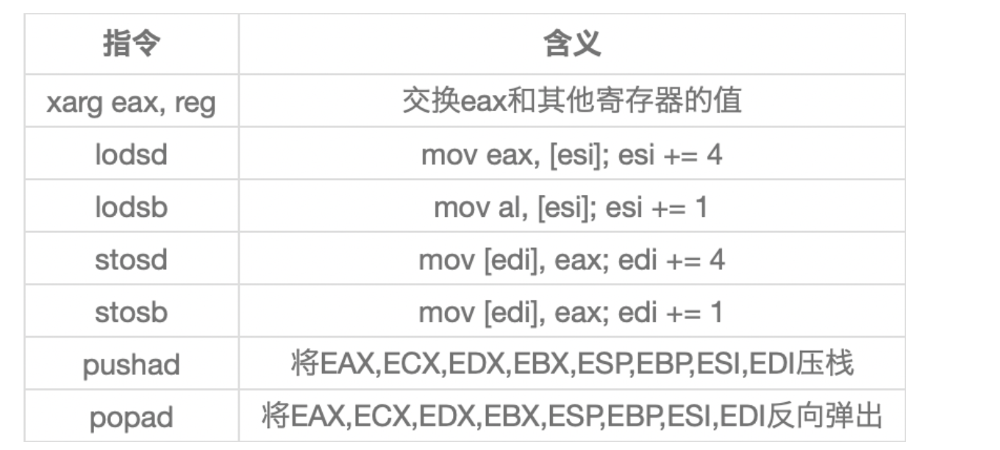

# shellcode介绍

# 比较牛逼的文章

太长了

https://tttang.com/user/P3nro5e


# 功能性shellcode的概念


这是一个攻防对抗很激烈的年代，杀毒软件的查杀技术是立体的，特征码、云、主防、启发、虚拟机。

如果恶意代码还只局限在必须依赖固定的PE格式，无法快速变异和免杀。

这要求恶意代码经过简单的处理就应该能躲过静态检测，不依赖于windows本身的loader可以加载运行

而shellcode正好符合这种形式, 

传统意义上的shellcode对长度容易产生苛刻要求,必须得短小,那样在漏洞利用场景才会更方便

**功能性shellcode**强调一个功能,是一段可能源代码有几千或者上万行

很明显，由于代码行数或者对于功能性的要求，使用纯汇编来进行功能性shellcode的编写是很不划算的。


功能性shellcode的编写主要还是用来对抗杀毒软件进行快速免杀的。

恶意代码封装成shellcode     对抗特征码和云

代码自修改技术多层SMC      对抗启发和虚拟机和云

random代码段和PE结构。     对抗杀软PE结构查杀和云

白名单技术                对抗国外杀软主防


**关于多层SMC**

因为存储这API地址的hash区域(ShellData)需要经过多次解密(密钥)才能还原出真实的API地址。

并且恶意代码的api地址全都从ShellData区域引出，我们可以很轻松的将密钥写入一个注册表键值或者bin文件亦或者

从网络上收包来接收这个用于SMC的密钥，杀软的虚拟机根本无从模拟我们恶意代码的API调用。

原来,,这就可以防止被解密,被杀软窥探,,

**关于random代码段和PE结构**。

现有的方法如使用下面的指令。

```
#pragma code_seg(push,r2,".test")
Some your backdoor code
#pragma code_seg(pop,r2)
```

把自的恶意代码添加到一个.test段中或者使用下面的合并区段的指令。

```
#pragma comment(linker, "/MERGE:.rdata=.data")   //把rdata区段合并到data区段里
#pragma comment(linker, "/MERGE:.text=.data")    //把text区段合并到data区段里
#pragma comment(linker, "/MERGE:.reloc=.data"    //把reloc区段合并到data区段里
```

很容易就被判定PE是被人工修饰过的，会被启发杀到PE结构。

使用dup指令占位.text段，配合上SMC，几乎可以控制恶意代码的每一个字节。

# 高级语言的选择

# 核心理念

我们创建shellcodes的方法就是利用C编译器可以从C代码生成汇编代码的特性，它包含了如下几个基础步骤：

- 准备一个C项目
- 将该项目重构，所有的导入函数都通过PEB查找的方式进行（移除导入表中的依赖）
- 使用C编译器生成汇编代码：`cl /c /FA /GS- <file_name>.cpp`
- 重构汇编代码，以使得其遵循shellcode的准则（移除其他剩余的依赖，将字符串和变量等改为内联）
- 将汇编代码进行编译：`cl /c file.asm`
- 链接为PE文件，测试运行是否正常
- 获取.text中的代码，可以使用[pe-parser](https://github.com/wqreytuk/pe_parser#2022-10-02-更新)，这个提取出来的代码就是shellcode

C编译器生成的汇编代码有时候并不是100%正确的，有时需要手动进行修改

# 准备C项目

当我们为shellcode准备C项目的时候，我们需要遵守以下几个规则：

- 不要直接使用导入表
- 总是通过PEB获取API地址
- 不要使用任何静态库
- 只是用局部变量，不要用全局变量和静态变量（否则它们会被存储到另外的section中从而破坏代码的位置无关性）
- 使用基于栈的字符串（或者在生成的汇编代码中内联）

[基于栈的字符串转换](http://144.34.164.217/agsduiagsdaigiada.html)

下面进行演示，我们的代码会弹个窗


# 为shellcode减肥





# 开源的Github

https://github.com/Pizz33/GobypassAV-shellcode


pe到shellcode 

https://github.com/hasherezade/pe_to_shellcode

我怀疑是一个peloader罢了

