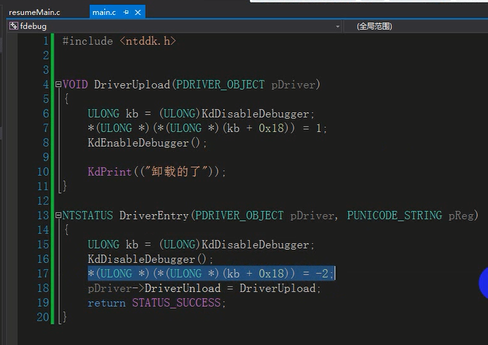
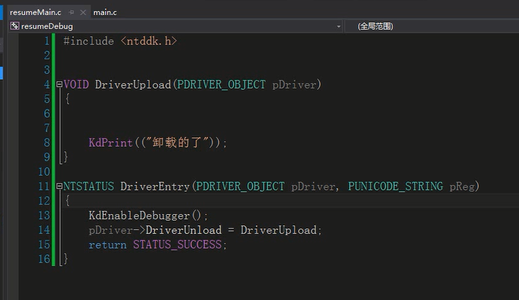

这个好像可以用于反调试的

windbg直接无法返回


安装



卸载




# 内核反调试

还没有开始哟😛😛😛😛😛😛😛


1).

```
dt _ETHREAD HideFromDebugger
```

去修改标志位HideFromDebugger

人畜无害的指令

```
__asm
{
    sgdt GDT;
    ret
}
```

这个指令的效果就是你调试的次数越多,越容易跑飞


