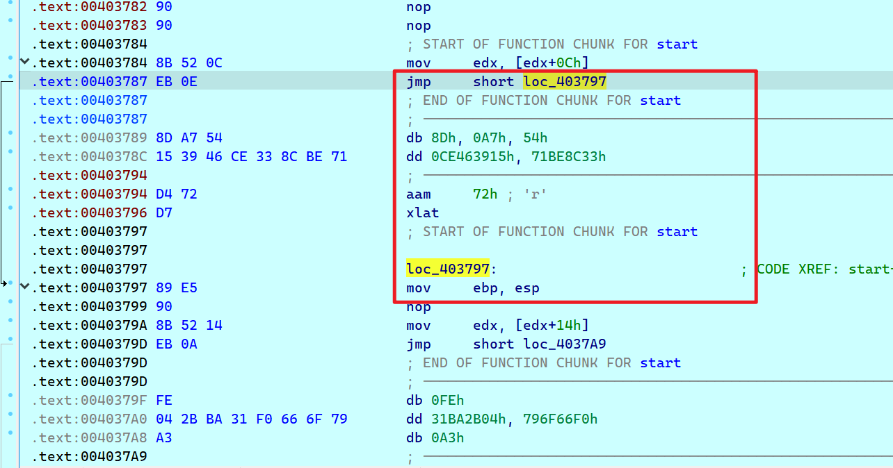

# 进入主题

**花指令=载体+垃圾代码**

# 参考链接links

一些简单的花指令的解析(含Intel指令集)

[https://www.52pojie.cn/thread-1068444-1-1.html](https://www.52pojie.cn/thread-1068444-1-1.html)

花指令 :

如何构造: [https://www.52pojie.cn/thread-326995-1-1.html](https://www.52pojie.cn/thread-326995-1-1.html)

如何用IDC解决: [https://www.cnblogs.com/LyShark/p/13100048.html](https://www.cnblogs.com/LyShark/p/13100048.html)

# 载体

常见类型如下

```
//该类型对IDA已经失效了

jmp tag;
//垃圾代码
tag:

```

1

```
jnz tag1;
jz tag1;
//垃圾代码
tag1:

//基于本类型的变种还有很多 js/jns,jp/jnp,...

```

1

```
xor eax,eax
jz tag1:
//垃圾代码
tag1:
//正常代码
//基于这个类型的变种,其实是最多的,核心思想是构造条件,然后跳转

```

1

```
call tag;
//垃圾代码
tag：
add esp,4
//正常代码
```

1

```
call tag;
//垃圾代码
tag:
add dword [esp],xx;
ret
//正常代码
```

1

```
call tag;
tag:
add dword [esp],xx;
ret
//垃圾代码
//正常代码
```

1

```
call tag;
//垃圾代码
tag:
add dword [esp],xx;
ret
//垃圾代码
```

1

其实载体类型有很多很多

特点 :

```
长度可能的小,别太大就行
不破坏其它寄存器,破环了也得还原

```

# 垃圾代码

一般我是随机化构造的, `rand()%0xff`

0xe8的效果貌似是最好的

# 关于一些条件的构造

如果单纯的运算结果是0

类似于 `xor eax,eax, sub eax,eax`

发生的跳转:

JZ JNO JNC JBE JNS JP JGE JLE


# 自认为比较难搞的花指令


## 情况1

比如这种情况,,除了反汇编失败以外

他和正常情况的汇编代码有什么区别呢?

eb 0e 的跳转,,感觉还是比较正常的

比如有些正常的跳转也可以是eb 0e

