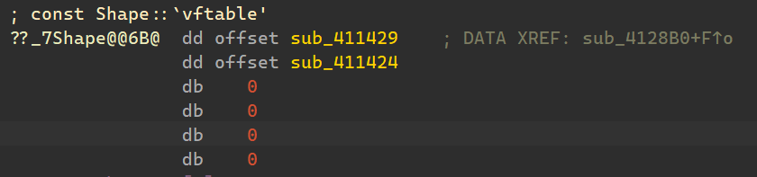
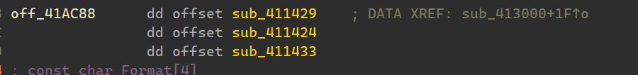
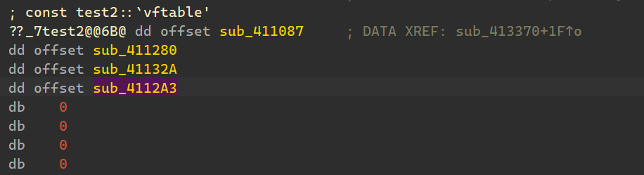
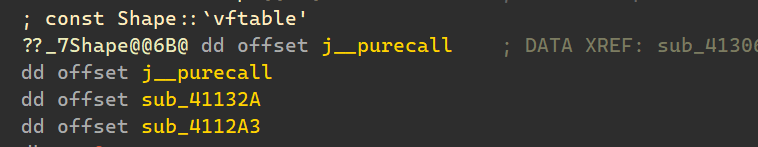

# 面向对象

# 权限和继承

public不多说

private就是不对外访问

protect也是不对外访问,,,区别于private体现在在继承上

也就是子类可以访问父类的public和protect,,但是不能访问private

说一下关于继承吧,,,子类可以通过3种方式去继承父类的一些东西

比如提供public,private,protect的方式去继承父类的成员和函数

在子类对父类的访问上,,,一直都是子类可以访问父类的public,protect,,但是不可以访问private

在对外访问上,,,该怎么样就怎么样...

比如你是private,protect继承,那么父类的所有都不对外开放

如果你是public继承,,,只有父类的public对外开放

# 参数传递

这个不多说,,以前都知道

主要了解一些他的其它语法,,,因为看懂别人的代码需要这个东西的

> 使用初始化列表来初始化字段

1), 情况1

```
Line::Line( double len): length(len)
{
    cout << "Object is being created, length = " << len << endl;
}
```

等价于

```
Line::Line( double len)
{
    length = len;
    cout << "Object is being created, length = " << len << endl;
}
```

2), 情况2

还有下面这种,意思是你在编译的时候如果没有传参,,那么就使用默认参数

如果传递了参数就使用自定义的

我感觉这个语法更像是一个宏定义的,,,真正的

`int l = 2, int b = 2, int h = 2`在汇编代码中并没有出现的

```cpp
Box(int l = 2, int b = 2, int h = 2)
{
    cout << "调用构造函数。" << endl;
    length = l;
    breadth = b;
    height = h;
}
```

3), 情况3

```cpp
class Shape {
protected:
    int width;
    int height;
public:
    Shape(int a = 0, int b = 0)
    {
        width = a;
        height = b;
    }
    int area()
    {
        cout << "Parent class area :" << endl;
        return 0;
    }
};
class Rectangle : public Shape {
public:
    Rectangle(int a = 0, int b = 0) :Shape(a, b)//子类去调用父类的构造函数
    {

    }
    int area()
    {
        cout << "Rectangle class area :" << endl;
        return (width * height);
    }
};
```

其中要注意的地方

```
Rectangle(int a = 0, int b = 0) :Shape(a, b)//子类去调用父类的构造函数
```

子类去调用父类的构造函数

现在有一个问题....

子类创建的时候,,子类如果不对父类的构造函数做一些处理

父类的构造函数其实也是会自动调用的

只不过父类的构造处理都是默认的

所以子类要带参数调用父类的构造函数就可以采用如上的形式

# 拷贝构造

```cpp
#include <iostream>

using namespace std;

class Line
{
public:
	int getLength(void);
	Line(int len);             // 简单的构造函数
	Line(const Line& obj);      // 拷贝构造函数
	~Line();                     // 析构函数

private:
	int* ptr;
};

// 成员函数定义，包括构造函数
Line::Line(int len)
{
	cout << "调用构造函数" << endl;
	// 为指针分配内存
	ptr = new int;
	*ptr = len;
}

Line::Line(const Line& obj)
{
	cout << "调用拷贝构造函数并为指针 ptr 分配内存" << endl;
	ptr = new int;
	*ptr = *obj.ptr; // 拷贝值
}

Line::~Line(void)
{
	cout << "释放内存" << endl;
	delete ptr;
}
int Line::getLength(void)
{
	return *ptr;
}

void display(Line obj)
{
	cout << "line 大小 : " << obj.getLength() << endl;
}

// 程序的主函数
int main()
{
	Line line1(10);

	Line line2 = line1; // 这里也调用了拷贝构造函数

	display(line1);// 这里也调用了拷贝构造函数
	display(line2);// 这里也调用了拷贝构造函数

	return 0;
}
```

# 虚函数

虚函数...

什么是虚函数,,,通过例子就会了解到到虚函数

## 虚函数有什么效果

```cpp
#include <iostream>
using namespace std;

class Shape {
protected:
    int width, height;
public:
    Shape(int a = 0, int b = 0)
    {
        width = a;
        height = b;
    }
    //virtual int area()
    int area()
    {
        cout << "f" << endl;
        return 0;
    }
};
class Rectangle : public Shape {
public:
    Rectangle(int a = 0, int b = 0) :Shape(a, b) { }
    int area()
    {
        cout << "s1" << endl;
        return (width * height);
    }
};
class Triangle : public Shape {
public:
    Triangle(int a = 0, int b = 0) :Shape(a, b) { }
    int area()
    {
        cout << "s2" << endl;
        return (width * height / 2);
    }
};
// 程序的主函数
int main()
{
    Shape* shape;
    Rectangle rec(10, 7);
    Triangle  tri(10, 5);

    shape = &rec;

    shape->area();
    rec.area();

    shape = &tri;

    shape->area();
    tri.area();
    return 0;
}
```

他的输出如下

```
f
s1
f
s2
```

这一看就知道

父类指针指向了子类,,并调用了重写的函数,,,发现还是调用的父类的

对于子类来说,,,重写了父类函数,,调用的话,,还是调用重新的

如果在父类的函数前面加一个东西`virtual`

```cpp
class Shape {
protected:
	int width, height;
public:
	Shape(int a = 0, int b = 0)
	{
		width = a;
		height = b;
	}
	virtual int area()
	{
		cout << "f" << endl;
		return 0;
	}
};
```

输出如下

```
s1
s1
s2
s2
```

父类指针指向了子类,,并调用了重写的函数,,,发现 调用的子类的了

## 虚表 vftable

这个东西是干什么的???

就是存储虚函数的表

比如下面,,,,

```cpp
#include <iostream> 
using namespace std;

class Shape
{
protected:
	int width;
	int height;
public:
	Shape(int a = 0, int b = 0)
	{
		width = a;
		height = b;
	}

	virtual int fun1()
	{
		printf("V1\n");
		return 0;
	}
	virtual int fun2()
	{
		printf("V2\n");
		return 0;
	}
	int demo()
	{
		printf("demo\n");
		return 0;
	}

};
class test1 : public Shape {
public:
	test1(int a = 0, int b = 0) :Shape(a, b) { }
	int fun3()
	{
		printf("V3\n");
		return 0;
	}
	int fun4()
	{
		printf("V4\n");
		return 0;
	}
	virtual int fun5()
	{
		printf("V5\n");
		return 0;
	}

};
class test2 : public Shape {
public:
	test2(int a = 0, int b = 0) :Shape(a, b) { }
	int fun1()
	{
		printf("V7\n");
		return 0;
	}
	int fun2()
	{
		printf("V8\n");
		return 0;
	}
};
// 程序的主函数
int main()
{
	Shape* shape;
	test1 *rec=new test1(10, 7);
	test2  *tri=new test2(10, 5);

	shape = rec;
	shape->fun2();
	rec->fun2();

	shape = tri;
	shape->fun2();
	tri->fun2();
	return 0;
}
```

对于`class Shape`的vftable有个成员

因为他有2个虚函数,其它函数不会被记录



然后来看看`class test1`,,

它继承了2个虚函数,,同时没有重写父类虚函数

然后自己也有1个虚函数

于是一共有3个虚函数



对于`class test2`,就只有来自继承的2个函数,,,但是它重写了这个2个函数

此刻,,,`class test2` 仍然有虚函数,,,但是虚表的内容被重写了,,,

所以这个有什么用呢???

所有,,虚表是占用一个class的大小的,,大小=sizeof(void*)

x86多4字节,x64多8字节

```cpp
int __cdecl main_0(int argc, const char **argv, const char **envp)
{
  int v4; // [esp+Ch] [ebp-6Ch]
  int v5; // [esp+Ch] [ebp-6Ch]
  int v6; // [esp+64h] [ebp-14h]
  int v7; // [esp+68h] [ebp-10h]

  if ( operator new(12u) )
    v4 = sub_41142E(10, 7);
  else
    v4 = 0;
  v6 = v4;
  if ( operator new(12u) )
    v5 = sub_411438(10, 5);
  else
    v5 = 0;
  (*(void (__thiscall **)(int))(*(_DWORD *)v6 + 4))(v6);
  (*(void (__thiscall **)(int))(*(_DWORD *)v6 + 4))(v6);
  v7 = v5;
  (*(void (__thiscall **)(int))(*(_DWORD *)v7 + 4))(v7);
  (*(void (__thiscall **)(int))(*(_DWORD *)v7 + 4))(v7);
  return 0;
}
```

可以看到,虽然只有8字节的成员,,但是占据12字节,,

因为多出的4字节,指向了虚表

## 虚表怎么发挥占用的…?

我感觉就是虚表的迭代…

我们仍然以  `虚表 vftable` 中的代码为例子

class Shape 是表1

1. A
2. B

class test2 是表2

1. A
2. B
3. C

class test3 是表3

1. 被重写的A
2. 被重写的B

每一个class的虚表都是独立存放的,不会交叉

我们以class test2 的构造函数为例

虚表会在构造函数中被初始化

```cpp
_DWORD *__thiscall sub_4131C0(_DWORD *this, int a2, int a3)
{
  sub_411267(a2, a3);
  *this = &test2::`vftable'
  return this;
}

```

我们进入 sub_411267(a2, a3); 查看

```cpp
_DWORD *__thiscall sub_411267(_DWORD *this, int a2, int a3)
{
  *this = &Shape::`vftable';
  this[1] = a2;
  this[2] = a3;
  return this;
}
```

发现特点如下

1. vftable位于this[0]的位置
2. this[0]的数据在不断的更新
    1. 先是Shape::`vftable'
    2. 后来是test2::`vftable'

所以在父类指针指向子类的时候

子类把虚函数重写了,,,

父类再去调用的时候….

this[0][xx]已经被更新了…于是调用的就是子类重写的,,,,

如果子类没有重写,,,那么调用的就是自己的,,,

class Shape 是表1

1. A
2. B

class test2 是表2

1. A
2. B
3. C

class test3 是表3

1. 被重写的A→A1
2. 被重写的B→B1

比如

Shape 指向 test2,调用A函数,,call this[0][0] 其实就是调用自己的,,,A

Shape 指向 test3,调用A函数,,call this[0][0]  调用的是被重写后的A1

main函数反汇编如下

```cpp
int __cdecl main_0(int argc, const char **argv, const char **envp)
{
  int v4; // [esp+Ch] [ebp-6Ch]
  int v5; // [esp+Ch] [ebp-6Ch]
  int **vf_table1; // [esp+64h] [ebp-14h]
  int **vf_table2; // [esp+68h] [ebp-10h]

  if ( operator new(12u) )
    v4 = sub_41142E(10, 7);
  else
    v4 = 0;
  vf_table1 = v4;
  if ( operator new(12u) )
    v5 = sub_411438(10, 5);
  else
    v5 = 0;
  ((*vf_table1)[1])(vf_table1);
  ((*vf_table1)[1])(vf_table1);
  vf_table2 = v5;
  ((*vf_table2)[1])(vf_table2);
  ((*vf_table2)[1])(vf_table2);
  return 0;
}
```

# 纯虚函数

纯虚函数不同于虚函数不同的是

虚函数它并不要求子类对它完一个重写

并且子类可以调用父类的虚函数

而纯虚函数的话,,在父类中,它没有具体的实现,,只有一个声明

然后要求子类必须对他完成一个重写

如果子类不完成父类的纯虚函数的重写,,,

那么子类就会变为虚类

虚类是不能被实例化的,,,,

以下面代码为例

```cpp
#include <iostream> 
using namespace std;

class Shape {
protected:
	int width, height;
public:
	Shape(int a = 0, int b = 0)
	{
		width = a;
		height = b;
	}
	// pure virtual function
	virtual int area1() = 0;
	virtual int area2() = 0;
	virtual int fun1()
	{
		printf("V1\n");
		return 0;
	}
	virtual int fun2()
	{
		printf("V2\n");
		return 0;
	}
};
class test2 : public Shape {
public:
	test2(int a = 0, int b = 0) :Shape(a, b) { }
	int area1()
	{
		cout << "a1" << endl;
		return (width * height);
	}
	int area2()
	{
		cout << "a2" << endl;
		return (width * height);
	}
	int my_fecho() {
		printf("x\n");
		return 0;
	}
};
// 程序的主函数
int main()
{
	Shape* shape;
	test2* rec = new test2(10, 7);

	shape = rec;
	shape->area2();
	shape->fun2();
	return 0;
}
```

我们尝试去反汇编一下

test2虚表有4个成员



Shape有4个成员



但是前2个是纯虚函数的指针

j__purecall是一个MSVCRXXX.dll的导出函数

如果调用它..我估计会g掉