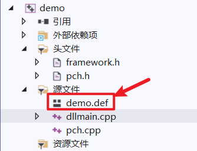

# dllMain


```c
BOOL WINAPI DllMain(
   HINSTANCE hinstDLL, // Dll的ImageBase
   DWORD fdwReason, // 调用原因
   LPVOID lpvReserved // 表示一个保留参数
)
{
	switch(fdwReason)
    {
        case DLL_PROCESS_ATTACH:
            break;
        case DLL_THREAD_ATTACH:
            break;
        case DLL_THREAD_DETACH:
            break;
        case DLL_PROCESS_DETACH:
            break;
        default:
            break;
    }
    return TRUE;

}

```


其中fdwReason用来表示Dll被调用的状态，一共分为四种：

-   DLL_PROCESS_ATTACH  ==1 进程加载 进程映射 LoadLibiary的时候
-   DLL_PROCESS_DETACH  ==0 进程释放 进程卸载 FreeLibiary的时候
-   DLL_THREAD_ATTACH   ==2 线程加载 线程映射
-   DLL_THREAD_DETACH   ==3 线程释放 线程卸载


# 导出dll的方式

DLL中导出函数的声明有两种方式：

一种方式是：在函数声明中加上__declspec(dllexport)；

另外一种方式是：采用模块定义(.def)文件声明，(.def)文件为链接器提供了有关被链接程序的导出、属性及其他方面的信息。


## __declspec(dllexport)


使用 `__declspec(dllexport)`导出一个函数


```c
__declspec(dllexport) int add(int,int)
{
    //不写_declspec的话,你的函数就不会导出,也就是不会出现在导出表里面
	...
}
```

注意:动态库编译链接后, 也会有LIB文件,是作为动态库函数`映射`使用,与静态库`不完全相同`。


这种导出方式对于cpp文件来说,会出现换名的机制,woc

所以,我们就在前面加上一个 extern "C" 

```c
extern "C" __declspec(dllexport) void TestFuction( )
{
    return ;
}
```


## 模块化定义文件.def


可以更加精确的配置一些导出函数

于是写函数的时候,不需要特意的写出导出谁谁

而是在del文件中导出





 

dll测试文件

```c++
// dllmain.cpp : 定义 DLL 应用程序的入口点。
#include "pch.h"


int global_variable;
int  f1(int x,int y) {
    return x + y;
}
int  f2(int x, int y) {
    return x - y;
}
int  f3(int x, int y) {
    return x * y;
}
int  f4(int x, int y) {
    return x / y;
}
int  f5(int x, int y) {
    return x ^ y;
}
BOOL APIENTRY DllMain( HMODULE hModule,
                       DWORD  ul_reason_for_call,
                       LPVOID lpReserved
                     )
{
    switch (ul_reason_for_call)
    {
    case DLL_PROCESS_ATTACH:
    case DLL_THREAD_ATTACH:
    case DLL_THREAD_DETACH:
    case DLL_PROCESS_DETACH:
        break;
    }
    return TRUE;
}


```


一个def文件必须有两个部分：LIBRARY和EXPORTS

基本格式:  函数名字 【=内部名称】【@ordinal】【NONAME】【PRIVATE】【DATA】

NONAME关键字：允许只按序号输出，并减小结果DLL中导出表的大小

PRIVATE关键字：禁止将函数名字放到又LINK生成的导入库中

DATA关键字：指定导出的是数据，而不是代码。


def测试文件

```c++
LIBRARY MyDLL

;我是可爱的注释呀
;LIBRARY后面跟的的名字是自定义的


EXPORTS

func1=f1   @3

func2=f2   @4

f3 @5   NONAME

f4 @7   PRIVATE

global_variable DATA
```


dll调用测试文件

```c++
#include<Windows.h>
#include<stdio.h>

typedef int (*dqx_xx)(int x, int y);
int main() {
	HMODULE xx = LoadLibrary(TEXT("demo.dll"));
	dqx_xx f1, f2, f3, f4;
	int x = 20, y = 10;
	if (xx) {
		f1	= (dqx_xx)GetProcAddress(xx, "func1");
		f2 = (dqx_xx)GetProcAddress(xx, "func2");
		f3 = (dqx_xx)GetProcAddress(xx, 5);
		f4 = (dqx_xx)GetProcAddress(xx, "f4");
		printf("%d %d %d %d", f1(x, y), f2(x, y), f3(x, y), f4(x, y));
	}
	return 0;
}
```


# dll的加载和卸载

**DLL路径搜索目录顺序**

1.程序所在目录

2.程序加载目录（SetCurrentDirectory）

3.系统目录即 SYSTEM32 目录

4.16位系统目录即 SYSTEM 目录

5.Windows目录

6.PATH环境变量中列出的目录


如果一个dll内部再次加载一个dll,貌似要用LoadLibraryEx


## 进程映射

DLL_PROCESS_ATTACH

当一个DLL文件被映射到进程的地址空间时，系统调用该DLL的DllMain函数，传递的fdwReason参数为DLL_PROCESS_ATTACH，

这种调用只会发生在第一次映射时。如果同一个进程后来为已经映射进来的DLL再次调用LoadLibrary或者LoadLibraryEx，

操作系统只会增加DLL的使用次数

它不会再用DLL_PROCESS_ATTACH调用DLL的DllMain函数。

不同进程用LoadLibrary同一个DLL时，

每个进程的第一次映射都会用DLL_PROCESS_ATTACH调用DLL的DllMain函数。


## 进程卸载


DLL_PROCESS_DETACH

当DLL被从进程的地址空间解除映射时，系统调用了它的DllMain，传递的fdwReason值是DLL_PROCESS_DETACH。

当DLL处理该值时，它应该执行进程相关的清理工作。

那么什么时候DLL被从进程的地址空间解除映射呢？两种情况：

◆ FreeLibrary解除DLL映射（有几个LoadLibrary，就要有几个FreeLibrary）

◆ 进程结束而解除DLL映射，进程结束后会解除DLL映射。

如果进程的终结是因为调用了TerminateProcess，系统就不会用DLL_PROCESS_DETACH来调用DLL的DllMain函数。

这就意味着DLL在进程结束前没有机会执行任何清理工作。

注意：

当用DLL_PROCESS_ATTACH调用DLL的DllMain函数时，如果返回FALSE，说明没有初始化成功，

系统仍会用DLL_PROCESS_DETACH调用DLL的DllMain函数。因此，必须确保清理那些没有成功初始化的东西。


## 线程映射

DLL_THREAD_ATTACH

当进程创建一线程时，系统查看当前映射到进程地址空间中的所有DLL文件映像，

并用值DLL_THREAD_ATTACH调用DLL的DllMain函数。

新创建的线程负责执行这次的DLL的DllMain函数，只有当所有的DLL都处理完这一通知后，

系统才允许进程开始执行它的线程函数。

ps: 所以的话…dll那个线程attach会先于线程处理函数哟..有点意思


注意跟DLL_PROCESS_ATTACH的区别，我们在前面说过，第n(n>=2)次以后地把DLL映像文件映射到进程的地址空间时，

是不再用DLL_PROCESS_ATTACH调用DllMain的。而DLL_THREAD_ATTACH不同，进程中的每次建立线程，

都会用值DLL_THREAD_ATTACH调用DllMain函数，哪怕是线程中建立线程也一样。


## 线程卸载


DLL_THREAD_DETACH

如果线程调用了ExitThread来结束线程（线程函数返回时，系统也会自动调用ExitThread），

系统查看当前映射到进程空间中的所有DLL文件映像，并用DLL_THREAD_DETACH来调用DllMain函数，

通知所有的DLL去执行线程级的清理工作。

注意：如果线程的结束是因为系统中的一个线程调用了TerminateThread，系统就不会用值DLL_THREAD_DETACH来调用所有DLL的DllMain函数。


