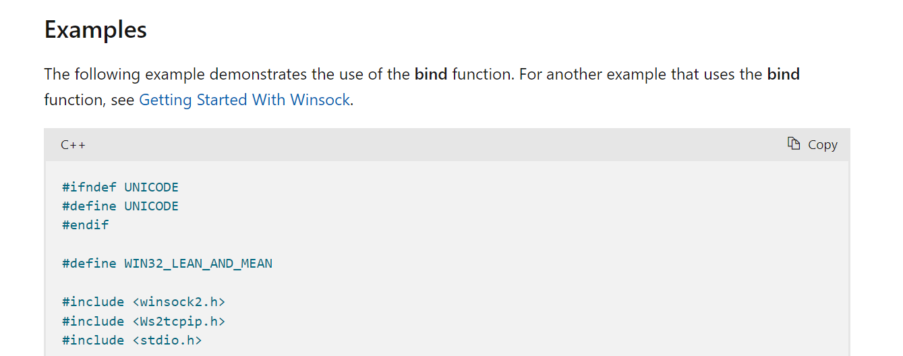

# 参考链接links

[socket探究和实现](https://drunkmars.top/2021/10/25/socket/)

[Windows网络编程(C++ Socket编程)](https://blog.csdn.net/qq_44731954/article/details/113796530)

[网络编程](https://renyili.org/categories/%E7%BD%91%E7%BB%9C%E7%BC%96%E7%A8%8B/)

[视频讲义](https://edu.51cto.com/course/20388.html)

# 前言

视频教程比较全面复杂,自己并用不了那么多


所以就看一些基本的函数就可以了

参考链接


但是微软官方却给了很多的例子

比如我们的bind函数



可以看见,他就会给出一些api的example

所以之后的学习,就可以查看这些API操作了


查看端口是否被占用

```
netstat -ano | findstr "80"
```


# 函数列表


WSAStartup 初始化Ws2_32.lib库, 保证了Socket 动态链接库的加载。

WSACleanup 关闭Ws2_32.lib库

Socket 创建socket

closesocket 关闭socket

sockaddr和sockaddr_in 结构体socket地址

bind 绑定

listen 监听

accept 接收

connect 连接

send 发送

recv 获取返回


## 一、基本Socket函数

accept() 响应连接请求，返回一个连接socket，原来的socket返回监听状态

bind() 把一个socket绑定在某个端口上

CloseSocket() 关闭套接字

Connect() 连接

GetPeerName() 得到连接在指定套接口上的对等通信方的名字

GetSockName() 得到指定套接口上当前的名字

GetSockopt() 得到与制定套接口相关的属性选项

htonl() 把32位的数字从主机字节顺序转换到网络字节顺序

htons() 把16位的数字从主机字节顺序转换到网络字节顺序

inet_addr() 把一个Internet标准的点分十进制地址转换成Internet地址数值

inet_ntoa() 把Internet地址转换成点分十进制的字符串

ioctlsocket() 为套接字提供控制

listen() 监听套接字上连接请求的到来

ntohl() 把32位的数字从网咯字节顺序转换为主机字节顺序

ntons() 把16位的数字从网咯字节顺序转换为主机字节顺序

recv() 从已经连接的套接字接受数据

recvfrom() 从已连接的或没有连接的套接口接受数据

select() 执行同步IO多路复用

send() 从已连接的套几口发送数据

sendto() 从已连接的或没有连接的套接口发送数据

setsockopt() 设置与指定套接口相关的属性选项

shutdown() 关闭一部分全双工的链接

socket() 创建并返回一个socket


## 二、获取信息

Gethostbyaddr() 根据网络地址得到对应的名字(会有多个)和地址

Gethostbyname() 根据主机名得到对应的名字(会有多个)和地址

gethostname() 得到本机主机名

getservbyname() 根据服务的名字得到对应的服务名和端口号

getservbyport() 根据端口号得到对应的服务名和端口号

getprotobyname() 根据协议名得到对应的协议名和数值

getprotobynumber() 根据端口号得到对应的协议名和数值

## 三、DLL操作

WSAStartup 初始化底层的windows Sockets DLL

WSACleanup 从底层的Sockets DLL中撤销注册

WSAAsyncSelect Select函数的异步版本

WSAIsBlocking 确定底层的winsock DLL是否在该线程已经被一个调用阻塞

WSACancelBlockingCall 取消未完成的阻塞的API调用

WSASetBlockingHook 为底层的windows sockets实现设置阻塞钩子

WSASetLastError 设置下一次的WSAGetLastError返回的错误信息

WSAGetLastError 得到最近的一个windows sockets API调用错误的详细信息

WSAUnhookBlockingHook 恢复原始的阻塞钩子

WSACancelAsyncRequest 取消一个未完成的 WSAAsyncGetXByY 函数的实例


# TCP通信

见res/tcp_demo


服务端的模样:

启动环境WSAStartup

创建套接字 socket

使用 bind 与 (ip:port)绑定

然后使用listen处于监听

处于listen的状态

如果有客户端过来,,服务端就` accept`他,建立连接成功后,然后和他进行一个recv和send的操作


客户端的模样:

启动环境WSAStartup

创建套接字 socket

使用connect连接服务端的(ip:port),建立连接成功后,然后和他进行一个recv和send的操作


# UDP通信

见res/udp_dmeo


服务端的模样:

启动环境WSAStartup

创建套接字 socket

使用 bind 与 (ip:port)绑定

然后使用recvfrom和sendto收发消息


客户端的模样:

启动环境WSAStartup

创建套接字 socket

然后使用recvfrom和sendto收发消息


可以看见udp的通信,,没有一个建立连接的过程,,,,直接通信,,,,


# TCP的粘包问题

从文字<< [](https://drunkmars.top/2021/10/25/socket/) >>了解到

socket缓冲区和数据的传递过程，可以看到数据的接收和发送是无关的

read()/recv() 函数不管数据发送了多少次，都会尽可能多的接收数据。也就是说，read()/recv() 和 write()/send() 的执行次数可能不同。

例如，write()/send() 重复执行三次，每次都发送字符串”abc”，那么目标机器上的 read()/recv() 可能分三次接收，每次都接收”abc”；

也可能分两次接收，第一次接收”abcab”，第二次接收”cabc”；

也可能一次就接收到字符串”abcabcabc”。

假设我们希望客户端每次发送一位学生的学号，让服务器端返回该学生的姓名、住址、成绩等信息，这时候可能就会出现问题，

服务器端不能区分学生的学号。例如第一次发送 1，第二次发送 3，服务器可能当成 13 来处理，返回的信息显然是错误的。

这就是数据的“粘包”问题，客户端发送的多个数据包被当做一个数据包接收。也称数据的无边界性，

read()/recv() 函数不知道数据包的开始或结束标志（实际上也没有任何开始或结束标志），只把它们当做连续的数据流来处理。

在实际状况来说，客户端连续三次向服务器端发送数据，但是服务器端却一次性接收到了所有数据，这就是TCP的粘包问题。

ps: 先提出问题,,,问题如何解决呢...后面再了解吧

