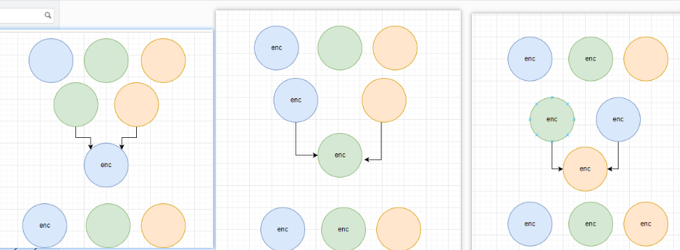

# tea

一个很简单的算法

主要是加加

逆运算就是减减

一次性加密8个字节

要求key是16字节

完整的加密是

```
void encrypt(DWORD32* v, DWORD32* k)
{
    DWORD32 sum = 0, i;
    DWORD32 delta = 0x9e3779b9;
    for (i = 0; i < 32; i++)
    {
        sum += delta;
        v[0] += f(v[1], sum, k);
        v[1] += f(v[0], sum, &k[2]);
    }
}
```

假如已知加密是下面

```
    v[0] += f(v[1], sum, k);
    v[1] += f(v[0], sum, &k[2]);
```

那么解密的话肯定是

因为v0在最后一步加密是不变的

所以应该先解密v1,v1解出来,然后就解开v0

解密是

```
    v[1] -= f(v[0], sum, &k[2]);
    v[0] += f(v[1], sum, k);
```

所以完整的解密

```
void decrypt(DWORD32* v, DWORD32* k)
{
    DWORD32 sum = 0xC6EF3720, i;
    DWORD32 delta = 0x9e3779b9;
    for (i = 0; i < 32; i++)
    {
        v[1] -= f(v[0], sum, &k[2]);//解密的时候,你给他v0,不能先给v1
        v[0] -= f(v[1], sum, k);
        sum -= delta;
    }
}
```

也还是很好理解的

那么问题来了,f函数是什么东西

```
DWORD32 f(DWORD32 value, DWORD32 sum,DWORD32* k)
{
    DWORD32 x, y, z;
    x = (value << 4) + k[0];
    y = value + sum;
    z = (value >> 5) + k[1];
    return x^ y^ z;
}
```

它就长这个样子

也就一个异或

无论f多么复杂,我么只需要知道,进来的数据决定了出去的数据就可以了

也就是进来的 (value,sum,k) -> (x ^ y ^ z)

我么要逆的也不是f函数

而是逆那个--和++的函数

所以这就是简单的tea算法

对于f函数,它不一定是<<4或者>>5,可以任意的

也就是无论f函数多么复杂,只需要保证 (value,sum,k) -> (x ^ y ^ z)这个就可以了

# xtea

其实和tea大同小异

多的不说

他的加密是

```
void fenc(DWORD32 v[2], DWORD32 key[4])
{
    int i;
    DWORD32 sum = 0, delta = 0x9E3779B9;
    for (i = 0; i < 32; i++)
    {
        v[0] += f(v[1], sum + key[sum & 3]);
        sum += delta;
        v[1] += f(v[0], sum + key[(sum >> 11) & 3]);
    }
    return;
}
```

比如加密是

```
		v[0] += f(v[1], sum + key[sum & 3]);
        sum += delta;
        v[1] += f(v[0], sum + key[(sum >> 11) & 3]);
```

可想而知

解密

```
        v[1] += f(v[0], sum + key[(sum >> 11) & 3]);
        sum -= delta;
        v[0] += f(v[1], sum + key[sum & 3]);
```

所以完整的解密便是

```
void fdec( DWORD32 v[2], DWORD32 key[4])
{
    int i;
    DWORD32  delta = 0x9E3779B9, sum = delta * 32;
    for (i = 0; i < 32; i++)
    {
        v[1] -= f(v[0], sum + key[(sum >> 11) & 3]);
        sum -= delta;
        v[0] -= f(v[1], sum + key[sum & 3]);;
    }
    return;
}
```

其中的f函数,变化了一下

```
DWORD32 f(DWORD32 value,  DWORD32 k)
{
    DWORD32 x, y, z;
    x = value << 4;
    y = value >> 5;
    z = (x ^ y) + value;
    return z ^ k;
}
```

# xxtea

始算法要求每次加密8字节(2个DWORD)
key要求是16字节(4个DWORD)

其实和tea算法大同小异

只不过稍稍f函数编复杂了,之前就说过,f函数的复杂程度,其实没有太大关系

整体加密流程如下

```
void encrypt(DWORD32* m, DWORD32* k, DWORD32 len)
{

    DWORD32 delta = 0x9e3779b9, rounds = 0, sum = 0;
    int i = 0;

    first = 0;
    end = len - 1;
    rounds = 6 + 52 / len;//轮回的次数

    for (; rounds; rounds--)//先设置end的值为最后一个，因为加密第一个要用
    {
        sum += delta;
        for (i = 0; i < len; i++)
        {
            m[i] += f(i, m, (sum >> 2) & 3, sum, k);
        }
    }
}
```

核心关键点其实比xtea,tea算法更加的简单

加密是

```
 m[i] += f(i, m, (sum >> 2) & 3, sum, k);
```

那么解密当然是

```
 m[i] -= f(i, m, (sum >> 2) & 3, sum, k);
```

所以解密脚本就是

```
void decrypt(DWORD32* c, DWORD32* k, DWORD32 len)
{
    DWORD32 sum, rounds;
    DWORD32 delta = 0x9e3779b9;
    int i;

    rounds = 6 + 52 / len;
    sum = rounds * delta;

    for (; rounds; rounds--)
    {
        for (i = end; i >= 0; i--)
        {
            c[i] -= f(i, c, (sum >> 2) & 3, sum, k);
        }
        sum -= delta;
    }
}
```

其中f函数可能比较的复杂

```
DWORD32 f(int i, DWORD32* m, DWORD32 e, DWORD32 sum, DWORD32* key)
{
    DWORD32 a, b, c, d;
    DWORD32 next_one, pre_one;

    pre_one = (i == first ? m[end] : m[i - 1]);
    next_one = (i == end ? m[first] : m[i + 1]);

    a = pre_one >> 5 ^ next_one << 2;
    b = pre_one << 4 ^ next_one >> 3;
    c = sum ^ next_one;
    d = key[(i & 0b11) ^ e] ^ pre_one;

    return (a + b) ^ (c + d);
}
```

当前这一位加密,和前面那一位和后面那一位都有关系

```
 m[i] += f(i, m, (sum >> 2) & 3, sum, k);
```

这样的话,对解密会造成一些影响?



可以看出
如果你正序开始解的话,第一个蓝色的求依赖于2个没有被加密的球,而那2个球已经被加密了
如果你逆序的话,黄色的求,依赖于2个被加密的球,是可以解开的