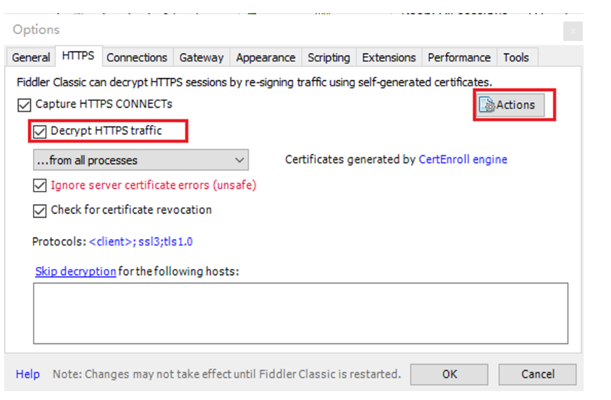
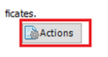
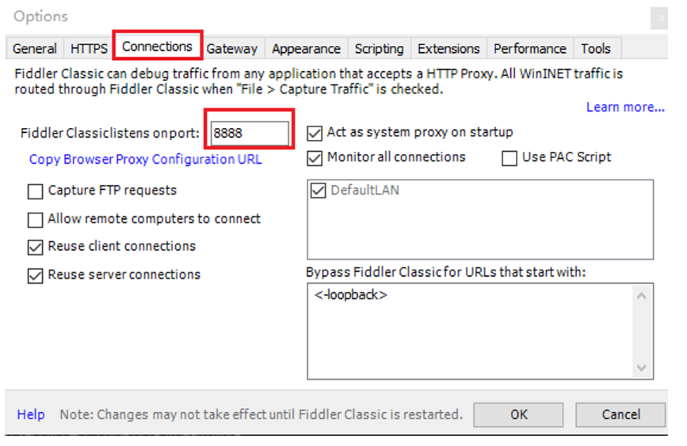
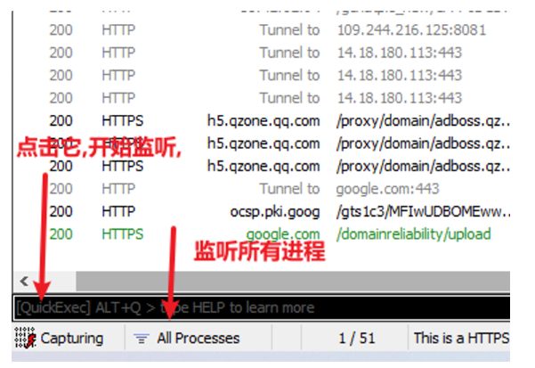
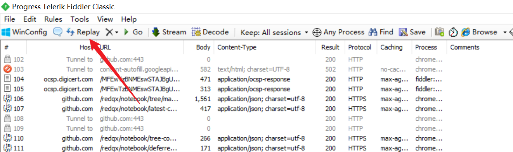
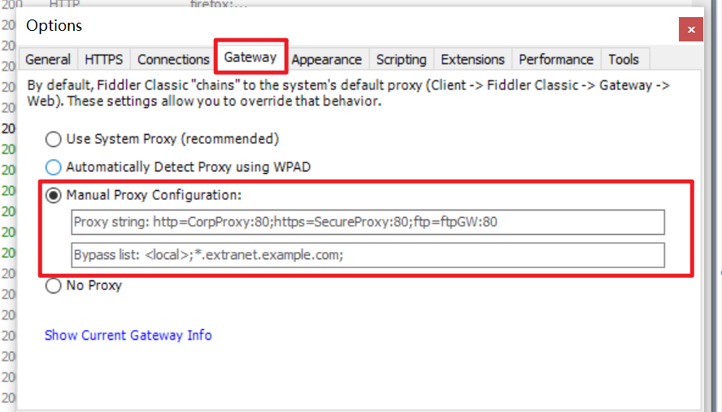

# links


```
https://www.cnblogs.com/GeekerJun/p/16259224.html
```


# 基本技能掌握


- 
- 浏览器代理神器
- 拦截请求或响应
- 抓包
- 重放
- 模拟请求
- 编码解码
- 第三方扩展

# exe抓包

Fiddler的功能类似于Burp suit

详细的介绍

[Fiddler抓包：详解Fiddler抓包工具软件使用教程_fiddler抓包工具使用教程_陪代码一起浪迹天涯的博客-CSDN博客](https://blog.csdn.net/seoyundu/article/details/121067090)


1),



 

选上那个,一开始这个页面其实只有2个选项,就下面这2


我们要勾住红色的,才会有很多选项的出现

期间涉及管理员权限的操作

然后再象征性的点击一下下面这个,,,



2), 关于端口



注意这个端口要和Proxifier设置的代理端口一致



关于怎么开始监听

点击Capturing,它只会监听来自8888端口的流量

也就是Proxifier配置那个

如果不点击它,他会监听所有进程的所有流量

点击后,他会变为透明,看不见


 

左边是监听的报文,右边是具体的报文内容

跟多的用法可以以后再写,或者参考顶部的链接

比如如何过滤,如何拦截等等


# app抓包


## 安卓12的真机


请阅读一下文章,,然后再看我补充说明的东西

```
https://www.jianshu.com/p/7242d4e8b179
https://blog.csdn.net/tianshuiyimo/article/details/116698916

https://zhuanlan.zhihu.com/p/352767166
https://www.telerik.com/fiddler/add-ons

还有一个链接的,但是找不到了
```


补充说明:

环境

```
红米k40
安卓12,arm64
已经root
magisk+LSpoed
```

知识背景:

```
用户证书目录：/data/misc/user/0/cacerts-added/
系统证书目录：/system/etc/security/cacerts
zygisk_LSposed模块: /data/adb/modules/zygisk_lsposed/
```


首先,我们需要 让面具`magisk`安装模块`lsposed`

模块自行Github下载并安装


然后访问fiddler, 下载证书

然后把证书移动到` /data/adb/modules/Zygisk_LSPosed/system/etc/security/cacerts/证书文件`

其中`system/etc/security/cacerts/`是我们新建的目录

只需要

```
cp ./证书   /data/adb/modules/Zygisk_LSPosed/system/etc/security/cacerts/
```

然后重启手机

然后我们去用户证书目录看看的话

就会发现,,,我们的证书已经进入系统证书目录了

然后就开始我们的抓包了


 


# 其他功能


注释:

选中一个包,,然后点击那多云,,就可以对选中的包些注释了


Replay(重放请求按钮):

把一个包,再次发一遍

选中一个,并replay或者键盘`R`

如果要发送指定次数,shift+R




## 流量包转发


fiddler可以显示流量包

如果我们希望它把流量包转发到burp呢?



看到红色的框没?

第一个红色是网关的意思

然后第二个红色是人工设置的意思,第一个是要转发的ip:port,第二个是不要转发的

网上很多人不看提示,,乱写配置,,,,,(我指得是第二个红框的内容该怎么写)

所以我们应该写

```
http=127.0.0.1:8080;https=127.0.0.1:8080
```

然后就🆗了

如果点击Show Current Gateway Info 出现下面的就表示没问题

最后让我还是很不理解的就是,,,burp抓的全是https,,,http一个也抓不到

就很离谱耶

