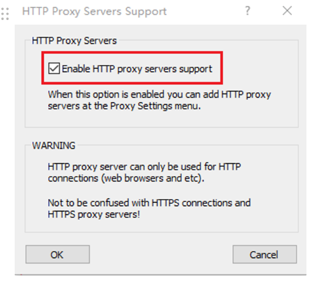
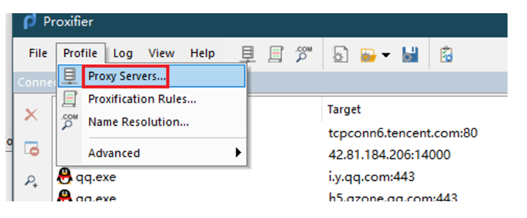
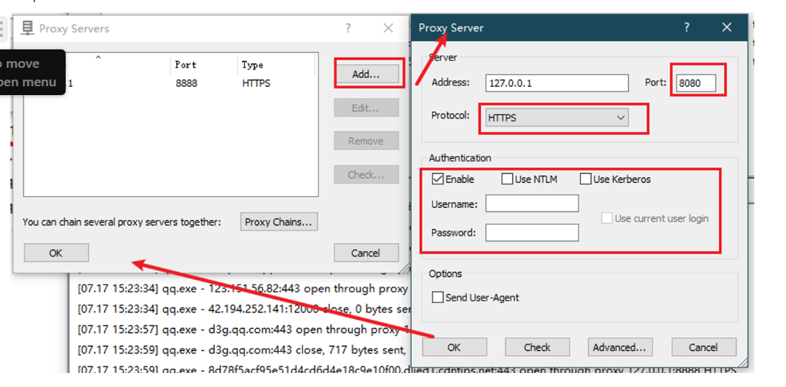
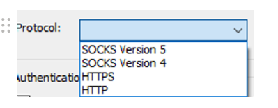
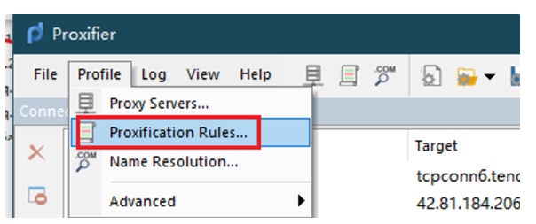
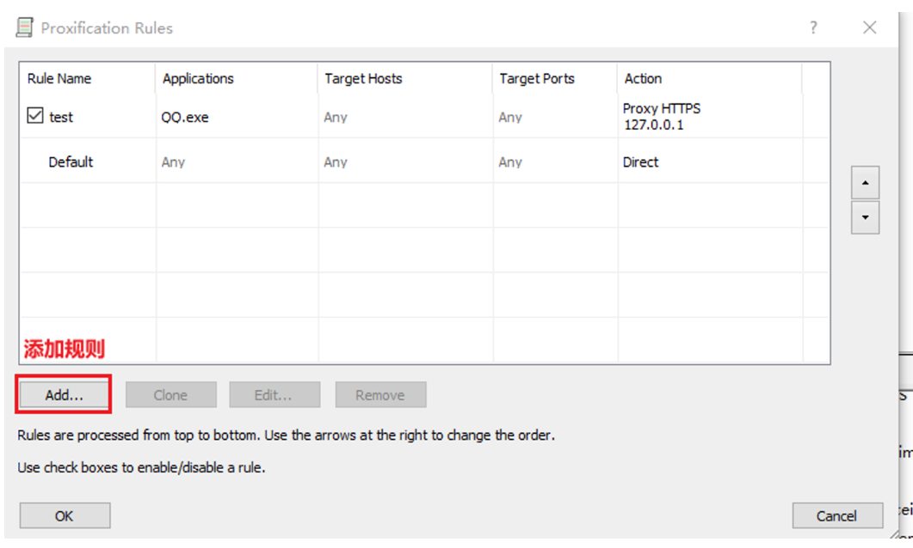
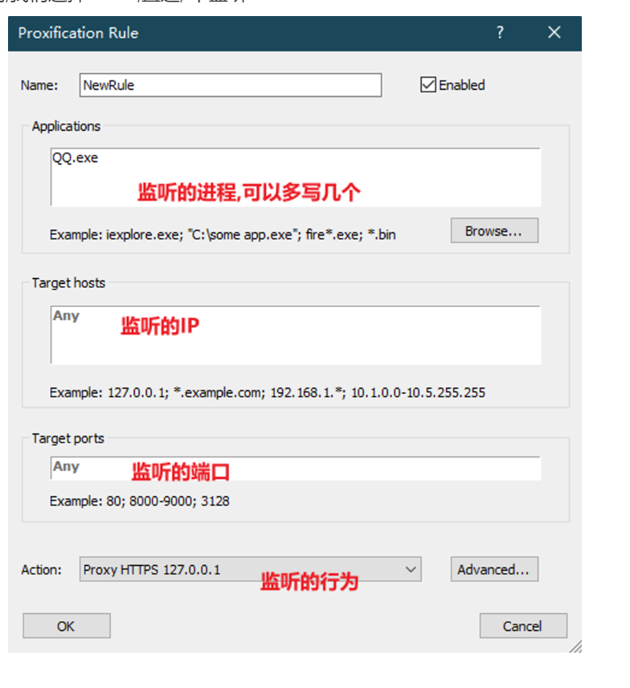
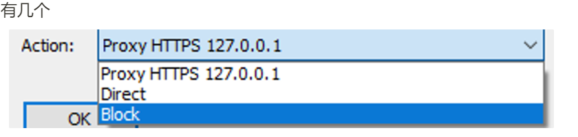

# Proxifier

一款代理软件

可以把指定进程的流量传递给某个端口

具体配置如下

类似于浏览器的FoxyProxy,一款代理工具,,不负责抓包,只是做一个转发

网上有破解版的,虽然可以免费试用30天

# 如何配置

## https的配置

先开启一个设置

然后勾选

 	

然后才是具体的配置

## 配置转发的的端口

配置ip

比如burp用的是8080端口监听

我们就添加一个8080的代理

密码和用户名可以设置一个,通过后面发现,,,设置一个..报错就少些

在Protocol,我们选择的是HTTPS.其实还可以选择其他的

 

那个端口我们得注意一下

那是监听器的端口

Proxifier只是一个代理软件

监听器的端口有burp suit 或者 Fiddler

burp suit的监听端口是8080

Fiddler的监听端口是8888

代理抓取到的流量都会送往监听器

重要的事情说3遍:

Proxifier配置后,pc的所有流量都会走Proxifier,

Proxifier会分发流量

1), 阻塞它

2), 让它溜走

3), 送给监听器,自己去处理, 比如给burp suit 或者Fiddler

## 配置监听(进程,端口,IP)

其实就是要监听哪一个进程的流量

 

比如我们这里

 

我们只监听QQ.exe进程的任何数据

对于默认的应用,我们选择Direct,直连, 不监听

 

监听的行为有几个

阻塞,

直连,

走代理,

