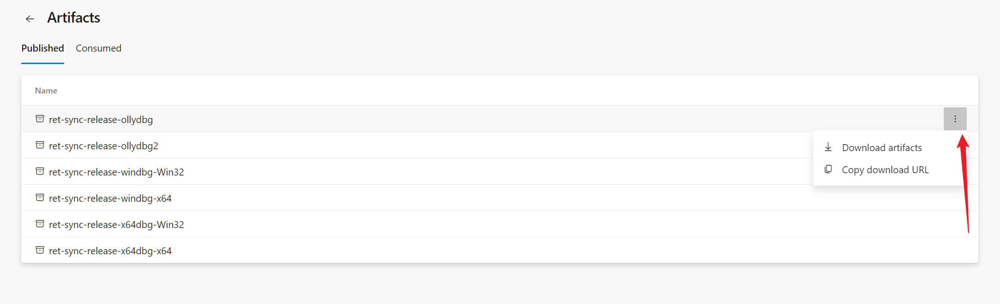
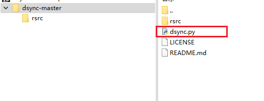
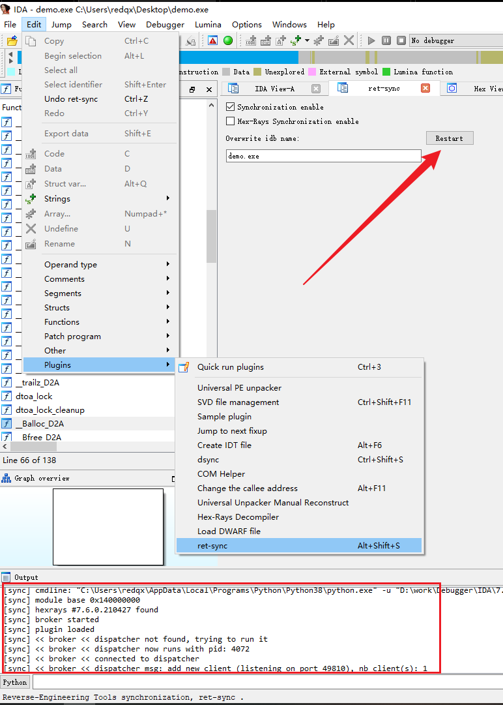
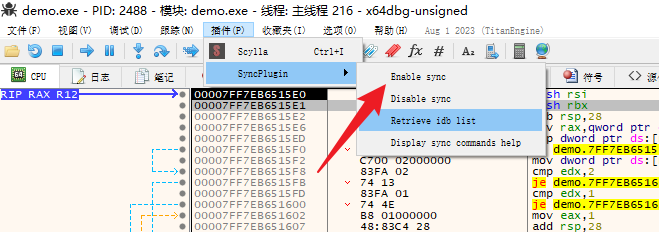
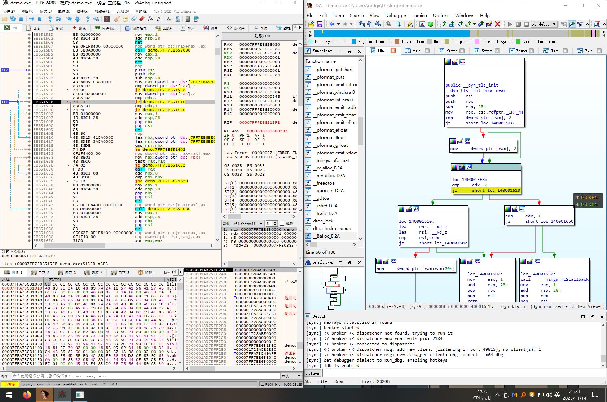

# 参考教程

```
https://azha0.github.io/2021/02/13/04_%E5%B7%A5%E5%85%B7%E4%BD%BF%E7%94%A8/ret-sync%E9%85%8D%E7%BD%AE%E8%AF%B4%E6%98%8E/

https://blog.csdn.net/lixiangminghate/article/details/95668806
https://blog.csdn.net/qq_36088602/article/details/106153225
https://blog.csdn.net/lixiangminghate/article/details/82631934
```


环境

```
IDA 7.6
x64debug
Python 3.8.9
```

准备材料

Github项目地址：https://github.com/bootleg/ret-sync

Github项目地址：https://github.com/patois/dsync


Ret-sync分为两部分，

```
一部分是IDA插件(python)，
另一部分是调试器插件（编译好的DLL）；
```

该插件的功能是将调试器中的EIP所指的地址在IDA中同步显示出来。这样就可以将动静结合起来了。

ps: 此刻只是说,我们用的是x64debug去调试,,,IDA仍然需要在之前静态加载和分析目标文件


在ret-sync中,,,它给的是我们要去自己编译的源码,,,懂得都懂,,,

有些people他就是死活编译不出来

于是,,网上就出现了编译好的,然后提供下载

编译好的调试器插件可从Azure DevOps下载，链接：https://dev.azure.com/bootlegdev/ret-sync-release/_build/results?buildId=105&view=results


 然后点击


然后把鼠标移动到右边



就可以实现点击下载


# 单机调试

ps: 以IDA结合x64debug为例子

就是用(一个机器+2个调试器)来调试


首先把ret-sync/ret-sync/ext_ida的内容存入 `IDA76\plugins`目录


 然后我们把dsync.py放入`IDA76\plugins`目录下



最后如下


然后我们来配置x64debug

比如我们调试的是x64的程序,我们把`x64dbg_sync.dp64`放到`\release\x64\plugins`目录中


然后就配置完了

然后开启调试过程

IDA加载程序



然后x64启动程序,先F9,

然后启动插件



然后IDA那边就自动附加上了


于是我们每在x64debug调试一步,IDA就会同步的显示EIP指针

好像,,我们只能在x64debug中调试,,然后在IDA中同步显示

无法实现在IDA中调试,,,x64debug也会跟着一起显示





可以看到左边界面,右边界面,感觉有点紧凑

如果你有2个屏幕,,一边看一个,另外一边看另外一个

那么就会很舒服

于是就产生了一个新的想法

双击调试

在真机使用x64debug,在虚拟机使用IDA


# 远程调试

就是用(2个机器+2个工具)来调试


环境

```
虚拟机(作为服务端): 使用IDA
物理机(作为客户端): 使用x64debug
```


准备如下文件

服务端(IDA): 在用户的家目录中,准备一个名字叫做`.sync`的文本文件,然后带调试的demo.exe随便放在桌面上,

客户端(x64debug): 在当前目录,建一个文件夹,名字任意,然后里面有带调试的demo.exe,准备一个名字叫做`.sync`的文本文件

2个`.sync`文件的内容是一致的

内容如下

```
[INTERFACE]
host=192.168.102.3
port=8089

```

host是服务端的IP,也就是有IDA那个

port任意,,最好别太任意

ps: 得保证物理机和虚拟机网络可以相通


然后服务的用IDA打开并静态分析demo.exe

然后IDA开启插件,ret-sync

初次反应如下


然后客户端,x64debug打开demo.exe,并F9到用户模块

然后打开插件


然后不出意外就结束了


可以看到2者是同步的

