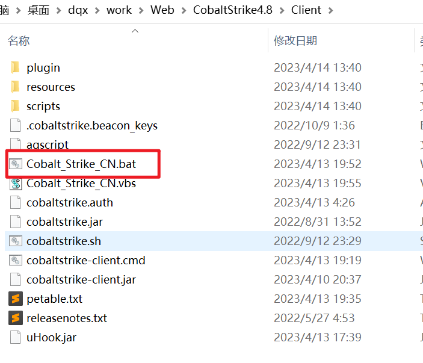

# CS


Server运行在Linux服务端,,

Client运行在Windows客户端

运行如下

kali:

```c
┌──(kali㉿kali)-[~]
└─$ su
Password: 
┌──(root㉿kali)-[/home/kali]
└─# cd 
┌──(root㉿kali)-[/home/kali]
└─# cd /home/kali/Desktop/csServe
┌──(root㉿kali)-[/home/kali/Desktop/csServer]
└─#  
┌──(root㉿kali)-[/home/kali/Desktop/csServer]
└─#  chmod a+x
┌──(root㉿kali)-[/home/kali/Desktop/csServer]
└─# ./teamserver 192.168.127.129 key_1212

[*] Will use existing X509 certificate and keystore (for SSL)

[*] Starting teamserver
[*] Team Server Version: 4.8 (Pwn3rs)
[*] Setting 'https.protocols' system property: SSLv3,SSLv2Hello,TLSv1,TLSv1.1,TLSv1.2,TLSv1.3
[*] Loading keystrokes.
[*] Loaded 0 keystrokes.
[*] Loading screenshots.
[*] Loaded 0 screenshots.
[*] Loading downloads.
[*] Loaded 0 downloads.
[*] Loading Windows error codes.
[*] Windows error codes loaded
[*] Loading hosted files
[*] Loaded 0 servers with hosted items
[*] Loading beacons
[*] Loaded 0 beacons
[+] Team server is up on 0.0.0.0:50050
[*] SHA256 hash of SSL cert is: 3b9b3dd1d61b7ff02a611f5ae525f2cbf031c89126da8b4aa7f8df20f2a74e16
```

在.**/teamserver 192.168.127.129 key_1212** 中

**192.168.127.129** 是kali的ip

**key_1212**是连接的密码

服务的端口是5050

其中有写明的

```c
*] Loading beacons
[*] Loaded 0 beacons
[+] Team server is up on 0.0.0.0:50050
```

然后客户端win10启动

ps: 配置java的环境,对于cs4.8, 要java11才行,java8不行

双击xxx.bat运行



 